# Grafana Loki Log Aggregation Documentation

## 📋 Overview

This e-commerce microservices application uses **Grafana Loki** for centralized log aggregation, with **Grafana Alloy** as the log shipping agent. Loki is deployed in a scalable **read/write/backend** microservices mode with **MinIO** as S3-compatible object storage.

---

## 🏗️ Loki Architecture Overview

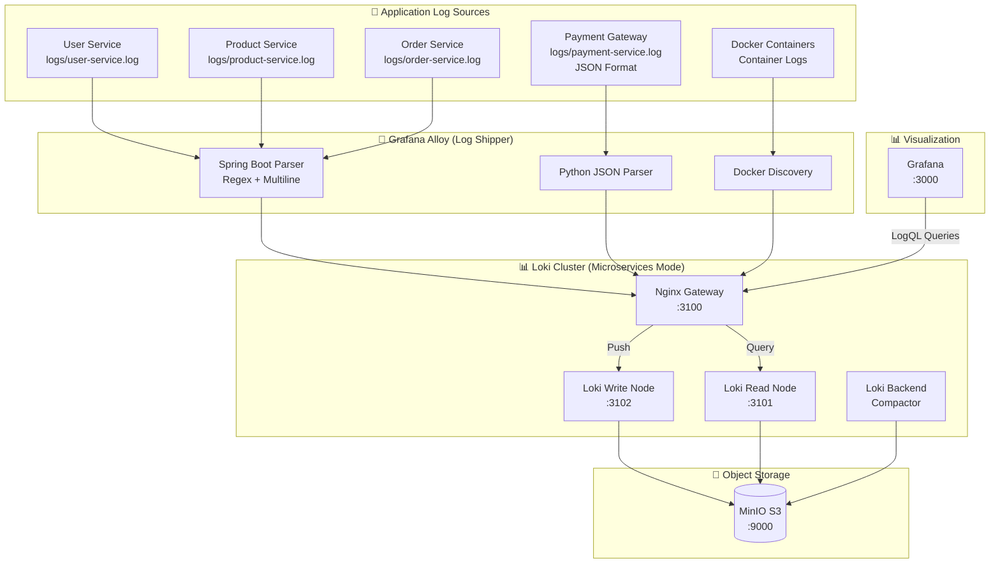

---

## 🔄 Complete Log Flow Process

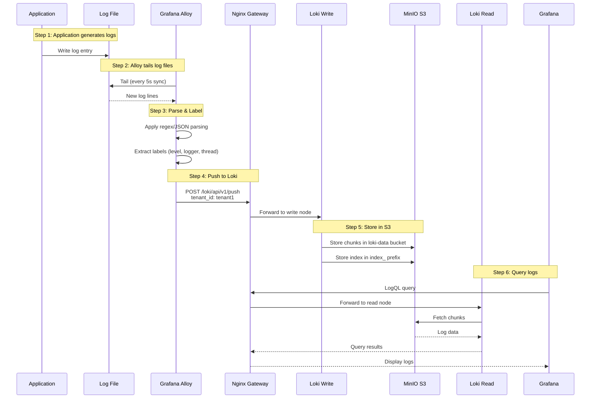

---

## 📦 Component Details

### Service Ports & Roles

| Service | Port | Role | Description |
|---------|------|------|-------------|
| **Nginx Gateway** | 3100 | Load Balancer | Routes push/query to correct nodes |
| **Loki Write** | 3102 | Ingester | Receives and batches log entries |
| **Loki Read** | 3101 | Querier | Executes LogQL queries |
| **Loki Backend** | 3100 | Compactor | Compacts and indexes chunks |
| **MinIO** | 9000 | Storage | S3-compatible object storage |
| **Alloy** | 12345 | Agent | Log collection and shipping |
| **Grafana** | 3000 | UI | Visualization and querying |

---

## 🔧 Grafana Alloy Configuration

### Log Sources Pipeline

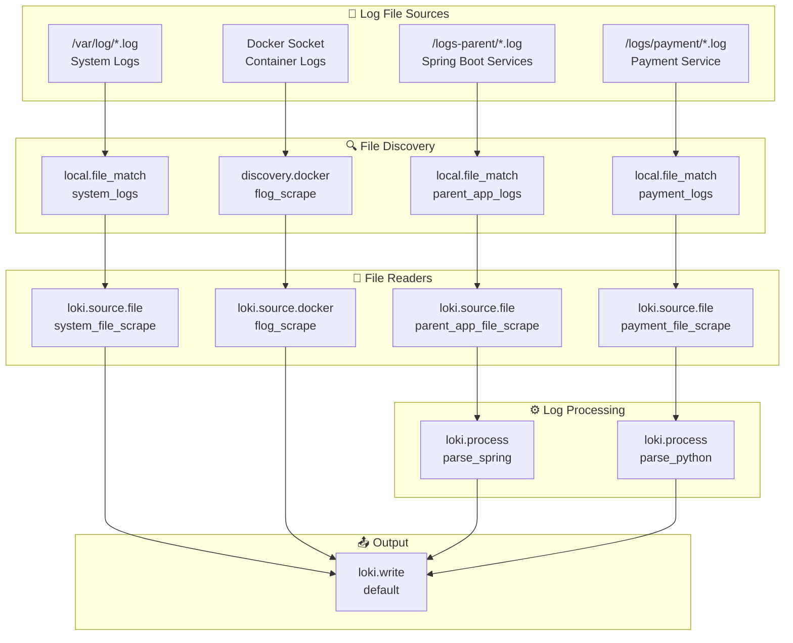

---

## 📝 Spring Boot Log Parsing

### Log Format Example
```
2024-01-15T10:30:45.123Z INFO 1 --- [order-service] [http-nio-8083-exec-1] c.e.order.controller.OrderController : Creating order for user: user123
```

### Parsing Pipeline

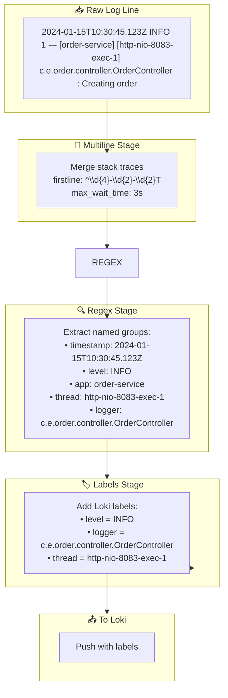

### Alloy Configuration for Spring Boot
```yaml
loki.process "parse_spring" {
    // Merge multi-line stack traces
    stage.multiline {
        firstline     = "^\\d{4}-\\d{2}-\\d{2}T"
        max_wait_time = "3s"
    }

    stage.regex {
        expression = "^(?P<timestamp>\\S+)\\s+(?P<level>\\w+)\\s+\\d+\\s+---\\s+\\[(?P<app>[^\\]]+)\\]\\s+\\[(?P<thread>[^\\]]+)\\].*?(?P<logger>[\\w\\.\\$]+)\\s*:"
    }

    stage.labels {
        values = {
            level  = "level",
            logger = "logger",
            thread = "thread",
        }
    }

    forward_to = [loki.write.default.receiver]
}
```

---

## 🐍 Python (FastAPI) Log Parsing

### Log Format (JSON via python-json-logger)
```json
{"asctime": "2024-01-15T10:30:45", "levelname": "INFO", "name": "payment-service", "message": "Processing payment for order ORD-123"}
```

### Parsing Pipeline

```mermaid
flowchart TD
    subgraph Input["📥 JSON Log Line"]
        RAW["{\"asctime\": \"...\", \"levelname\": \"INFO\", \"name\": \"payment-service\", \"message\": \"...\"}"]
    end

    subgraph JSONStage["🔍 JSON Stage"]
        EXTRACT["Extract fields:<br/>• level = levelname<br/>• logger = name<br/>• message = message"]
    end

    subgraph Labels["🏷️ Labels Stage"]
        LABEL["Add Loki labels:<br/>• level = INFO<br/>• logger = payment-service<br/>• service = payment-service<br/>• env = local"]
    end

    subgraph Output["📤 To Loki"]
        PUSH["Push with labels"]
    end

    RAW --> JSONStage
    JSONStage --> EXTRACT
    EXTRACT --> Labels
    Labels --> LABEL
    LABEL --> Output
```

### Python Logging Configuration
```python
# logging_config.py
from pythonjsonlogger import jsonlogger

formatter = jsonlogger.JsonFormatter(
    fmt="%(asctime)s %(levelname)s %(name)s %(message)s",
    datefmt="%Y-%m-%dT%H:%M:%S",
)

# File handler — Alloy tails this file
file_handler = logging.FileHandler("logs/payment-service.log")
file_handler.setFormatter(formatter)
```

---

## 🐋 Docker Container Log Collection

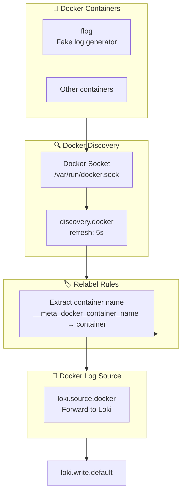

---

## 🏢 Loki Microservices Architecture

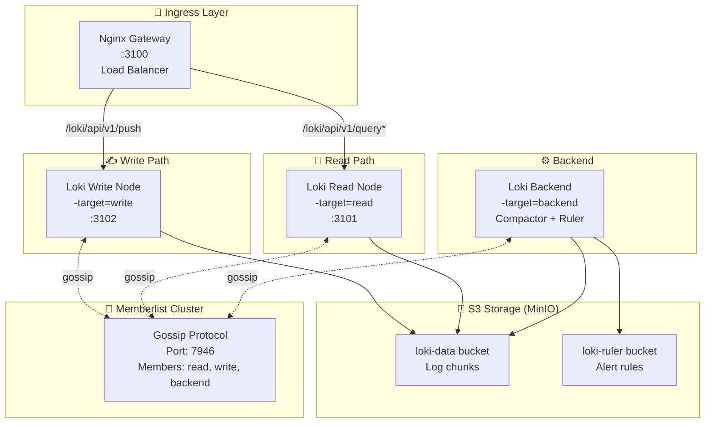

---

## ⚙️ Loki Configuration Details

### Schema & Storage Configuration
```yaml
# loki-config.yaml
schema_config:
  configs:
    - from: 2023-01-01
      store: tsdb          # Time-series database index
      object_store: s3     # MinIO S3 storage
      schema: v13          # Latest schema version
      index:
        prefix: index_
        period: 24h        # Daily index rotation

common:
  storage:
    s3:
      endpoint: minio:9000
      insecure: true
      bucketnames: loki-data
      access_key_id: loki
      secret_access_key: supersecret
      s3forcepathstyle: true
```

### Memberlist Cluster Configuration
```yaml
memberlist:
  join_members: ["read", "write", "backend"]
  dead_node_reclaim_time: 30s
  gossip_to_dead_nodes_time: 15s
  left_ingesters_timeout: 30s
  bind_addr: ['0.0.0.0']
  bind_port: 7946
  gossip_interval: 2s
```

---

## 🔀 Nginx Gateway Routing

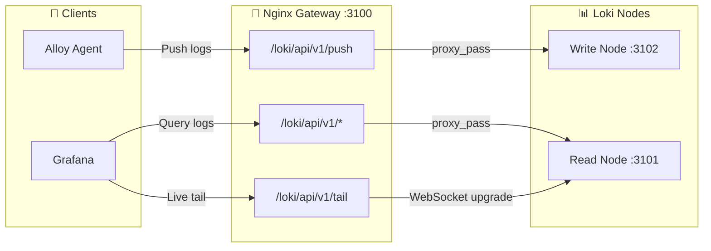

### Nginx Configuration
```nginx
server {
    listen 3100;

    # Push endpoint → Write node
    location = /loki/api/v1/push {
        proxy_pass http://write:3100$request_uri;
    }

    # Live tail → Read node (WebSocket)
    location = /loki/api/v1/tail {
        proxy_pass http://read:3100$request_uri;
        proxy_set_header Upgrade $http_upgrade;
        proxy_set_header Connection "upgrade";
    }

    # All other queries → Read node
    location ~ /loki/api/.* {
        proxy_pass http://read:3100$request_uri;
    }
}
```

---

## 📊 Grafana Integration

### Data Source Configuration
```yaml
# grafana/datasources/datasources.yml
apiVersion: 1
datasources:
  - name: Loki
    type: loki
    access: proxy
    url: http://gateway:3100
    jsonData:
      httpHeaderName1: "X-Scope-OrgID"
    secureJsonData:
      httpHeaderValue1: "tenant1"
```

### Multi-Tenancy

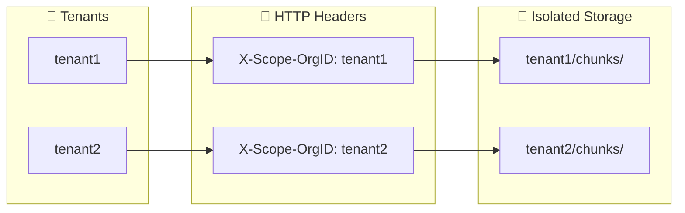

---

## 🔍 LogQL Query Examples

### Basic Queries
```logql
# All logs from order-service
{service="order-service"}

# Error logs only
{level="ERROR"}

# Specific logger
{logger="c.e.order.controller.OrderController"}

# Combined filters
{service="payment-service", level=~"ERROR|WARN"}
```

### Pattern Matching
```logql
# Search for specific text
{service="order-service"} |= "Creating order"

# Regex pattern
{service="user-service"} |~ "user.*login"

# Exclude pattern
{level="ERROR"} != "timeout"
```

### Aggregations
```logql
# Error count by service (last 5m)
sum by (service) (count_over_time({level="ERROR"}[5m]))

# Log volume rate
sum(rate({service=~".+"}[1m])) by (service)
```

---

## 🚀 Startup Sequence

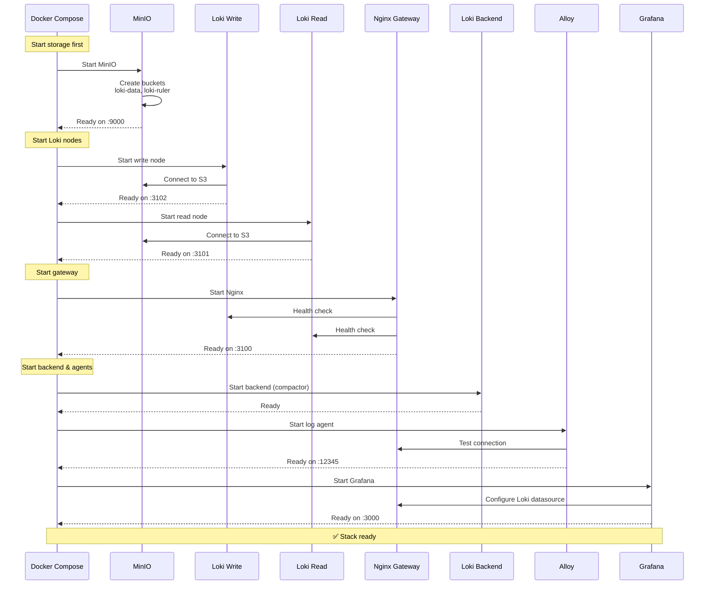

---

## 📁 Volume Mappings

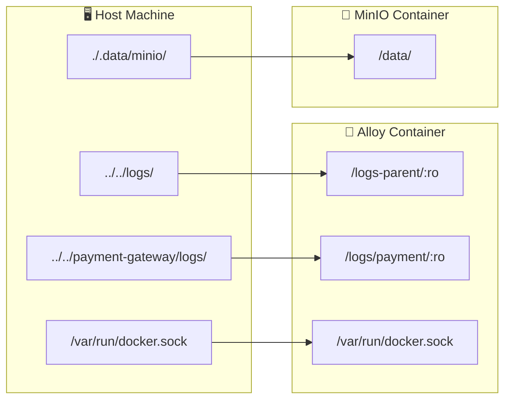

---

## 🛠️ Docker Compose Services Summary

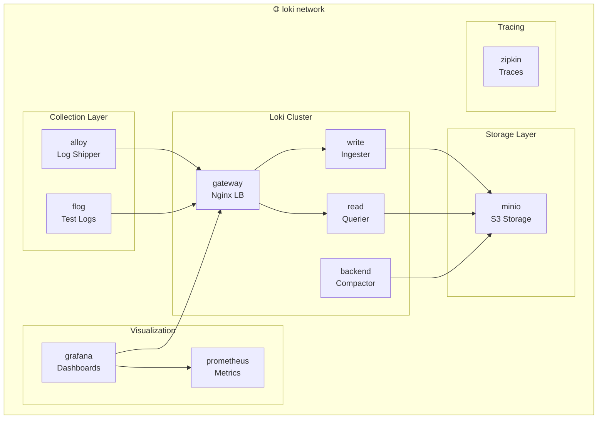

---

## 🎯 Best Practices

### Label Cardinality
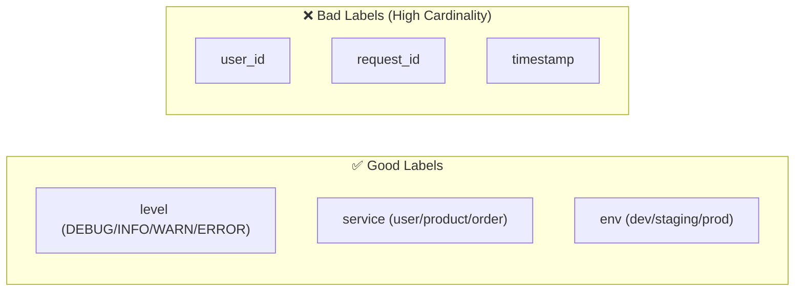

### Log Retention Strategy
| Environment | Retention | Chunk Compaction |
|-------------|-----------|------------------|
| Development | 7 days | Daily |
| Staging | 14 days | Daily |
| Production | 30 days | Daily |

---

## 📊 Quick Reference

| Component | URL | Purpose |
|-----------|-----|---------|
| **Grafana** | http://localhost:3000 | Log visualization |
| **Loki Gateway** | http://localhost:3100 | API endpoint |
| **Loki Read** | http://localhost:3101 | Query node |
| **Loki Write** | http://localhost:3102 | Ingest node |
| **Alloy UI** | http://localhost:12345 | Agent status |
| **MinIO Console** | http://localhost:9000 | Storage UI |

### Start the Stack
```bash
cd additional/evaluate-prometheus
docker-compose up -d
```

### View Logs in Grafana
1. Open http://localhost:3000
2. Go to **Explore** → Select **Loki** datasource
3. Run LogQL query: `{service=~".+"}`

---

## 🎯 Summary

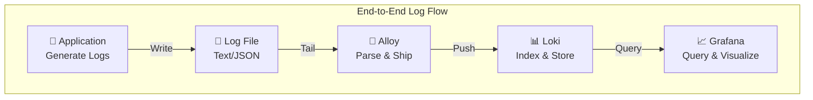

| Feature | Implementation |
|---------|----------------|
| **Log Collection** | Grafana Alloy (file tailing + Docker) |
| **Log Parsing** | Regex (Spring Boot) + JSON (Python) |
| **Log Storage** | Loki with MinIO S3 backend |
| **Log Querying** | LogQL via Grafana |
| **Multi-tenancy** | X-Scope-OrgID header |
| **High Availability** | Read/Write/Backend microservices mode |
