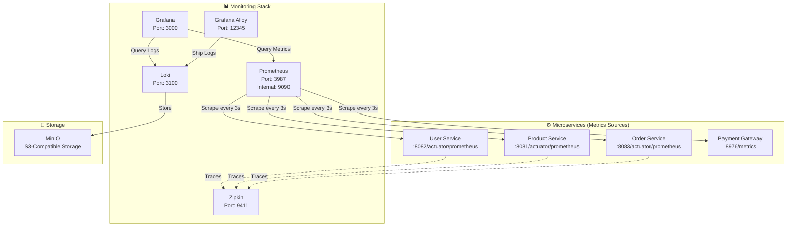
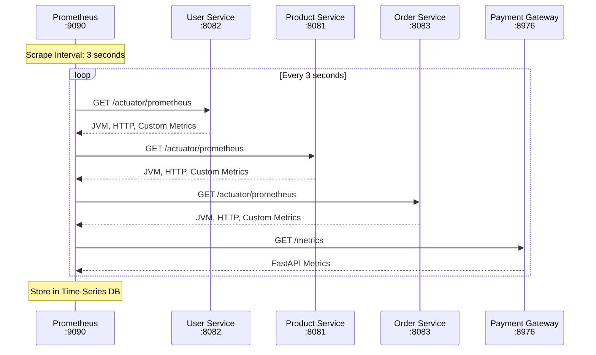
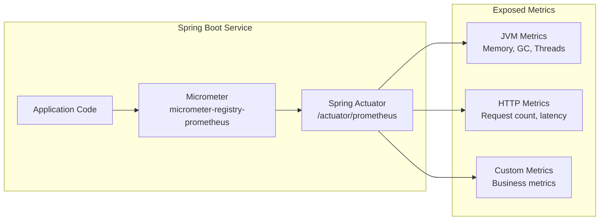
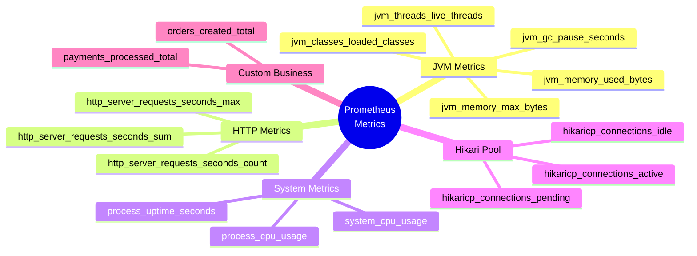
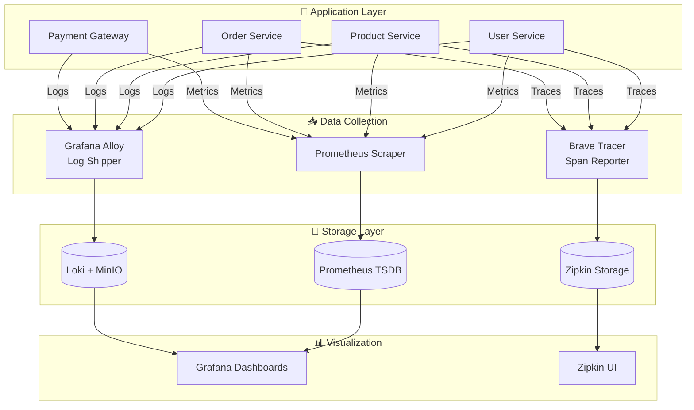
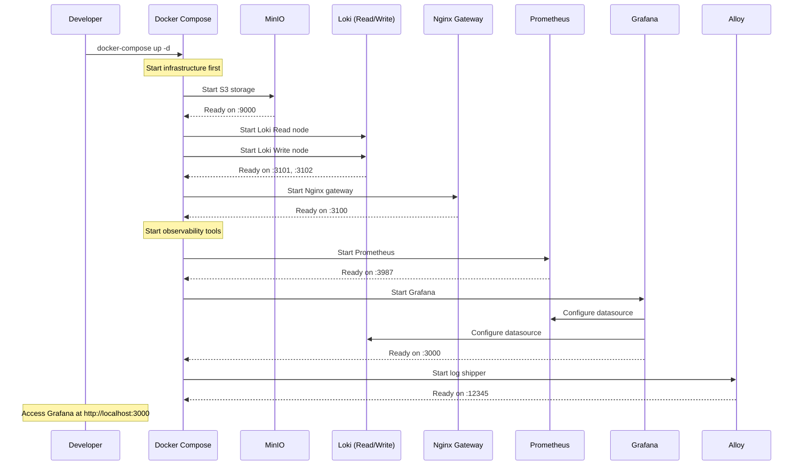
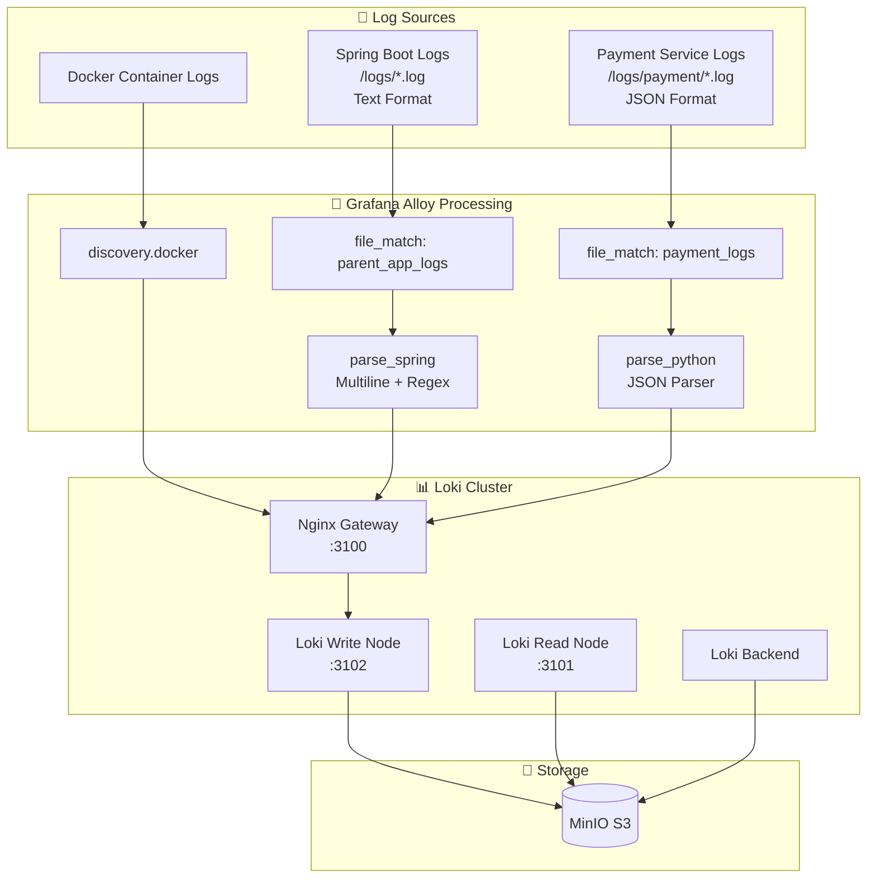
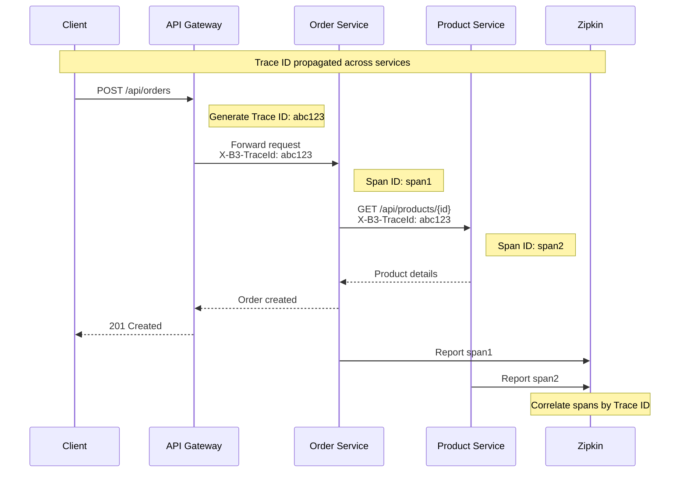
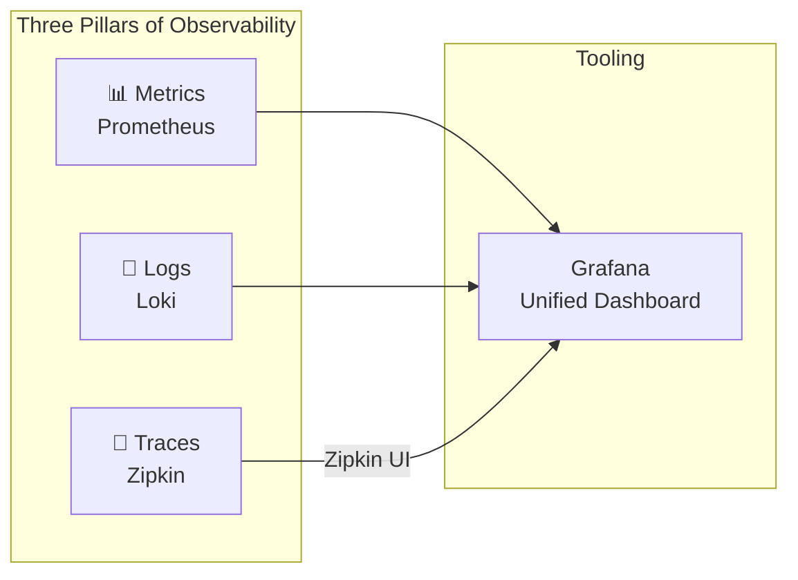

# Prometheus Monitoring Documentation

## 📊 Overview

This e-commerce microservices application uses **Prometheus** for metrics collection and **Grafana** for visualization, forming a complete observability stack along with **Loki** for log aggregation and **Zipkin** for distributed tracing.

---

## 🏗️ Monitoring Architecture



---

## 🔄 Prometheus Metrics Collection Flow



---

## 📦 Technology Stack

| Component | Technology | Port | Purpose |
|-----------|------------|------|---------|
| **Prometheus** | prom/prometheus:v2.44.0 | 3987 (→9090) | Metrics collection & storage |
| **Grafana** | grafana/grafana:latest | 3000 | Visualization dashboards |
| **Loki** | grafana/loki:latest | 3100 | Log aggregation |
| **Alloy** | grafana/alloy:latest | 12345 | Log shipping agent |
| **Zipkin** | openzipkin/zipkin | 9411 | Distributed tracing |
| **MinIO** | minio/minio | 9000 | S3 storage for Loki |

---

## ⚙️ Service Instrumentation

### Spring Boot Services (Java)

All Spring Boot services use **Micrometer** with Prometheus registry:



**Dependencies (pom.xml):**
```xml
<!-- Prometheus metrics registry -->
<dependency>
    <groupId>io.micrometer</groupId>
    <artifactId>micrometer-registry-prometheus</artifactId>
    <scope>runtime</scope>
</dependency>

<!-- Distributed tracing -->
<dependency>
    <groupId>io.micrometer</groupId>
    <artifactId>micrometer-tracing-bridge-brave</artifactId>
</dependency>
```

**Configuration (application.yml):**
```yaml
management:
  endpoints:
    web:
      exposure:
        include: "*"    # Expose all actuator endpoints
  tracing:
    sampling:
      probability: 1.0  # 100% trace sampling
```

### Payment Gateway (Python/FastAPI)

Uses **prometheus-fastapi-instrumentator** for automatic metrics:

```mermaid
flowchart LR
    subgraph FastAPI["FastAPI Service"]
        APP[app.py]
        INST[Instrumentator]
        ENDPOINT[/metrics endpoint]
    end
    
    subgraph AutoMetrics["Auto-Generated Metrics"]
        REQ[http_requests_total]
        LAT[http_request_duration_seconds]
        SIZE[http_request_size_bytes]
        RESP[http_response_size_bytes]
    end
    
    APP --> INST
    INST --> ENDPOINT
    ENDPOINT --> REQ
    ENDPOINT --> LAT
    ENDPOINT --> SIZE
    ENDPOINT --> RESP
```

**Code (app.py):**
```python
from prometheus_fastapi_instrumentator import Instrumentator

app = FastAPI()

# Auto-instrument and expose /metrics endpoint
Instrumentator().instrument(app).expose(app)
```

---

## 📋 Prometheus Configuration

```yaml
# prometheus/prometheus.yml
scrape_configs:
  - job_name: 'product-service'
    metrics_path: '/actuator/prometheus'
    scrape_interval: 3s
    static_configs:
      - targets: ['host.docker.internal:8081']
        labels:
          application: 'product-service'

  - job_name: 'user-service'
    metrics_path: '/actuator/prometheus'
    scrape_interval: 3s
    static_configs:
      - targets: ['host.docker.internal:8082']
        labels:
          application: 'user-service'

  - job_name: 'order-service'
    metrics_path: '/actuator/prometheus'
    scrape_interval: 3s
    static_configs:
      - targets: ['host.docker.internal:8083']
        labels:
          application: 'order-service'

  - job_name: 'payment-service'
    metrics_path: '/metrics'
    scrape_interval: 3s
    static_configs:
      - targets: ['host.docker.internal:8976']
        labels:
          application: 'payment-service'
```

---

## 📈 Metrics Exposed by Services

### Spring Boot Services (via Micrometer)



### FastAPI Payment Service

| Metric | Type | Description |
|--------|------|-------------|
| `http_requests_total` | Counter | Total HTTP requests |
| `http_request_duration_seconds` | Histogram | Request latency |
| `http_request_size_bytes` | Summary | Request body size |
| `http_response_size_bytes` | Summary | Response body size |
| `http_requests_in_progress` | Gauge | Current active requests |

---

## 🔍 Complete Observability Flow



---

## 🚀 Starting the Monitoring Stack



**Command:**
```bash
cd additional/evaluate-prometheus
docker-compose up -d
```

---

## 🎛️ Grafana Data Sources

```yaml
# grafana/datasources/datasources.yml
apiVersion: 1
datasources:
  - name: Prometheus
    type: prometheus
    access: proxy
    url: http://prometheus:9090
    isDefault: true

  - name: Loki
    type: loki
    access: proxy
    url: http://gateway:3100
    jsonData:
      httpHeaderName1: "X-Scope-OrgID"
    secureJsonData:
      httpHeaderValue1: "tenant1"
```

---

## 📂 Log Collection Architecture



---

## 🔗 Distributed Tracing Flow



**Configuration:**
```yaml
management:
  tracing:
    sampling:
      probability: 1.0  # 100% of requests traced
```

---

## 📊 Key PromQL Queries for Grafana

### Request Rate
```promql
rate(http_server_requests_seconds_count{application="order-service"}[5m])
```

### Average Response Time
```promql
rate(http_server_requests_seconds_sum{application="product-service"}[5m]) 
/ rate(http_server_requests_seconds_count{application="product-service"}[5m])
```

### Error Rate
```promql
sum(rate(http_server_requests_seconds_count{status=~"5.."}[5m])) 
/ sum(rate(http_server_requests_seconds_count[5m])) * 100
```

### JVM Memory Usage
```promql
jvm_memory_used_bytes{area="heap"} / jvm_memory_max_bytes{area="heap"} * 100
```

### Active Database Connections
```promql
hikaricp_connections_active{application="order-service"}
```

---

## 🎯 Summary



| Pillar | Tool | Data Source | Endpoint |
|--------|------|-------------|----------|
| **Metrics** | Prometheus | Micrometer / FastAPI Instrumentator | `/actuator/prometheus` or `/metrics` |
| **Logs** | Loki + Alloy | Log files | File-based collection |
| **Traces** | Zipkin | Brave Tracer | Span reporting |
| **Visualization** | Grafana | All above | http://localhost:3000 |

---

## 🔧 Quick Reference

| Service | Metrics URL |
|---------|-------------|
| User Service | http://localhost:8082/actuator/prometheus |
| Product Service | http://localhost:8081/actuator/prometheus |
| Order Service | http://localhost:8083/actuator/prometheus |
| Payment Gateway | http://localhost:8976/metrics |
| Prometheus UI | http://localhost:3987 |
| Grafana | http://localhost:3000 |
| Zipkin | http://localhost:9411 |
