# Zipkin Distributed Tracing Documentation

## 📋 Overview

This e-commerce microservices application uses **Zipkin** for distributed tracing, enabling end-to-end visibility of requests as they flow through multiple services. The tracing is implemented using **Micrometer Tracing** with the **Brave** bridge and automatic span propagation.

---

## 🏗️ Distributed Tracing Architecture

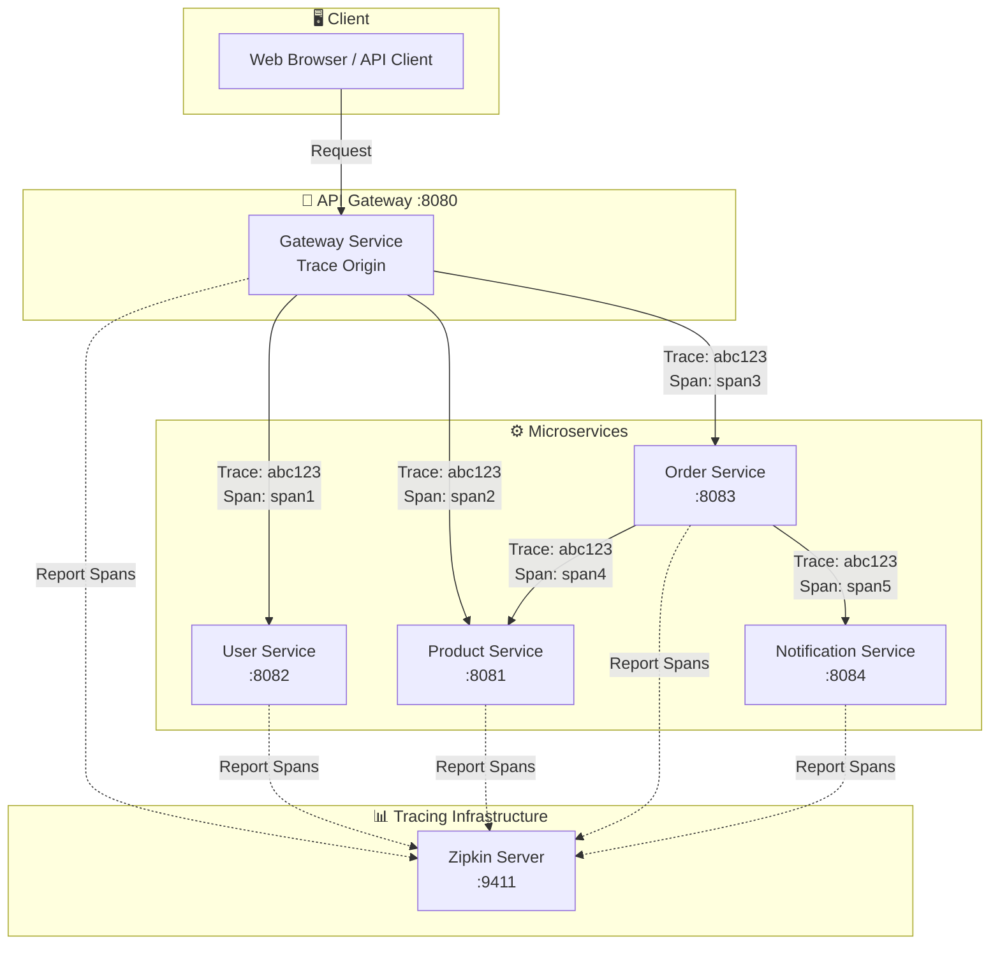

---

## 🔄 Complete Trace Flow

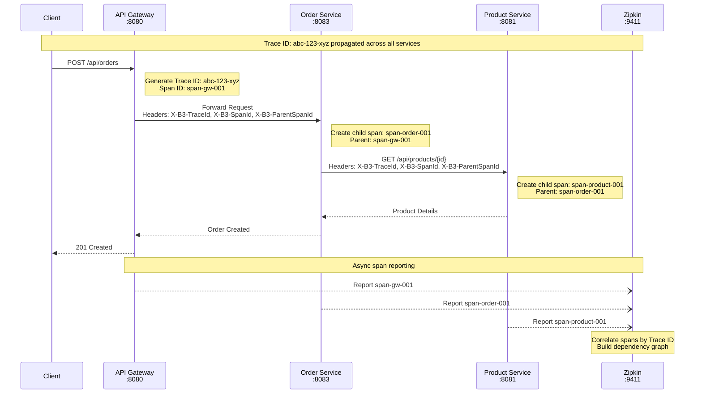

---

## 📦 Technology Stack

| Component | Library | Purpose |
|-----------|---------|---------|
| **Micrometer Tracing** | `micrometer-tracing-bridge-brave` | Tracing abstraction layer |
| **Brave** | `brave` | Distributed tracing instrumentation |
| **Zipkin Reporter** | `zipkin-reporter-brave` | Send spans to Zipkin |
| **Zipkin Server** | `openzipkin/zipkin` | Trace collection & visualization |

---

## ⚙️ Service Configuration

### Maven Dependencies (All Services)

```xml
<!-- Micrometer Tracing with Brave bridge -->
<dependency>
    <groupId>io.micrometer</groupId>
    <artifactId>micrometer-tracing-bridge-brave</artifactId>
</dependency>

<!-- Zipkin span reporter -->
<dependency>
    <groupId>io.zipkin.reporter2</groupId>
    <artifactId>zipkin-reporter-brave</artifactId>
</dependency>
```

### Application Configuration

```yaml
# All services: user-service.yml, product-service.yml, order-service.yml, gateway-service.yml
management:
  tracing:
    sampling:
      probability: 1.0  # 100% of requests are traced
```

---

## 🔗 Trace Context Propagation

### B3 Headers (Zipkin Standard)

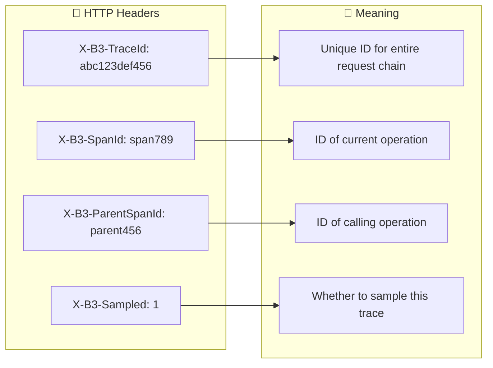

### Propagation in Order Service

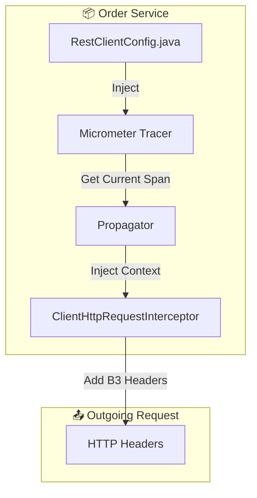

### Code: RestClientConfig.java

```java
@Configuration
public class RestClientConfig {

    @Autowired(required = false)
    private Tracer tracer;

    @Autowired(required = false)
    private Propagator propagator;

    @Bean
    @LoadBalanced
    public RestClient.Builder restClientBuilder() {
        RestClient.Builder builder = RestClient.builder();
        if (observationRegistry != null) {
            builder.requestInterceptor(createTracingInterceptor());
        }
        return builder;
    }

    private ClientHttpRequestInterceptor createTracingInterceptor() {
        return ((request, body, execution) -> {
            if (tracer != null && propagator != null && tracer.currentSpan() != null) {
                // Inject trace context into outgoing request headers
                propagator.inject(
                    tracer.currentTraceContext().context(),
                    request.getHeaders(),
                    (carrier, key, value) -> carrier.add(key, value)
                );
            }
            return execution.execute(request, body);
        });
    }
}
```

---

## 🌳 Span Hierarchy

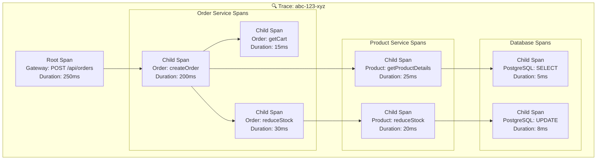

---

## 📊 Zipkin UI Features

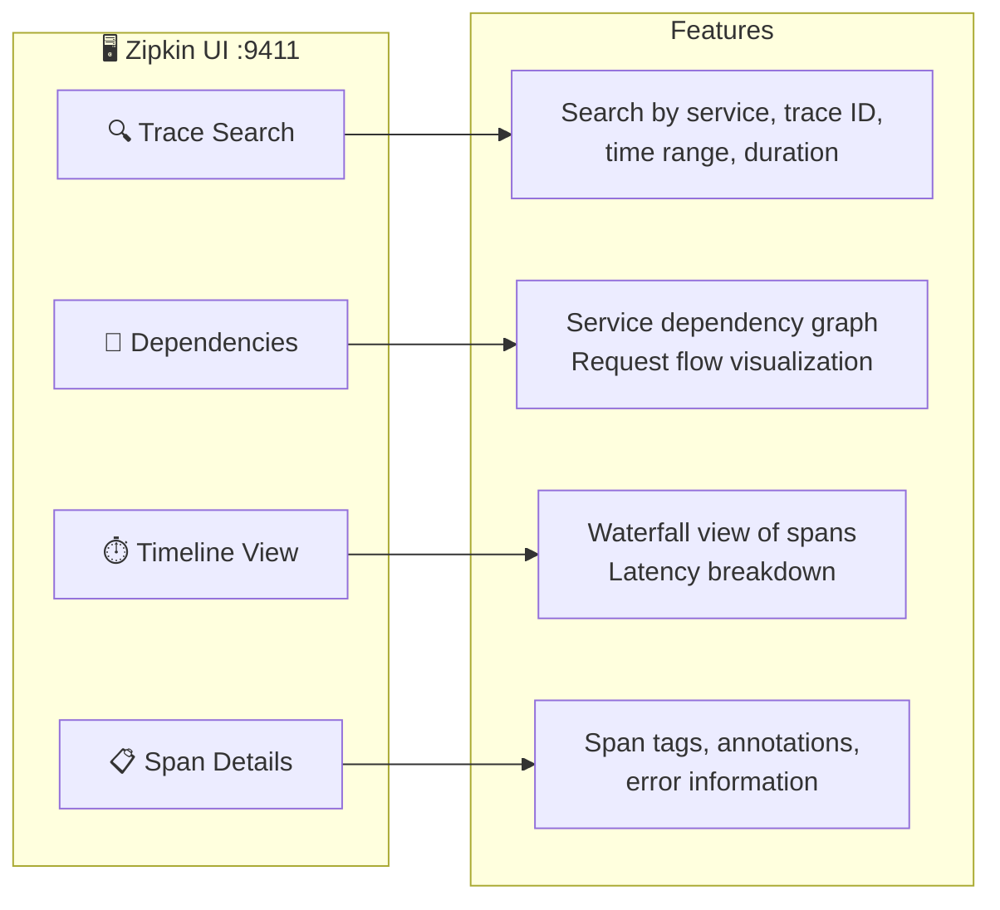

---

## 🔄 Service Communication Patterns

### Traced Communication Types

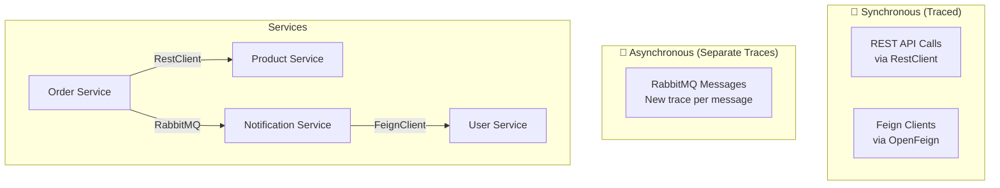

### Service-to-Service Calls

| From | To | Method | Trace Propagation |
|------|-----|--------|-------------------|
| Gateway | All Services | Spring Cloud Gateway | ✅ Automatic |
| Order | Product | RestClient | ✅ Via Interceptor |
| Notification | User | Feign Client | ✅ Automatic |
| Order | Notification | RabbitMQ | ❌ New Trace |

---

## 🚀 Order Creation Trace Example

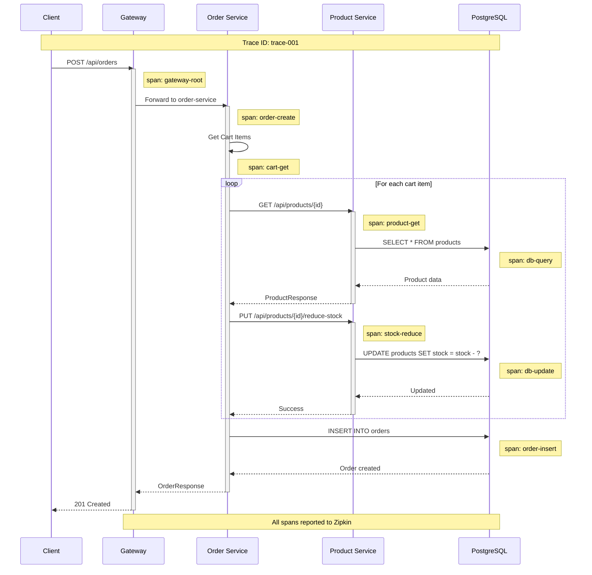

---

## 📋 Span Annotations

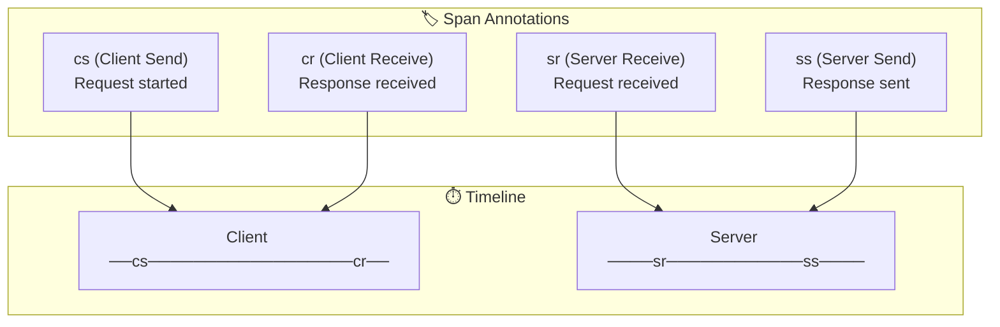

### Common Span Tags

| Tag | Description | Example |
|-----|-------------|---------|
| `http.method` | HTTP method | GET, POST |
| `http.url` | Request URL | /api/orders |
| `http.status_code` | Response code | 200, 404 |
| `mvc.controller.class` | Controller name | OrderController |
| `mvc.controller.method` | Method name | createOrder |
| `error` | Error flag | true |

---

## ⚙️ Docker Compose Setup

```yaml
# docker-compose.yaml
services:
  zipkin:
    image: openzipkin/zipkin
    container_name: zipkin
    ports:
      - 9411:9411
    networks:
      - loki
```

---

## 🔍 Trace Correlation with Logs

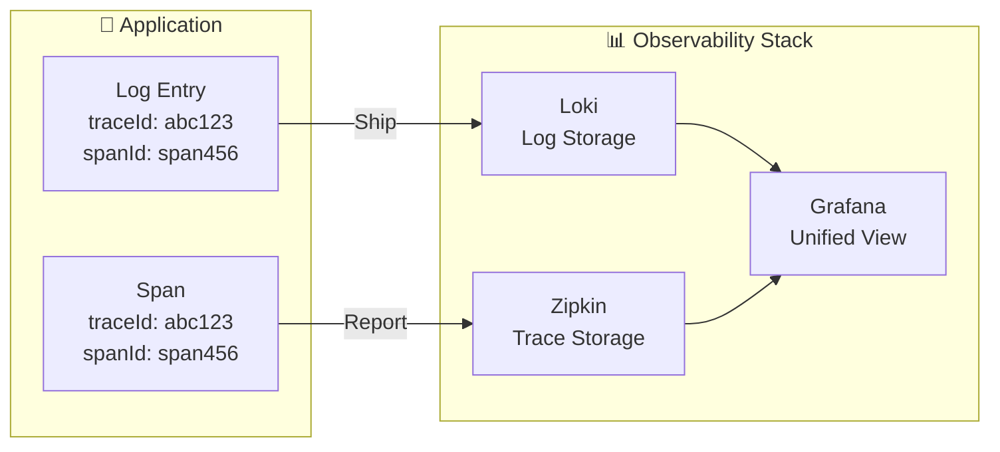

### Log Format with Trace Context

```
2024-01-15T10:30:45.123Z INFO [order-service,abc123,span456] --- OrderController : Creating order
                               └─ service ─┘ └trace┘ └span┘
```

---

## 📊 Sampling Strategies

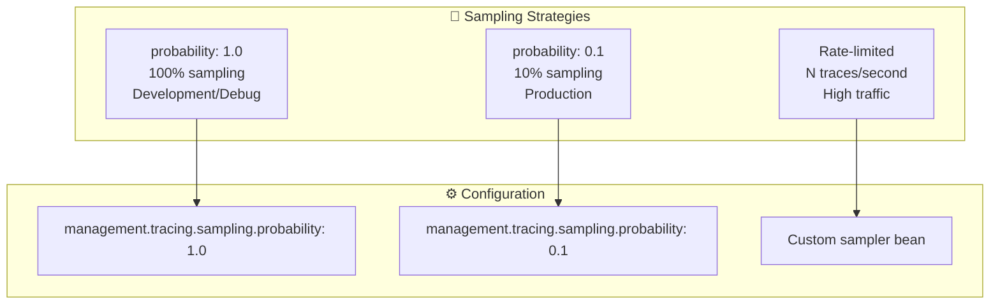

### Current Configuration (All Services)

```yaml
management:
  tracing:
    sampling:
      probability: 1.0  # 100% - suitable for development
```

---

## 🌐 Service Dependencies Visualization

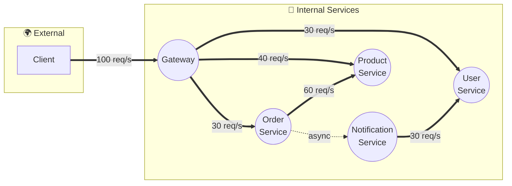

---

## 🛠️ Debugging with Zipkin

### Finding Slow Requests

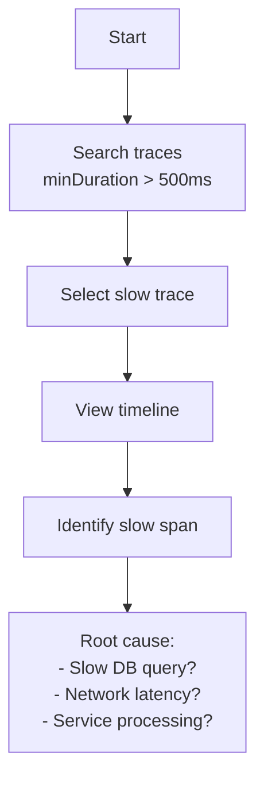

### Finding Errors

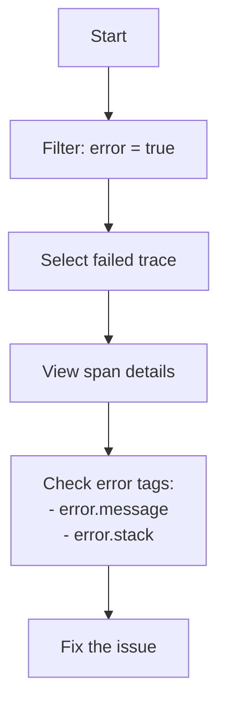

---

## 🚀 Quick Start

### 1. Start Zipkin Server

```bash
cd additional/evaluate-prometheus
docker-compose up -d zipkin
```

### 2. Start Application Services

```bash
# Start services in order
# Config Server → Eureka → Gateway → Services
```

### 3. Access Zipkin UI

Open http://localhost:9411

### 4. Find Traces

1. Select service name (e.g., `order-service`)
2. Click **Run Query**
3. Select a trace to view details

---

## 📈 Performance Considerations

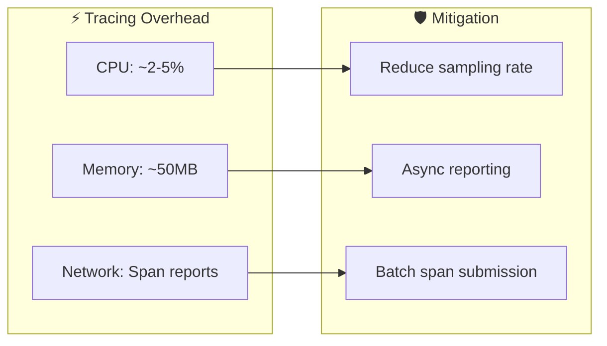

---

## 🎯 Best Practices

### Do ✅

| Practice | Reason |
|----------|--------|
| Use 100% sampling in dev | Full visibility |
| Use 1-10% sampling in prod | Reduce overhead |
| Add custom span tags | Better debugging |
| Correlate with logs | Unified observability |

### Don't ❌

| Anti-pattern | Problem |
|--------------|---------|
| 100% sampling in prod | Performance impact |
| Ignore async boundaries | Missing context |
| No error tagging | Hard to debug |

---

## 📊 Quick Reference

| Endpoint | URL | Purpose |
|----------|-----|---------|
| **Zipkin UI** | http://localhost:9411 | Search and view traces |
| **API: Search** | http://localhost:9411/api/v2/traces | Query traces |
| **API: Services** | http://localhost:9411/api/v2/services | List services |
| **API: Dependencies** | http://localhost:9411/api/v2/dependencies | Service graph |

---

## 🎯 Summary

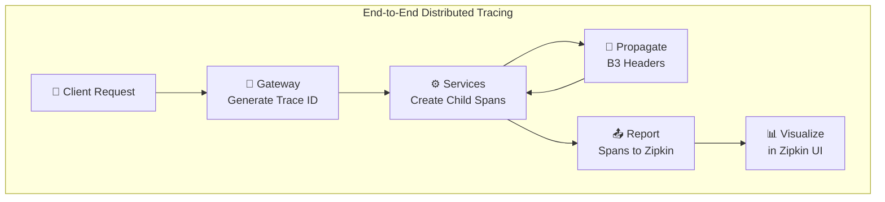

| Feature | Implementation |
|---------|----------------|
| **Tracing Library** | Micrometer Tracing + Brave |
| **Span Reporter** | zipkin-reporter-brave |
| **Context Propagation** | B3 Headers (automatic) |
| **Sampling** | 100% (configurable) |
| **Visualization** | Zipkin UI @ :9411 |
| **Traced Services** | Gateway, User, Product, Order |
