# E-commerce System Architecture

## 1. System Overview

This e-commerce platform follows a **microservices architecture** pattern built with **Spring Boot 3.4.x** and **Spring Cloud 2024.0.x**. The system is designed for scalability, fault tolerance, and maintainability with clear separation of concerns.

### Architecture Pattern: Microservices + Event-Driven Hybrid

The system combines:
- **Synchronous REST APIs** for real-time operations (user actions, queries)
- **Asynchronous messaging** (RabbitMQ/Kafka) for event-driven workflows (order processing, notifications)
- **Service mesh patterns** via Spring Cloud (discovery, configuration, circuit breakers)

### Key Design Principles

| Principle | Implementation |
|-----------|----------------|
| Database per Service | Each service owns its data (MongoDB, PostgreSQL) |
| API Gateway Pattern | Single entry point with routing, rate limiting, authentication |
| Service Discovery | Netflix Eureka for dynamic service registration |
| Centralized Configuration | Spring Cloud Config Server with Git/Native backends |
| Circuit Breaker | Resilience4j for fault tolerance |
| Event Sourcing | RabbitMQ/Kafka for async communication |

---

## 2. Service Breakdown

### Infrastructure Services

| Service | Responsibility | Tech Stack | Port |
|---------|----------------|------------|------|
| **Eureka Server** | Service discovery & registration | Spring Cloud Netflix Eureka | 8761 |
| **Config Server** | Centralized configuration management | Spring Cloud Config | 8888 |
| **API Gateway** | Routing, authentication, rate limiting, circuit breakers | Spring Cloud Gateway, Resilience4j, Redis | 8080 |

### Business Services

| Service | Responsibility | Tech Stack | Database | Port |
|---------|----------------|------------|----------|------|
| **User Service** | Authentication, authorization, user management, loyalty, OAuth2 | Spring Boot, Spring Security, JWT | MongoDB Atlas | 8082 |
| **Product Service** | Product catalog, inventory, campaigns, reviews, FAQs | Spring Boot, JPA | PostgreSQL | 8081 |
| **Order Service** | Orders, cart, shipping, returns, refunds, seller management | Spring Boot, JPA, Resilience4j | PostgreSQL | 8083 |
| **Payment Gateway** | Payment processing, Bakong KHQR integration | Python FastAPI, Motor | MongoDB Atlas | 8976 |
| **Notification Service** | Event-driven notifications (email, Telegram) | Spring Boot, Kafka | - | 8084 |

### Supporting Services

| Service | Responsibility | Tech Stack |
|---------|----------------|------------|
| **RabbitMQ** | Message broker for service communication | CloudAMQP (managed) |
| **Apache Kafka** | Event streaming for notifications | Kafka Cluster |
| **Redis** | Caching, session storage, rate limiting | Redis 7.x |
| **PostgreSQL** | Relational data storage | PostgreSQL 14 |
| **MongoDB** | Document storage for users & payments | MongoDB Atlas |

---

## 3. Architecture Diagrams

### 3.1 High-Level System Architecture

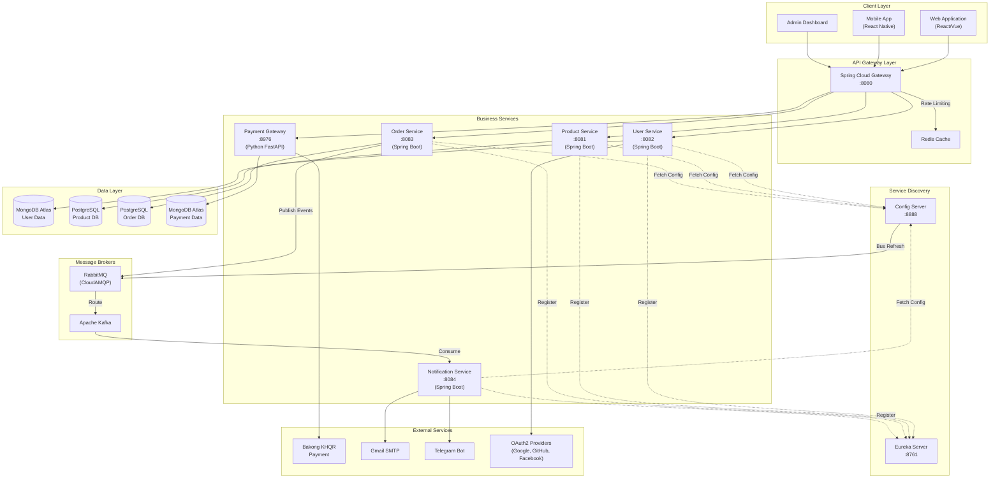

### 3.2 Service Communication Flow

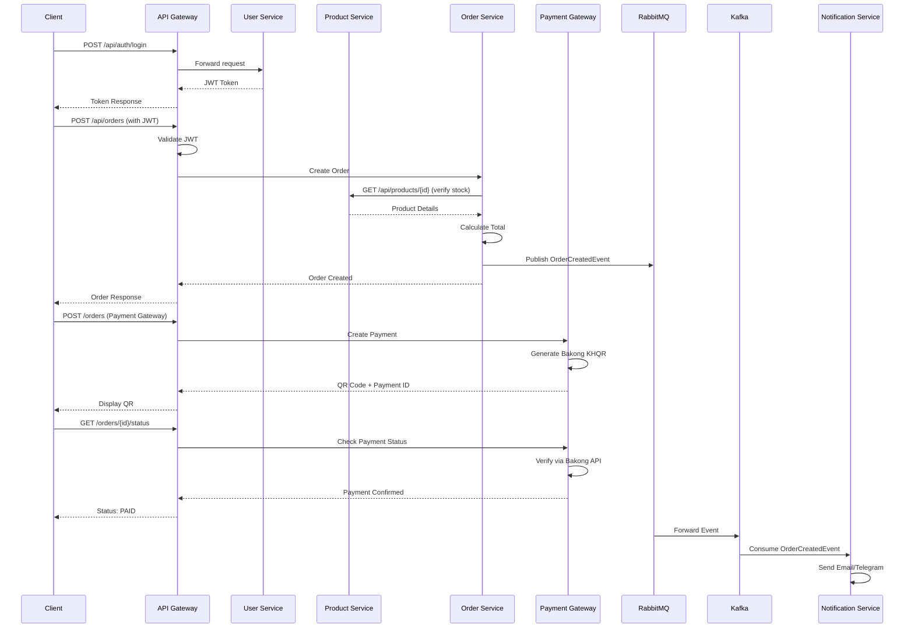

### 3.3 Microservices Deployment Architecture

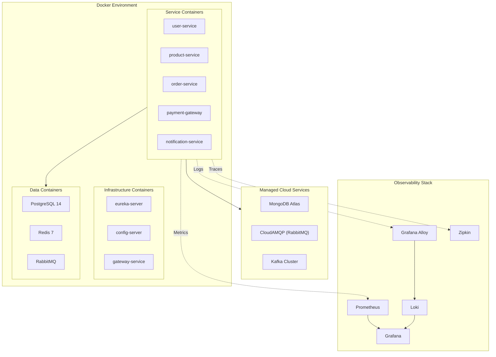

---

## 4. Communication Flow

### 4.1 Synchronous Communication (REST APIs)

| From | To | Purpose | Protocol |
|------|-----|---------|----------|
| Gateway | User Service | Authentication, user data | REST/HTTP |
| Gateway | Product Service | Product catalog, search | REST/HTTP |
| Gateway | Order Service | Order management | REST/HTTP |
| Gateway | Payment Gateway | Payment processing | REST/HTTP |
| Order Service | Product Service | Stock verification | REST/HTTP (Circuit Breaker) |
| Order Service | User Service | User validation | REST/HTTP (Circuit Breaker) |

### 4.2 Asynchronous Communication (Events)

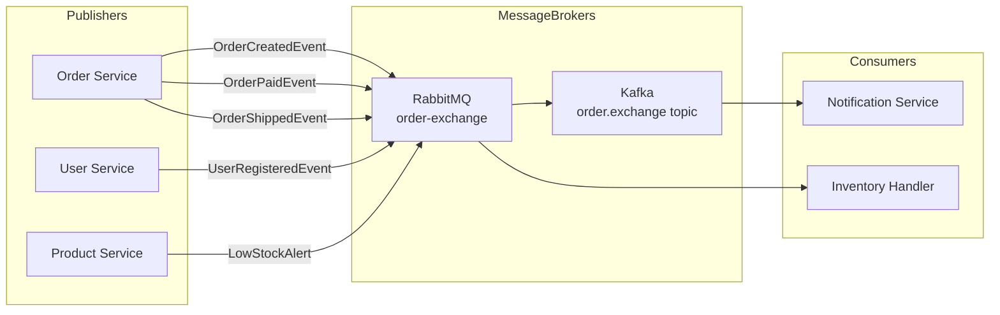

### 4.3 Event Definitions

| Event | Publisher | Consumer(s) | Payload |
|-------|-----------|-------------|---------|
| `OrderCreatedEvent` | Order Service | Notification Service | orderId, userId, items, total |
| `OrderPaidEvent` | Payment Gateway | Order Service, Notification | orderId, paymentId, amount |
| `OrderShippedEvent` | Order Service | Notification Service | orderId, trackingNumber |
| `UserRegisteredEvent` | User Service | Notification Service | userId, email, name |
| `LowStockAlert` | Product Service | Notification Service | productId, currentStock |

### 4.4 RabbitMQ Configuration

```yaml
Exchange: order-exchange (Topic)
Queues:
  - order.queue (routing key: order.tracker)
  - notification.queue (routing key: order.*)
  - inventory.queue (routing key: stock.*)
```

---

## 5. Database Design

### 5.1 Database per Service Pattern

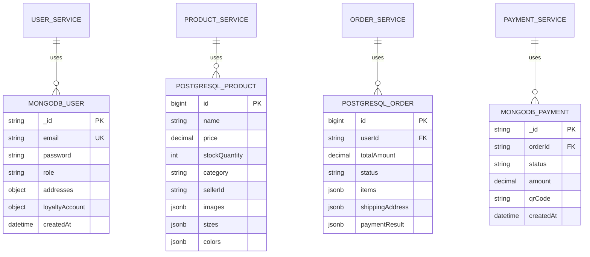

### 5.2 Database Technology Selection

| Service | Database | Rationale |
|---------|----------|-----------|
| User Service | MongoDB | Flexible schema for user profiles, addresses, sessions; horizontal scaling |
| Product Service | PostgreSQL | Complex queries, full-text search, ACID transactions for inventory |
| Order Service | PostgreSQL | Transactional integrity for orders, complex joins for reporting |
| Payment Gateway | MongoDB | Fast writes, flexible payment metadata, audit logs |

### 5.3 Data Consistency Strategy

| Pattern | Usage |
|---------|-------|
| **Saga Pattern** | Multi-service transactions (order → payment → inventory) |
| **Eventual Consistency** | Cross-service data sync via events |
| **Idempotency Keys** | Prevent duplicate payments/orders |
| **Optimistic Locking** | Concurrent inventory updates |

---

## 6. Message Queue / Event System

### 6.1 Technology Stack

| Technology | Purpose | Use Case |
|------------|---------|----------|
| **RabbitMQ (CloudAMQP)** | Service-to-service messaging | Config refresh, order events, direct routing |
| **Apache Kafka** | Event streaming | High-throughput notification processing |

### 6.2 RabbitMQ Architecture

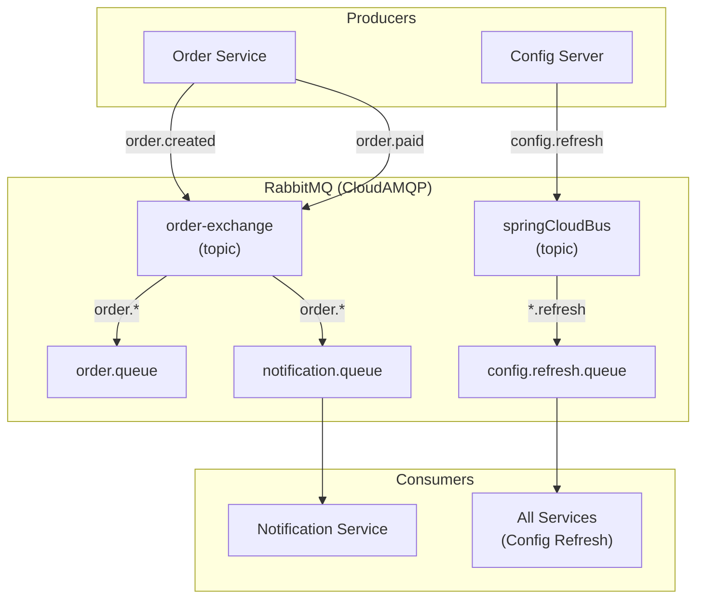

### 6.3 Kafka Configuration

```yaml
# Notification Service - Kafka Consumer
spring:
  cloud:
    stream:
      kafka:
        binder:
          brokers: localhost:9092
      bindings:
        orderEventConsumer-in-0:
          destination: order.exchange
          group: notification-group
```

### 6.4 Event Flow Example: Order Processing

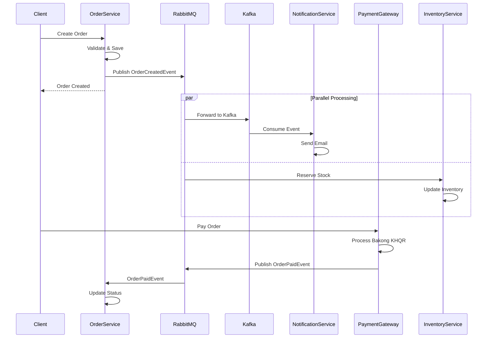

---

## 7. Deployment Architecture

### 7.1 Docker Compose Setup

```yaml
# docker-compose.yml structure
version: '3.8'

services:
  # Infrastructure
  eureka-server:
    build: ./eureka
    ports: ["8761:8761"]

  config-server:
    build: ./configserver
    ports: ["8888:8888"]
    depends_on: [eureka-server]

  gateway:
    build: ./gateway
    ports: ["8080:8080"]
    depends_on: [eureka-server, config-server]

  # Business Services
  user-service:
    build: ./user
    ports: ["8082:8082"]
    depends_on: [eureka-server, config-server]

  product-service:
    build: ./product
    ports: ["8081:8081"]
    depends_on: [eureka-server, config-server, postgres]

  order-service:
    build: ./order
    ports: ["8083:8083"]
    depends_on: [eureka-server, config-server, postgres, rabbitmq]

  payment-gateway:
    build: ./payment-gateway
    ports: ["8976:8976"]

  notification-service:
    build: ./notification
    ports: ["8084:8084"]
    depends_on: [kafka]

  # Data Services
  postgres:
    image: postgres:14
    ports: ["5432:5432"]
    volumes: [postgres_data:/var/lib/postgresql/data]

  redis:
    image: redis:7-alpine
    ports: ["6379:6379"]

  rabbitmq:
    image: rabbitmq:3-management
    ports: ["5672:5672", "15672:15672"]

  # Observability
  prometheus:
    image: prom/prometheus
    ports: ["9090:9090"]

  grafana:
    image: grafana/grafana
    ports: ["3000:3000"]

  loki:
    image: grafana/loki
    ports: ["3100:3100"]
```

### 7.2 Kubernetes Deployment (Future)

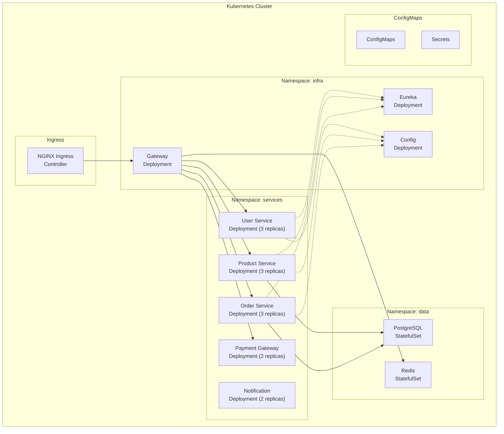

### 7.3 Service Startup Order

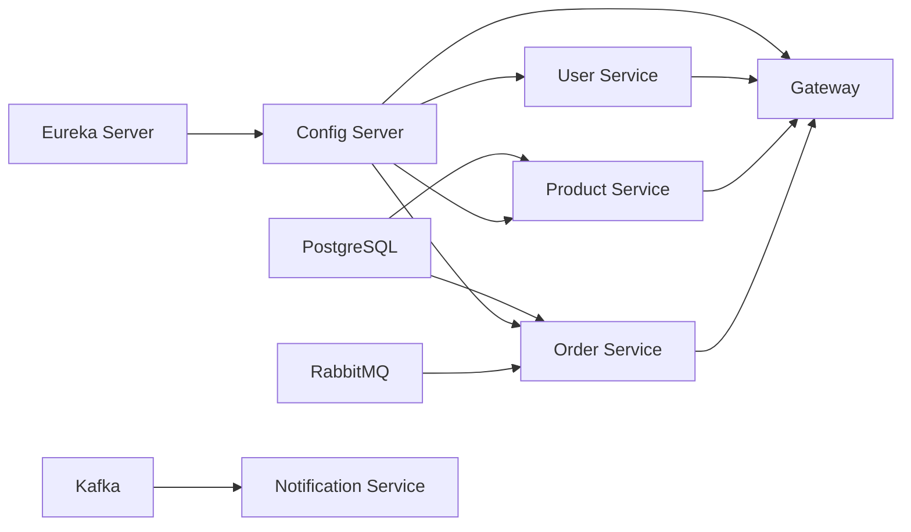

---

## 8. Security Design

### 8.1 Authentication & Authorization Flow

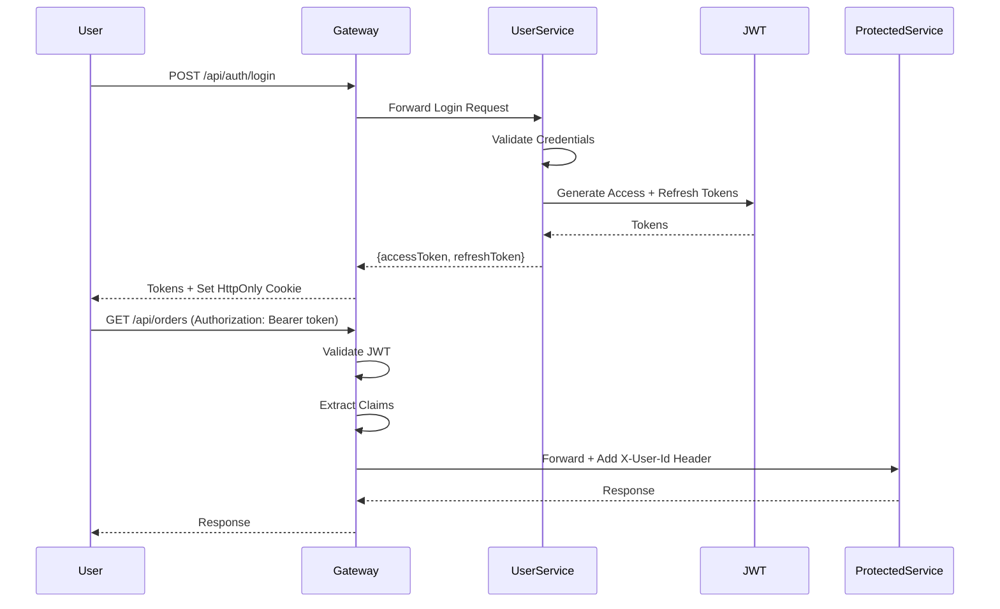

### 8.2 Security Components

| Layer | Security Measure | Implementation |
|-------|------------------|----------------|
| **API Gateway** | Rate Limiting | Resilience4j RateLimiter (2 req/4s default) |
| **API Gateway** | Circuit Breaker | Resilience4j CircuitBreaker |
| **API Gateway** | JWT Validation | Spring Security + JJWT |
| **User Service** | Password Hashing | BCrypt |
| **User Service** | OAuth2 | Google, GitHub, Facebook |
| **User Service** | Session Management | Multi-device session tracking |
| **All Services** | HTTPS | TLS/SSL termination at Gateway |
| **All Services** | CORS | Configured per service |

### 8.3 JWT Token Structure

```json
{
  "header": {
    "alg": "HS256",
    "typ": "JWT"
  },
  "payload": {
    "sub": "user_id",
    "email": "user@example.com",
    "role": "CUSTOMER|SELLER|ADMIN",
    "iat": 1234567890,
    "exp": 1234571490
  }
}
```

### 8.4 Security Best Practices Implemented

| Practice | Implementation |
|----------|----------------|
| Token Expiry | Access: 15min, Refresh: 7 days |
| Password Reset | 6-digit code with expiry |
| Session Invalidation | Logout terminates all sessions option |
| Trust Scoring | Customer behavior analysis |
| Loyalty Security | Referral code validation |

### 8.5 API Gateway Security Configuration

```yaml
resilience4j:
  circuitbreaker:
    configs:
      default:
        slidingWindowSize: 10
        failureRateThreshold: 50
        waitDurationInOpenState: 10000
        permittedNumberOfCallsInHalfOpenState: 3

  ratelimiter:
    configs:
      default:
        limitForPeriod: 2
        limitRefreshPeriod: 4s
        timeoutDuration: 5s

  retry:
    configs:
      default:
        maxAttempts: 5
        waitDuration: 5000
```

---

## 9. Scalability Strategy

### 9.1 Horizontal Scaling

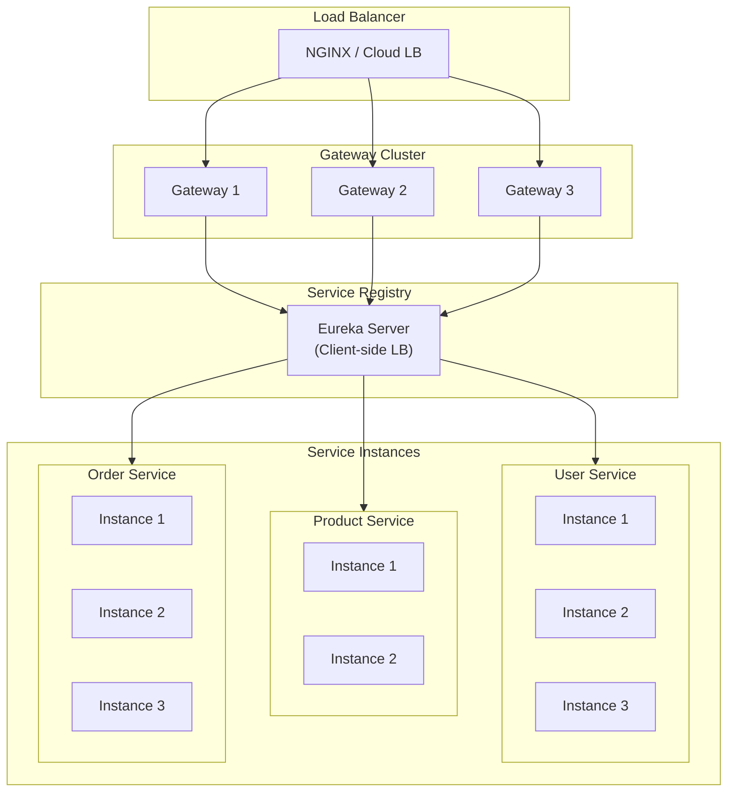

### 9.2 Scaling Strategies by Service

| Service | Scaling Strategy | Considerations |
|---------|------------------|----------------|
| **Gateway** | Horizontal (3+ instances) | Stateless, use Redis for rate limit sync |
| **User Service** | Horizontal (2-3 instances) | Stateless JWT, MongoDB handles scale |
| **Product Service** | Horizontal + Read Replicas | PostgreSQL read replicas for queries |
| **Order Service** | Horizontal + Saga Pattern | Ensure idempotency, distributed locking |
| **Payment Gateway** | Horizontal (2 instances) | Idempotency keys for payments |
| **Notification Service** | Horizontal (auto-scale) | Based on Kafka partition count |

### 9.3 Caching Strategy

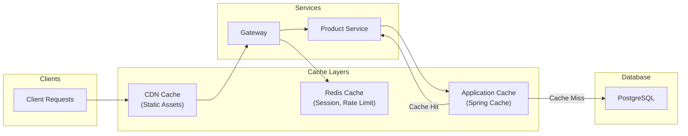

### 9.4 Caching Implementation

| Cache Type | Technology | TTL | Use Case |
|------------|------------|-----|----------|
| Session Cache | Redis | 30 min | User sessions, JWT blacklist |
| Rate Limit | Redis | 4 sec | API rate limiting counters |
| Product Cache | Spring Cache | 5 min | Product listings, categories |
| Config Cache | Config Server | On refresh | Application configuration |

### 9.5 Database Scaling

| Database | Scaling Approach |
|----------|------------------|
| **MongoDB Atlas** | Built-in sharding, auto-scaling |
| **PostgreSQL** | Read replicas, connection pooling (HikariCP) |
| **Redis** | Redis Cluster for high availability |

---

## 10. Observability Stack

### 10.1 Monitoring Architecture

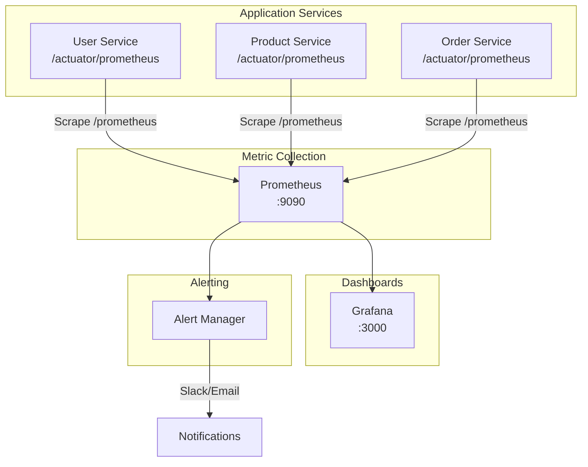

### 10.2 Logging Architecture (Loki Stack)

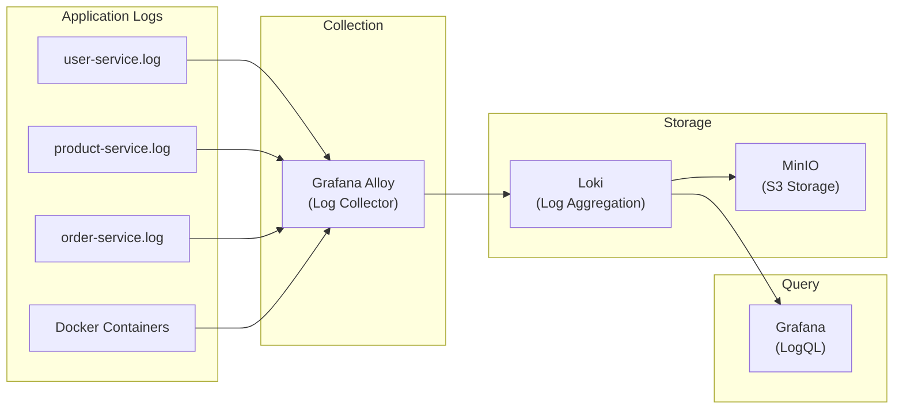

### 10.3 Distributed Tracing (Zipkin)

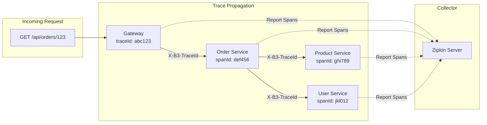

### 10.4 Metrics Exposed

| Metric Category | Examples |
|-----------------|----------|
| **JVM Metrics** | heap memory, GC pauses, thread count |
| **HTTP Metrics** | request count, latency percentiles, error rate |
| **Business Metrics** | orders created, payments processed |
| **Circuit Breaker** | state, failure rate, slow call rate |

---

## 11. Future Improvements

### 11.1 Short-term Enhancements

| Improvement | Priority | Benefit |
|-------------|----------|---------|
| Add Zipkin Server deployment | High | Complete distributed tracing |
| Externalize secrets (Vault) | High | Security compliance |
| Implement CQRS for Orders | Medium | Better read/write scaling |
| Add API versioning | Medium | Backward compatibility |
| GraphQL Gateway | Medium | Flexible client queries |

### 11.2 Long-term Evolution

| Improvement | Description |
|-------------|-------------|
| **Kubernetes Migration** | Full K8s deployment with Helm charts |
| **Service Mesh (Istio)** | Advanced traffic management, mTLS |
| **Event Sourcing** | Full audit trail for orders/payments |
| **Multi-region Deployment** | Geographic redundancy |
| **AI/ML Integration** | Recommendation engine, fraud detection |

### 11.3 Architecture Evolution Roadmap

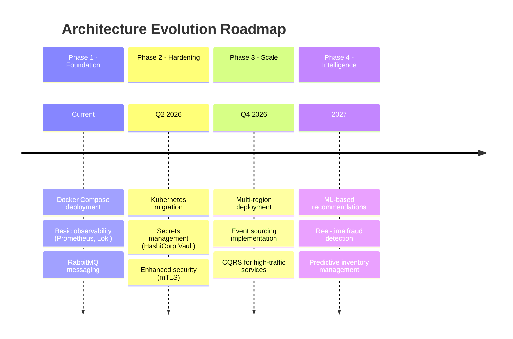

---

## 12. Quick Reference

### 12.1 Service Endpoints

| Service | Local URL | Health Check |
|---------|-----------|--------------|
| Eureka Dashboard | http://localhost:8761 | /actuator/health |
| Config Server | http://localhost:8888 | /actuator/health |
| API Gateway | http://localhost:8080 | /actuator/health |
| User Service | http://localhost:8082 | /actuator/health |
| Product Service | http://localhost:8081 | /actuator/health |
| Order Service | http://localhost:8083 | /actuator/health |
| Payment Gateway | http://localhost:8976 | /health |
| Notification Service | http://localhost:8084 | /actuator/health |

### 12.2 External Dashboards

| Tool | URL | Purpose |
|------|-----|---------|
| Grafana | http://localhost:3000 | Metrics & Logs visualization |
| Prometheus | http://localhost:9090 | Metrics queries |
| RabbitMQ | http://localhost:15672 | Message broker management |
| PGAdmin | http://localhost:5050 | PostgreSQL administration |

### 12.3 Key Configuration Files

| File | Purpose |
|------|---------|
| `configserver/src/main/resources/config/*.yml` | Centralized service configs |
| `docker-compose.yml` | Container orchestration |
| `additional/evaluate-prometheus/prometheus/prometheus.yml` | Prometheus scrape targets |
| `additional/evaluate-prometheus/logging/loki-config.yaml` | Loki log aggregation |

---

## 13. Feature Analysis (Detailed)

### 13.1 User Authentication & Management

| Feature | Description | API Endpoint |
|---------|-------------|--------------|
| **User Registration** | Email-based registration with password validation | `POST /api/auth/register` |
| **User Login** | JWT-based authentication with session tracking | `POST /api/auth/login` |
| **Token Refresh** | Access token renewal using refresh tokens | `POST /api/auth/refresh` |
| **Password Reset** | 6-digit code via email for password recovery | `POST /api/auth/forgot-password` |
| **Session Management** | Multi-device session tracking and termination | `GET /api/auth/sessions` |
| **OAuth2 Integration** | Google, GitHub, Facebook social login | `GET /api/oauth2/{provider}` |
| **User Profile** | Profile management with addresses | `GET/PUT /api/users/{id}` |
| **Trust Scoring** | Customer behavior analysis for fraud prevention | Internal service |

### 13.2 Product Catalog & Management

| Feature | Description | API Endpoint |
|---------|-------------|--------------|
| **Product CRUD** | Create, read, update, delete products | `POST/GET/PUT/DELETE /api/products` |
| **Product Search** | Keyword-based full-text search | `GET /api/products/search` |
| **Advanced Filtering** | Filter by category, price, colors, sizes | `GET /api/products/filter` |
| **Product Reviews** | Customer reviews with ratings | `POST/GET /api/products/{id}/reviews` |
| **Product FAQs** | Question and answer per product | `POST/GET /api/products/{id}/faqs` |
| **Top Products** | Bestseller and trending products | `GET /api/products/top` |
| **Seller Products** | Products by specific seller | `GET /api/products/seller/{sellerId}` |

### 13.3 Shopping Cart

| Feature | Description | API Endpoint |
|---------|-------------|--------------|
| **Add to Cart** | Add products with quantity and variants | `POST /api/cart` |
| **View Cart** | Get all items in user's cart | `GET /api/cart` |
| **Remove Item** | Remove specific product from cart | `DELETE /api/cart/items/{productId}` |
| **Stock Validation** | Real-time stock check before adding | Internal validation |

### 13.4 Order Processing

| Feature | Description | API Endpoint |
|---------|-------------|--------------|
| **Create Order** | Convert cart to order with shipping | `POST /api/orders` |
| **View Orders** | List all user orders | `GET /api/orders/myorders` |
| **Order Details** | Single order information | `GET /api/orders/{id}` |
| **Mark as Paid** | Update payment status | `PUT /api/orders/{id}/pay` |
| **Mark as Delivered** | Update delivery status | `PUT /api/orders/{id}/deliver` |

**Order States:**
```
PENDING → PAID → PROCESSING → SHIPPED → DELIVERED
                    ↓
              CANCELLED / REFUNDED
```

### 13.5 Payment Integration (Bakong KHQR)

| Feature | Description | API Endpoint |
|---------|-------------|--------------|
| **QR Code Generation** | Bakong KHQR payment QR | `POST /orders` (Python) |
| **Payment Status Check** | Real-time payment verification | `GET /orders/{id}/status` |
| **Multi-currency** | Support for USD | Built-in |

### 13.6 Inventory Management

| Feature | Description | API Endpoint |
|---------|-------------|--------------|
| **Inventory Overview** | Stock summary dashboard | `GET /api/inventory/overview` |
| **Stock Alerts** | Low stock notifications | `GET /api/inventory/alerts` |
| **Add Stock** | Increase product quantity | `POST /api/inventory/products/{id}/add-stock` |
| **Remove Stock** | Decrease product quantity | `POST /api/inventory/products/{id}/remove-stock` |
| **Stock History** | Movement audit trail | `GET /api/inventory/products/{id}/history` |
| **Low Stock Report** | Products below threshold | `GET /api/inventory/low-stock` |

### 13.7 Shipping & Delivery

| Feature | Description | API Endpoint |
|---------|-------------|--------------|
| **Shipping Quote** | Calculate shipping cost | `POST /api/shipping/quote` |
| **Province-based Pricing** | Cambodia province rates | Admin configuration |
| **Delivery Tracking** | Shipment status updates | `GET /api/delivery/{id}` |

### 13.8 Returns & Refunds

| Feature | Description | API Endpoint |
|---------|-------------|--------------|
| **Create Return Request** | Initiate product return | `POST /api/returns` |
| **View Returns** | List user's return requests | `GET /api/returns` |
| **Admin Returns** | All returns for admin | `GET /api/returns/admin` |
| **Approve Return** | Accept return request | `PUT /api/returns/{id}/approve` |
| **Reject Return** | Deny return request | `PUT /api/returns/{id}/reject` |
| **Process Refund** | Issue refund | `POST /api/returns/{id}/refund` |

### 13.9 Loyalty & Rewards Program

| Feature | Description | API Endpoint |
|---------|-------------|--------------|
| **Loyalty Account** | Points balance and tier | `GET /api/loyalty/account` |
| **Transaction History** | Points earned/spent | `GET /api/loyalty/transactions` |
| **Redeem Points** | Convert points to discount | `POST /api/loyalty/redeem` |
| **Referral Code** | Generate unique referral link | `GET /api/loyalty/referral-code` |
| **Apply Referral** | Use friend's referral code | `POST /api/loyalty/apply-referral` |

### 13.10 Seller Management

| Feature | Description | API Endpoint |
|---------|-------------|--------------|
| **Financial Overview** | Revenue, balance, fees | `GET /api/sellers/financials/overview` |
| **Transactions** | Sales transaction history | `GET /api/sellers/financials/transactions` |
| **Payouts** | Request/view payouts | `GET/POST /api/sellers/financials/payouts` |
| **Bank Accounts** | Manage payout destinations | `GET/POST /api/sellers/financials/bank-accounts` |
| **Revenue Reports** | Date-range revenue analysis | `GET /api/sellers/financials/reports/revenue` |

### 13.11 Analytics & Reporting

| Feature | Description | API Endpoint |
|---------|-------------|--------------|
| **Overview Dashboard** | Sales, orders, revenue | `GET /api/analytics/overview` |
| **Sales Trends** | Daily/weekly/monthly trends | `GET /api/analytics/sales-trend` |
| **Category Performance** | Sales by category | `GET /api/analytics/category-performance` |
| **Payment Methods** | Payment method breakdown | `GET /api/analytics/payment-methods` |

---

## 14. API Reference Summary

### Complete Endpoint Reference

#### Authentication (`/api/auth`)
| Method | Endpoint | Description |
|--------|----------|-------------|
| POST | `/register` | User registration |
| POST | `/login` | User login |
| POST | `/refresh` | Token refresh |
| POST | `/logout` | User logout |
| GET | `/me` | Current user info |
| POST | `/forgot-password` | Request password reset |
| POST | `/verify-reset-code` | Verify 6-digit code |
| POST | `/reset-password` | Reset password |
| GET | `/sessions` | Active sessions |
| DELETE | `/sessions/{id}` | Terminate session |

#### Products (`/api/products`)
| Method | Endpoint | Description |
|--------|----------|-------------|
| GET | `/` | List all products |
| POST | `/` | Create product |
| GET | `/{id}` | Get product by ID |
| PUT | `/{id}` | Update product |
| DELETE | `/{id}` | Delete product |
| GET | `/search` | Search products |
| GET | `/filter` | Filter products |
| GET | `/top` | Top products |
| GET | `/{id}/reviews` | Product reviews |
| POST | `/{id}/reviews` | Create review |
| GET | `/{id}/faqs` | Product FAQs |

#### Orders (`/api/orders`)
| Method | Endpoint | Description |
|--------|----------|-------------|
| POST | `/` | Create order |
| GET | `/` | All orders |
| GET | `/{id}` | Order by ID |
| GET | `/myorders` | User's orders |
| PUT | `/{id}/pay` | Mark as paid |
| PUT | `/{id}/deliver` | Mark as delivered |

#### Cart (`/api/cart`)
| Method | Endpoint | Description |
|--------|----------|-------------|
| POST | `/` | Add to cart |
| GET | `/` | View cart |
| DELETE | `/items/{productId}` | Remove from cart |

#### Shipping (`/api/shipping`)
| Method | Endpoint | Description |
|--------|----------|-------------|
| POST | `/quote` | Get shipping quote |

#### Returns (`/api/returns`)
| Method | Endpoint | Description |
|--------|----------|-------------|
| POST | `/` | Create return request |
| GET | `/` | User's returns |
| GET | `/admin` | Admin view returns |
| PUT | `/{id}/approve` | Approve return |
| PUT | `/{id}/reject` | Reject return |
| POST | `/{id}/refund` | Process refund |

#### Loyalty (`/api/loyalty`)
| Method | Endpoint | Description |
|--------|----------|-------------|
| GET | `/account` | Loyalty account |
| GET | `/transactions` | Point history |
| POST | `/redeem` | Redeem points |
| GET | `/referral-code` | Get referral code |
| POST | `/apply-referral` | Apply referral |

#### Seller Financials (`/api/sellers/financials`)
| Method | Endpoint | Description |
|--------|----------|-------------|
| GET | `/overview` | Financial overview |
| GET | `/transactions` | Transaction history |
| GET | `/payouts` | View payouts |
| POST | `/payouts/request` | Request payout |
| GET | `/bank-accounts` | Bank accounts |
| POST | `/bank-accounts` | Add bank account |

#### Analytics (`/api/analytics`)
| Method | Endpoint | Description |
|--------|----------|-------------|
| GET | `/overview` | Analytics overview |
| GET | `/sales-trend` | Sales trend |
| GET | `/category-performance` | Category stats |
| GET | `/payment-methods` | Payment breakdown |

#### Inventory (`/api/inventory`)
| Method | Endpoint | Description |
|--------|----------|-------------|
| GET | `/overview` | Inventory overview |
| GET | `/alerts` | Stock alerts |
| POST | `/products/{id}/add-stock` | Add stock |
| POST | `/products/{id}/remove-stock` | Remove stock |
| GET | `/products/{id}/history` | Stock history |
| GET | `/low-stock` | Low stock products |

---

*Document Version: 2.0*
*Last Updated: March 2026*
*Architecture Review: Quarterly*
