# E-Commerce System Architecture

## Executive Summary

This document provides a comprehensive analysis of the e-commerce platform's features, services, and architectural design. The system is built using a **microservices architecture** with **Java Spring Boot** as the primary backend framework and **Python FastAPI** for specialized services. The platform supports multi-vendor operations, Cambodian payment integration (Bakong KHQR), and comprehensive seller management.

---

## 1. Feature Analysis

### 1.1 User Authentication & Management

| Feature | Description | API Endpoint |
|---------|-------------|--------------|
| **User Registration** | Email-based registration with password validation | `POST /api/auth/register` |
| **User Login** | JWT-based authentication with session tracking | `POST /api/auth/login` |
| **Token Refresh** | Access token renewal using refresh tokens | `POST /api/auth/refresh` |
| **Password Reset** | 6-digit code via email for password recovery | `POST /api/auth/forgot-password` |
| **Session Management** | Multi-device session tracking and termination | `GET /api/auth/sessions` |
| **OAuth2 Integration** | Google, GitHub, Facebook social login | `GET /api/oauth2/{provider}` |
| **User Profile** | Profile management with addresses | `GET/PUT /api/users/{id}` |
| **Trust Scoring** | Customer behavior analysis for fraud prevention | Internal service |

**Key Features:**
- BCrypt password hashing
- JWT with configurable expiration
- IP address and User-Agent tracking for sessions
- Rate-limited password reset attempts

---

### 1.2 Product Catalog & Management

| Feature | Description | API Endpoint |
|---------|-------------|--------------|
| **Product CRUD** | Create, read, update, delete products | `POST/GET/PUT/DELETE /api/products` |
| **Product Search** | Keyword-based full-text search | `GET /api/products/search` |
| **Advanced Filtering** | Filter by category, price, colors, sizes | `GET /api/products/filter` |
| **Product Reviews** | Customer reviews with ratings | `POST/GET /api/products/{id}/reviews` |
| **Product FAQs** | Question and answer per product | `POST/GET /api/products/{id}/faqs` |
| **Top Products** | Bestseller and trending products | `GET /api/products/top` |
| **Seller Products** | Products by specific seller | `GET /api/products/seller/{sellerId}` |
| **Image Upload** | Product image management | `POST /api/uploads` |

**Product Attributes:**
- Name, Description, Price
- Stock Quantity
- Category
- Colors & Sizes (variants)
- Images (multiple)
- Seller Information

---

### 1.3 Shopping Cart

| Feature | Description | API Endpoint |
|---------|-------------|--------------|
| **Add to Cart** | Add products with quantity and variants | `POST /api/cart` |
| **View Cart** | Get all items in user's cart | `GET /api/cart` |
| **Remove Item** | Remove specific product from cart | `DELETE /api/cart/items/{productId}` |
| **Stock Validation** | Real-time stock check before adding | Internal validation |

**Cart Item Data:**
- Product ID
- Quantity
- Selected Color
- Selected Size
- Price snapshot

---

### 1.4 Order Processing

| Feature | Description | API Endpoint |
|---------|-------------|--------------|
| **Create Order** | Convert cart to order with shipping | `POST /api/orders` |
| **View Orders** | List all user orders | `GET /api/orders/myorders` |
| **Order Details** | Single order information | `GET /api/orders/{id}` |
| **Mark as Paid** | Update payment status | `PUT /api/orders/{id}/pay` |
| **Mark as Delivered** | Update delivery status | `PUT /api/orders/{id}/deliver` |

**Order States:**
```
PENDING → PAID → PROCESSING → SHIPPED → DELIVERED
                    ↓
              CANCELLED / REFUNDED
```

---

### 1.5 Payment Integration

| Feature | Description | API Endpoint |
|---------|-------------|--------------|
| **QR Code Generation** | Bakong KHQR payment QR | `POST /orders` (Python) |
| **Payment Status Check** | Real-time payment verification | `GET /orders/{id}/status` |
| **Multi-currency** | Support for USD | Built-in |

**Payment Flow:**
1. User initiates payment
2. System generates Bakong KHQR code
3. User scans with banking app
4. System polls for payment confirmation
5. Order status updated to PAID

---

### 1.6 Inventory Management

| Feature | Description | API Endpoint |
|---------|-------------|--------------|
| **Inventory Overview** | Stock summary dashboard | `GET /api/inventory/overview` |
| **Stock Alerts** | Low stock notifications | `GET /api/inventory/alerts` |
| **Add Stock** | Increase product quantity | `POST /api/inventory/products/{id}/add-stock` |
| **Remove Stock** | Decrease product quantity | `POST /api/inventory/products/{id}/remove-stock` |
| **Stock History** | Movement audit trail | `GET /api/inventory/products/{id}/history` |
| **Low Stock Report** | Products below threshold | `GET /api/inventory/low-stock` |

**Alert Types:**
- LOW_STOCK
- OUT_OF_STOCK
- REORDER_POINT

---

### 1.7 Shipping & Delivery

| Feature | Description | API Endpoint |
|---------|-------------|--------------|
| **Shipping Quote** | Calculate shipping cost | `POST /api/shipping/quote` |
| **Province-based Pricing** | Cambodia province rates | Admin configuration |
| **Delivery Tracking** | Shipment status updates | `GET /api/delivery/{id}` |
| **Failed Delivery** | Attempt tracking | Internal service |

**Shipping Configuration:**
- Base rate per province
- Weight-based pricing
- Free shipping thresholds
- Express delivery options

---

### 1.8 Returns & Refunds

| Feature | Description | API Endpoint |
|---------|-------------|--------------|
| **Create Return Request** | Initiate product return | `POST /api/returns` |
| **View Returns** | List user's return requests | `GET /api/returns` |
| **Admin Returns** | All returns for admin | `GET /api/returns/admin` |
| **Approve Return** | Accept return request | `PUT /api/returns/{id}/approve` |
| **Reject Return** | Deny return request | `PUT /api/returns/{id}/reject` |
| **Process Refund** | Issue refund | `POST /api/returns/{id}/refund` |

**Return Request Data:**
- Order ID
- Product ID
- Reason (text)
- Photos (evidence)

---

### 1.9 Loyalty & Rewards Program

| Feature | Description | API Endpoint |
|---------|-------------|--------------|
| **Loyalty Account** | Points balance and tier | `GET /api/loyalty/account` |
| **Transaction History** | Points earned/spent | `GET /api/loyalty/transactions` |
| **Redeem Points** | Convert points to discount | `POST /api/loyalty/redeem` |
| **Referral Code** | Generate unique referral link | `GET /api/loyalty/referral-code` |
| **Apply Referral** | Use friend's referral code | `POST /api/loyalty/apply-referral` |

**Points System:**
- Earn points on purchases (1 point per $1)
- Bonus points for referrals
- Tiered benefits (Bronze, Silver, Gold)
- Point expiration policy

---

### 1.10 Seller Management

| Feature | Description | API Endpoint |
|---------|-------------|--------------|
| **Financial Overview** | Revenue, balance, fees | `GET /api/sellers/financials/overview` |
| **Transactions** | Sales transaction history | `GET /api/sellers/financials/transactions` |
| **Payouts** | Request/view payouts | `GET/POST /api/sellers/financials/payouts` |
| **Bank Accounts** | Manage payout destinations | `GET/POST /api/sellers/financials/bank-accounts` |
| **Revenue Reports** | Date-range revenue analysis | `GET /api/sellers/financials/reports/revenue` |
| **Order Management** | Seller-specific orders | `GET /api/sellers/orders` |
| **Review Management** | Respond to product reviews | `PUT /api/sellers/reviews/{id}` |
| **FAQ Management** | Answer product questions | `PUT /api/sellers/faqs/{id}` |

---

### 1.11 Marketing & Campaigns

| Feature | Description | API Endpoint |
|---------|-------------|--------------|
| **Create Campaign** | Marketing campaign setup | `POST /api/campaigns` |
| **Coupon Codes** | Discount code management | `POST /api/campaigns/{id}/coupons` |
| **Campaign Analytics** | Performance metrics | `GET /api/campaigns/{id}/stats` |

---

### 1.12 Analytics & Reporting

| Feature | Description | API Endpoint |
|---------|-------------|--------------|
| **Overview Dashboard** | Sales, orders, revenue | `GET /api/analytics/overview` |
| **Sales Trends** | Daily/weekly/monthly trends | `GET /api/analytics/sales-trend` |
| **Category Performance** | Sales by category | `GET /api/analytics/category-performance` |
| **Payment Methods** | Payment method breakdown | `GET /api/analytics/payment-methods` |

---

### 1.13 Admin Dashboard

| Feature | Description | API Endpoint |
|---------|-------------|--------------|
| **Store Settings** | Global store configuration | `GET/PUT /api/admin/store-settings` |
| **Shipping Config** | Province shipping rates | `GET/PUT /api/admin/shipping-config` |
| **Return Statistics** | Return analytics | `GET /api/returns/admin/stats` |
| **User Management** | Admin user operations | `GET /api/admin/users` |

---

## 2. Service Architecture

### 2.1 Service Decomposition

Based on feature analysis, the system is decomposed into the following microservices:

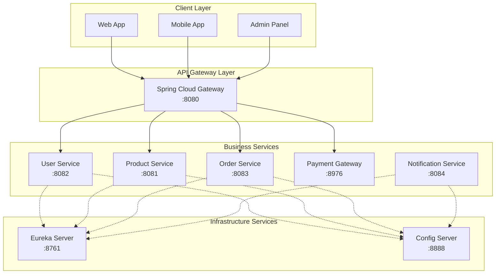
```mermaid
graph TB
    subgraph "Client Layer"
        WEB[Web App]
        MOBILE[Mobile App]
        ADMIN[Admin Panel]
    end

    subgraph "API Gateway Layer"
        GW[Spring Cloud Gateway<br/>:8080]
    end

    subgraph "Business Services"
        US[User Service<br/>:8082]
        PS[Product Service<br/>:8081]
        OS[Order Service<br/>:8083]
        PG[Payment Gateway<br/>:8976]
        NS[Notification Service<br/>:8084]
    end

    subgraph "Infrastructure Services"
        EUR[Eureka Server<br/>:8761]
        CFG[Config Server<br/>:8888]
    end

    WEB & MOBILE & ADMIN --> GW
    GW --> US & PS & OS & PG
    US & PS & OS & NS -.-> EUR
    US & PS & OS & NS -.-> CFG
```

### 2.2 Service Responsibility Matrix

| Service | Domain | Responsibilities | Tech Stack |
|---------|--------|------------------|------------|
| **User Service** | Identity | Authentication, Authorization, Sessions, Loyalty, Trust Scoring | Spring Boot, MongoDB |
| **Product Service** | Catalog | Products, Inventory, Reviews, FAQs, Campaigns | Spring Boot, PostgreSQL |
| **Order Service** | Commerce | Orders, Cart, Shipping, Returns, Seller Financials, Analytics | Spring Boot, PostgreSQL |
| **Payment Gateway** | Payments | QR Generation, Payment Verification, Bakong Integration | Python FastAPI, MongoDB |
| **Notification Service** | Communication | Email, Push, Telegram, Event Processing | Spring Boot, Kafka |
| **API Gateway** | Routing | Authentication, Rate Limiting, Routing | Spring Cloud Gateway |
| **Config Server** | Configuration | Centralized Configuration | Spring Cloud Config |
| **Eureka Server** | Discovery | Service Registry | Netflix Eureka |

### 2.3 Architecture Style Decision

**Decision: Microservices Architecture**

**Rationale:**

| Factor | Why Microservices? |
|--------|-------------------|
| **Independent Scaling** | Product catalog and order processing have different scaling needs |
| **Technology Diversity** | Payment service uses Python (Bakong SDK), rest uses Java |
| **Team Autonomy** | Different teams can own different services |
| **Fault Isolation** | Payment failure shouldn't affect product browsing |
| **Deployment Independence** | Can deploy user service without affecting orders |

**Trade-offs Accepted:**
- Increased operational complexity
- Network latency between services
- Data consistency challenges (eventual consistency)
- Need for service discovery and configuration management

---

## 3. System Architecture Diagram

### 3.1 Complete System Architecture

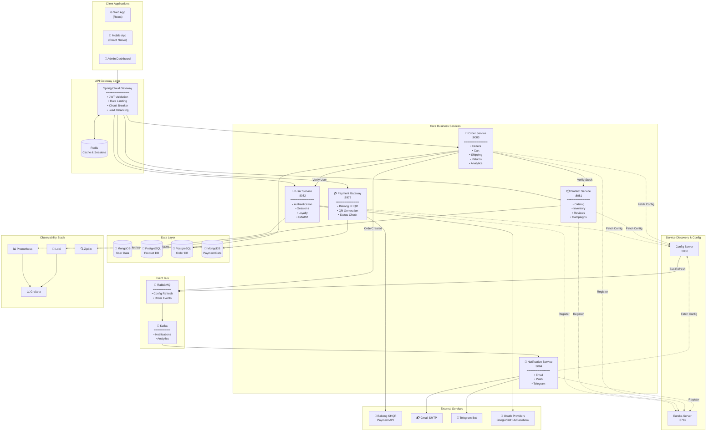
```mermaid
flowchart TB
    subgraph Clients["Client Applications"]
        direction LR
        WEB["🌐 Web App<br/>(React)"]
        MOBILE["📱 Mobile App<br/>(React Native)"]
        ADMIN["👤 Admin Dashboard"]
    end

    subgraph Gateway["API Gateway Layer"]
        GW["Spring Cloud Gateway<br/>━━━━━━━━━━━━━<br/>• JWT Validation<br/>• Rate Limiting<br/>• Circuit Breaker<br/>• Load Balancing"]
        REDIS[("Redis<br/>Cache & Sessions")]
        GW <--> REDIS
    end

    subgraph Discovery["Service Discovery & Config"]
        EUR["Eureka Server<br/>:8761"]
        CFG["Config Server<br/>:8888"]
    end

    subgraph CoreServices["Core Business Services"]
        US["👤 User Service<br/>:8082<br/>━━━━━━━━━━━━━<br/>• Authentication<br/>• Sessions<br/>• Loyalty<br/>• OAuth2"]

        PS["📦 Product Service<br/>:8081<br/>━━━━━━━━━━━━━<br/>• Catalog<br/>• Inventory<br/>• Reviews<br/>• Campaigns"]

        OS["🛒 Order Service<br/>:8083<br/>━━━━━━━━━━━━━<br/>• Orders<br/>• Cart<br/>• Shipping<br/>• Returns<br/>• Analytics"]

        PG["💳 Payment Gateway<br/>:8976<br/>━━━━━━━━━━━━━<br/>• Bakong KHQR<br/>• QR Generation<br/>• Status Check"]

        NS["📧 Notification Service<br/>:8084<br/>━━━━━━━━━━━━━<br/>• Email<br/>• Push<br/>• Telegram"]
    end

    subgraph DataStores["Data Layer"]
        MONGO_USER[("🍃 MongoDB<br/>User Data")]
        PG_PRODUCT[("🐘 PostgreSQL<br/>Product DB")]
        PG_ORDER[("🐘 PostgreSQL<br/>Order DB")]
        MONGO_PAY[("🍃 MongoDB<br/>Payment Data")]
    end

    subgraph Messaging["Event Bus"]
        RMQ["🐰 RabbitMQ<br/>━━━━━━━━━━<br/>• Config Refresh<br/>• Order Events"]
        KAFKA["📨 Kafka<br/>━━━━━━━━━<br/>• Notifications<br/>• Analytics"]
    end

    subgraph External["External Services"]
        BAKONG["🏦 Bakong KHQR<br/>Payment API"]
        GMAIL["📬 Gmail SMTP"]
        TELEGRAM["📱 Telegram Bot"]
        OAUTH["🔐 OAuth Providers<br/>Google/GitHub/Facebook"]
    end

    subgraph Observability["Observability Stack"]
        PROM["📊 Prometheus"]
        GRAF["📈 Grafana"]
        LOKI["📝 Loki"]
        ZIP["🔍 Zipkin"]
    end

    %% Client connections
    Clients --> GW

    %% Gateway to services
    GW --> US & PS & OS & PG

    %% Service discovery
    US & PS & OS & NS -.->|Register| EUR
    US & PS & OS & NS -.->|Fetch Config| CFG

    %% Database connections
    US --> MONGO_USER
    PS --> PG_PRODUCT
    OS --> PG_ORDER
    PG --> MONGO_PAY

    %% Inter-service communication
    OS -->|Verify Stock| PS
    OS -->|Verify User| US

    %% Message queue
    OS -->|OrderCreated| RMQ
    RMQ --> KAFKA
    KAFKA --> NS

    %% External integrations
    PG --> BAKONG
    US --> OAUTH
    NS --> GMAIL & TELEGRAM

    %% Config refresh
    CFG -->|Bus Refresh| RMQ

    %% Observability
    CoreServices -.->|Metrics| PROM
    CoreServices -.->|Logs| LOKI
    CoreServices -.->|Traces| ZIP
    PROM & LOKI --> GRAF
```

### 3.2 Domain-Driven Design Boundaries

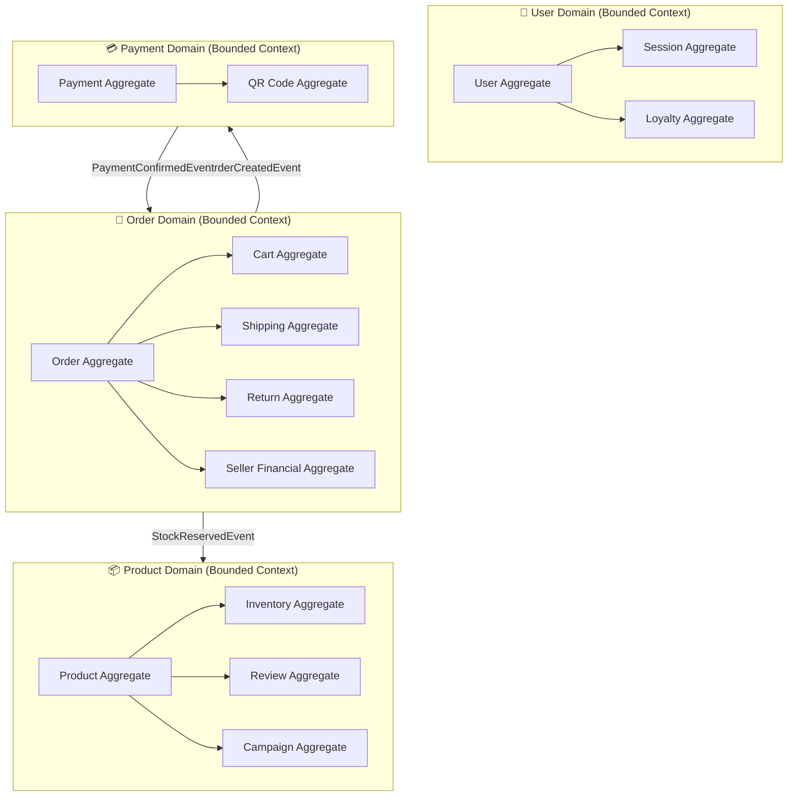
```mermaid
graph TB
    subgraph UserDomain["👤 User Domain (Bounded Context)"]
        UA[User Aggregate]
        SA[Session Aggregate]
        LA[Loyalty Aggregate]

        UA --> SA
        UA --> LA
    end

    subgraph ProductDomain["📦 Product Domain (Bounded Context)"]
        PA[Product Aggregate]
        IA[Inventory Aggregate]
        RA[Review Aggregate]
        CA[Campaign Aggregate]

        PA --> IA
        PA --> RA
        PA --> CA
    end

    subgraph OrderDomain["🛒 Order Domain (Bounded Context)"]
        OA[Order Aggregate]
        CTA[Cart Aggregate]
        SHA[Shipping Aggregate]
        RTA[Return Aggregate]
        SFA[Seller Financial Aggregate]

        OA --> CTA
        OA --> SHA
        OA --> RTA
        OA --> SFA
    end

    subgraph PaymentDomain["💳 Payment Domain (Bounded Context)"]
        PYA[Payment Aggregate]
        QRA[QR Code Aggregate]

        PYA --> QRA
    end

    %% Cross-domain events
    OrderDomain -->|OrderCreatedEvent| PaymentDomain
    PaymentDomain -->|PaymentConfirmedEvent| OrderDomain
    OrderDomain -->|StockReservedEvent| ProductDomain
```

---

## 4. Communication Flow

### 4.1 Synchronous Communication (REST APIs)

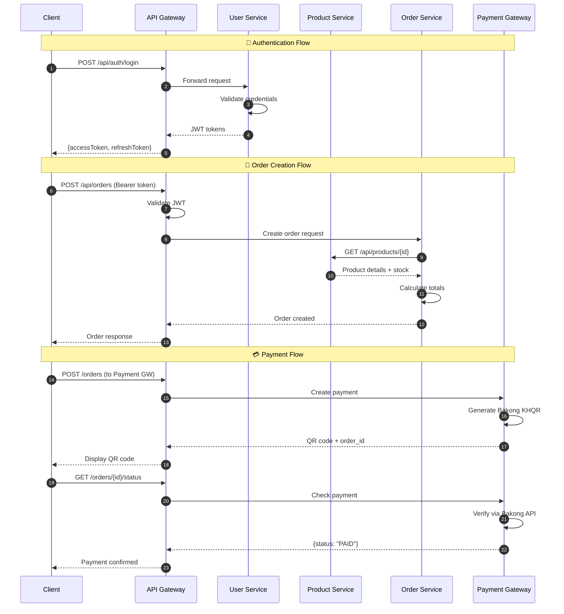
```mermaid
sequenceDiagram
    autonumber
    participant C as Client
    participant GW as API Gateway
    participant US as User Service
    participant PS as Product Service
    participant OS as Order Service
    participant PG as Payment Gateway

    Note over C,PG: 🔐 Authentication Flow
    C->>GW: POST /api/auth/login
    GW->>US: Forward request
    US->>US: Validate credentials
    US-->>GW: JWT tokens
    GW-->>C: {accessToken, refreshToken}

    Note over C,PG: 🛒 Order Creation Flow
    C->>GW: POST /api/orders (Bearer token)
    GW->>GW: Validate JWT
    GW->>OS: Create order request
    OS->>PS: GET /api/products/{id}
    PS-->>OS: Product details + stock
    OS->>OS: Calculate totals
    OS-->>GW: Order created
    GW-->>C: Order response

    Note over C,PG: 💳 Payment Flow
    C->>GW: POST /orders (to Payment GW)
    GW->>PG: Create payment
    PG->>PG: Generate Bakong KHQR
    PG-->>GW: QR code + order_id
    GW-->>C: Display QR code

    C->>GW: GET /orders/{id}/status
    GW->>PG: Check payment
    PG->>PG: Verify via Bakong API
    PG-->>GW: {status: "PAID"}
    GW-->>C: Payment confirmed
```

### 4.2 Asynchronous Communication (Events)

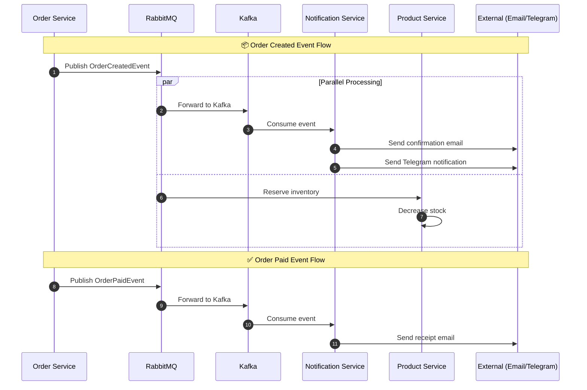
```mermaid
sequenceDiagram
    autonumber
    participant OS as Order Service
    participant RMQ as RabbitMQ
    participant KFK as Kafka
    participant NS as Notification Service
    participant PS as Product Service
    participant EXT as External (Email/Telegram)

    Note over OS,EXT: 📦 Order Created Event Flow
    OS->>RMQ: Publish OrderCreatedEvent

    par Parallel Processing
        RMQ->>KFK: Forward to Kafka
        KFK->>NS: Consume event
        NS->>EXT: Send confirmation email
        NS->>EXT: Send Telegram notification
    and
        RMQ->>PS: Reserve inventory
        PS->>PS: Decrease stock
    end

    Note over OS,EXT: ✅ Order Paid Event Flow
    OS->>RMQ: Publish OrderPaidEvent
    RMQ->>KFK: Forward to Kafka
    KFK->>NS: Consume event
    NS->>EXT: Send receipt email
```

### 4.3 Service Communication Matrix

| From | To | Method | Purpose | Pattern |
|------|-----|--------|---------|---------|
| Gateway | User Service | REST | Authentication | Sync |
| Gateway | Product Service | REST | Product queries | Sync |
| Gateway | Order Service | REST | Order operations | Sync |
| Gateway | Payment Gateway | REST | Payment processing | Sync |
| Order Service | Product Service | REST | Stock verification | Sync + Circuit Breaker |
| Order Service | User Service | REST | User validation | Sync + Circuit Breaker |
| Order Service | RabbitMQ | AMQP | Order events | Async |
| RabbitMQ | Kafka | Bridge | Event streaming | Async |
| Kafka | Notification Service | Consumer | Process notifications | Async |
| Config Server | All Services | RabbitMQ Bus | Config refresh | Async |

### 4.4 Event Catalog

| Event Name | Publisher | Consumers | Payload |
|------------|-----------|-----------|---------|
| `OrderCreatedEvent` | Order Service | Notification, Inventory | orderId, userId, items[], total |
| `OrderPaidEvent` | Order Service | Notification | orderId, paymentId, amount |
| `OrderShippedEvent` | Order Service | Notification | orderId, trackingNumber |
| `OrderDeliveredEvent` | Order Service | Notification, Loyalty | orderId, deliveryDate |
| `OrderCancelledEvent` | Order Service | Inventory, Notification | orderId, reason |
| `PaymentConfirmedEvent` | Payment Gateway | Order Service | orderId, transactionId |
| `StockLowEvent` | Product Service | Notification | productId, currentStock |
| `UserRegisteredEvent` | User Service | Notification | userId, email |
| `RefundProcessedEvent` | Order Service | Notification | returnId, amount |

---

## 5. Infrastructure Architecture

### 5.1 Infrastructure Components

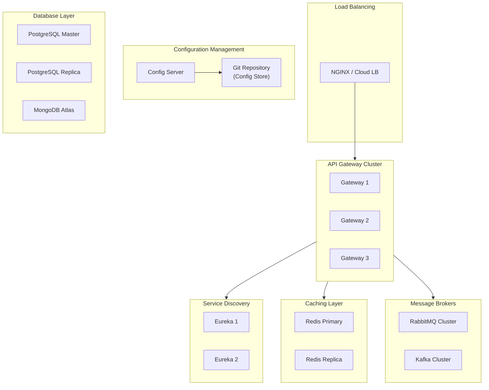
```mermaid
graph TB
    subgraph LoadBalancing["Load Balancing"]
        LB["NGINX / Cloud LB"]
    end

    subgraph APIGateway["API Gateway Cluster"]
        GW1["Gateway 1"]
        GW2["Gateway 2"]
        GW3["Gateway 3"]
    end

    subgraph ServiceDiscovery["Service Discovery"]
        EUR1["Eureka 1"]
        EUR2["Eureka 2"]
    end

    subgraph Configuration["Configuration Management"]
        CFG["Config Server"]
        GIT["Git Repository<br/>(Config Store)"]
        CFG --> GIT
    end

    subgraph MessageBrokers["Message Brokers"]
        RMQ["RabbitMQ Cluster"]
        KAFKA["Kafka Cluster"]
    end

    subgraph Caching["Caching Layer"]
        REDIS1["Redis Primary"]
        REDIS2["Redis Replica"]
    end

    subgraph Databases["Database Layer"]
        PG_MASTER["PostgreSQL Master"]
        PG_SLAVE["PostgreSQL Replica"]
        MONGO["MongoDB Atlas"]
    end

    LB --> APIGateway
    APIGateway --> ServiceDiscovery
    APIGateway --> Caching
    APIGateway --> MessageBrokers
```

### 5.2 Component Selection Matrix

| Component | Technology | Justification |
|-----------|------------|---------------|
| **API Gateway** | Spring Cloud Gateway | Native Spring integration, reactive, built-in filters |
| **Service Discovery** | Netflix Eureka | Mature, client-side load balancing, Spring Cloud native |
| **Configuration** | Spring Cloud Config | Centralized config, Git-backed, refresh via bus |
| **Message Broker** | RabbitMQ + Kafka | RabbitMQ for service events, Kafka for high-throughput streaming |
| **Cache** | Redis | Fast, supports sessions, rate limiting, distributed locks |
| **Relational DB** | PostgreSQL | ACID compliance, complex queries, JSON support |
| **Document DB** | MongoDB Atlas | Flexible schema, horizontal scaling, managed service |
| **Container Runtime** | Docker | Industry standard, consistent environments |
| **Orchestration** | Docker Compose (current), Kubernetes (future) | Development simplicity, production scalability |

### 5.3 Port Allocation

| Service | Port | Protocol |
|---------|------|----------|
| API Gateway | 8080 | HTTP/HTTPS |
| Eureka Server | 8761 | HTTP |
| Config Server | 8888 | HTTP |
| User Service | 8082 | HTTP |
| Product Service | 8081 | HTTP |
| Order Service | 8083 | HTTP |
| Payment Gateway | 8976 | HTTP |
| Notification Service | 8084 | HTTP |
| PostgreSQL | 5432 | TCP |
| MongoDB | 27017 | TCP |
| Redis | 6379 | TCP |
| RabbitMQ | 5672/15672 | AMQP/HTTP |
| Kafka | 9092 | TCP |
| Prometheus | 9090 | HTTP |
| Grafana | 3000 | HTTP |

---

## 6. Data Architecture

### 6.1 Database Per Service Pattern

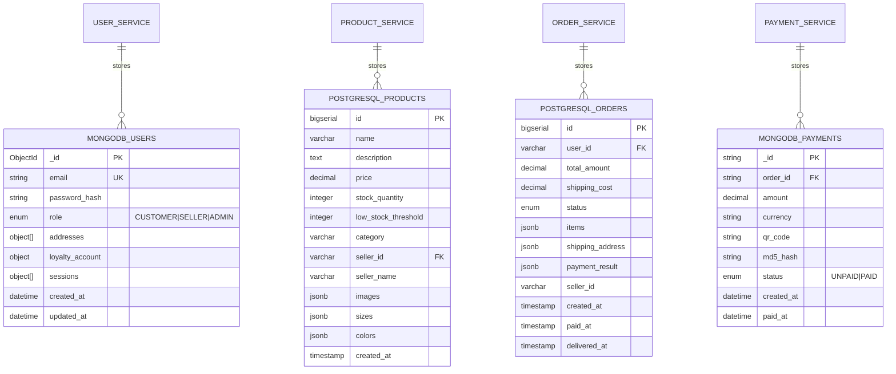
```mermaid
erDiagram
    USER_SERVICE ||--o{ MONGODB_USERS : stores
    PRODUCT_SERVICE ||--o{ POSTGRESQL_PRODUCTS : stores
    ORDER_SERVICE ||--o{ POSTGRESQL_ORDERS : stores
    PAYMENT_SERVICE ||--o{ MONGODB_PAYMENTS : stores

    MONGODB_USERS {
        ObjectId _id PK
        string email UK
        string password_hash
        enum role "CUSTOMER|SELLER|ADMIN"
        object[] addresses
        object loyalty_account
        object[] sessions
        datetime created_at
        datetime updated_at
    }

    POSTGRESQL_PRODUCTS {
        bigserial id PK
        varchar name
        text description
        decimal price
        integer stock_quantity
        integer low_stock_threshold
        varchar category
        varchar seller_id FK
        varchar seller_name
        jsonb images
        jsonb sizes
        jsonb colors
        timestamp created_at
    }

    POSTGRESQL_ORDERS {
        bigserial id PK
        varchar user_id FK
        decimal total_amount
        decimal shipping_cost
        enum status
        jsonb items
        jsonb shipping_address
        jsonb payment_result
        varchar seller_id
        timestamp created_at
        timestamp paid_at
        timestamp delivered_at
    }

    MONGODB_PAYMENTS {
        string _id PK
        string order_id FK
        decimal amount
        string currency
        string qr_code
        string md5_hash
        enum status "UNPAID|PAID"
        datetime created_at
        datetime paid_at
    }
```

### 6.2 Data Ownership

| Service | Owned Entities | Database |
|---------|---------------|----------|
| **User Service** | User, Session, Address, LoyaltyAccount, PointTransaction, TrustScore | MongoDB |
| **Product Service** | Product, ProductReview, ProductFAQ, InventoryAlert, StockMovement, Campaign, CouponCode | PostgreSQL |
| **Order Service** | Order, OrderItem, CartItem, ReturnRequest, Refund, ShippingConfig, SellerBankAccount, SellerTransaction, SellerPayout | PostgreSQL |
| **Payment Gateway** | PaymentOrder | MongoDB |

### 6.3 Data Consistency Strategy

| Pattern | Usage | Example |
|---------|-------|---------|
| **Saga Pattern** | Multi-service transactions | Order → Payment → Inventory |
| **Eventual Consistency** | Cross-service data sync | Order status → Notification |
| **Idempotency Keys** | Prevent duplicates | Payment processing |
| **Optimistic Locking** | Concurrent updates | Stock updates |
| **Event Sourcing** | Audit trail | Order state changes |

### 6.4 Cross-Service Data Access

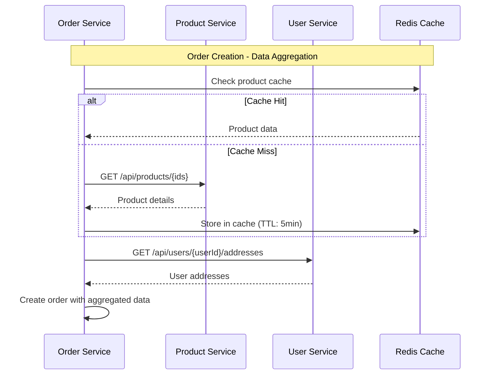
```mermaid
sequenceDiagram
    participant OS as Order Service
    participant PS as Product Service
    participant US as User Service
    participant Cache as Redis Cache

    Note over OS,Cache: Order Creation - Data Aggregation

    OS->>Cache: Check product cache
    alt Cache Hit
        Cache-->>OS: Product data
    else Cache Miss
        OS->>PS: GET /api/products/{ids}
        PS-->>OS: Product details
        OS->>Cache: Store in cache (TTL: 5min)
    end

    OS->>US: GET /api/users/{userId}/addresses
    US-->>OS: User addresses

    OS->>OS: Create order with aggregated data
```

---

## 7. Security Design

### 7.1 Security Architecture

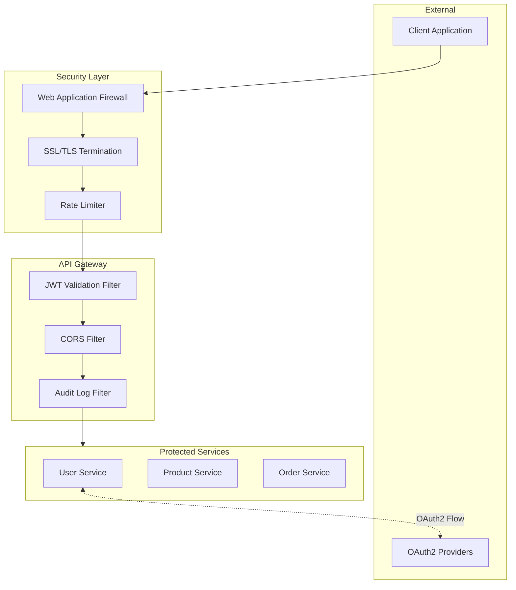
```mermaid
flowchart TB
    subgraph External["External"]
        CLIENT["Client Application"]
        OAUTH["OAuth2 Providers"]
    end

    subgraph SecurityLayer["Security Layer"]
        WAF["Web Application Firewall"]
        SSL["SSL/TLS Termination"]
        RATE["Rate Limiter"]
    end

    subgraph Gateway["API Gateway"]
        JWT_FILTER["JWT Validation Filter"]
        CORS["CORS Filter"]
        AUDIT["Audit Log Filter"]
    end

    subgraph Services["Protected Services"]
        US["User Service"]
        PS["Product Service"]
        OS["Order Service"]
    end

    CLIENT --> WAF
    WAF --> SSL
    SSL --> RATE
    RATE --> JWT_FILTER
    JWT_FILTER --> CORS
    CORS --> AUDIT
    AUDIT --> Services

    US <-.->|OAuth2 Flow| OAUTH
```

### 7.2 Authentication Flow

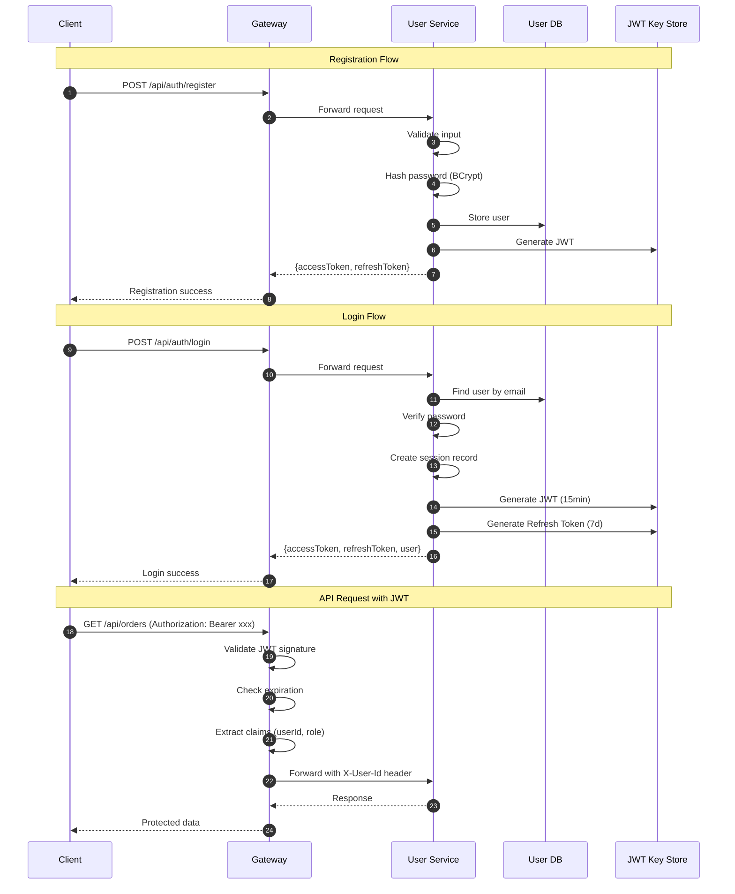
```mermaid
sequenceDiagram
    autonumber
    participant C as Client
    participant GW as Gateway
    participant US as User Service
    participant DB as User DB
    participant JWK as JWT Key Store

    Note over C,JWK: Registration Flow
    C->>GW: POST /api/auth/register
    GW->>US: Forward request
    US->>US: Validate input
    US->>US: Hash password (BCrypt)
    US->>DB: Store user
    US->>JWK: Generate JWT
    US-->>GW: {accessToken, refreshToken}
    GW-->>C: Registration success

    Note over C,JWK: Login Flow
    C->>GW: POST /api/auth/login
    GW->>US: Forward request
    US->>DB: Find user by email
    US->>US: Verify password
    US->>US: Create session record
    US->>JWK: Generate JWT (15min)
    US->>JWK: Generate Refresh Token (7d)
    US-->>GW: {accessToken, refreshToken, user}
    GW-->>C: Login success

    Note over C,JWK: API Request with JWT
    C->>GW: GET /api/orders (Authorization: Bearer xxx)
    GW->>GW: Validate JWT signature
    GW->>GW: Check expiration
    GW->>GW: Extract claims (userId, role)
    GW->>US: Forward with X-User-Id header
    US-->>GW: Response
    GW-->>C: Protected data
```

### 7.3 Authorization Model

| Role | Permissions |
|------|-------------|
| **CUSTOMER** | View products, manage cart, place orders, view own orders, manage addresses, loyalty program |
| **SELLER** | All customer permissions + manage own products, view seller orders, financial dashboard, inventory management |
| **ADMIN** | All permissions + user management, all order access, shipping config, return management, analytics |

### 7.4 Security Controls

| Layer | Control | Implementation |
|-------|---------|----------------|
| **Transport** | TLS 1.3 | SSL termination at Gateway |
| **Authentication** | JWT + OAuth2 | Spring Security, JJWT |
| **Authorization** | RBAC | `@PreAuthorize` annotations |
| **Rate Limiting** | Token bucket | Resilience4j (2 req/4s default) |
| **Input Validation** | Bean Validation | `@Valid`, custom validators |
| **Password Security** | BCrypt | 10 rounds |
| **Session Security** | Multi-device tracking | IP + User-Agent logging |
| **API Security** | CORS, CSRF protection | Spring Security filters |
| **Secrets** | Environment variables | Docker secrets (future: Vault) |

### 7.5 JWT Token Structure

```json
{
  "header": {
    "alg": "HS256",
    "typ": "JWT"
  },
  "payload": {
    "sub": "user_id_123",
    "email": "user@example.com",
    "role": "CUSTOMER",
    "iat": 1700000000,
    "exp": 1700000900
  },
  "signature": "..."
}
```

| Token Type | Expiration | Storage |
|------------|------------|---------|
| Access Token | 15 minutes | Memory/LocalStorage |
| Refresh Token | 7 days | HttpOnly Cookie |
| Session Token | 30 days | Database |

---

## 8. Scalability and Reliability

### 8.1 Scalability Patterns

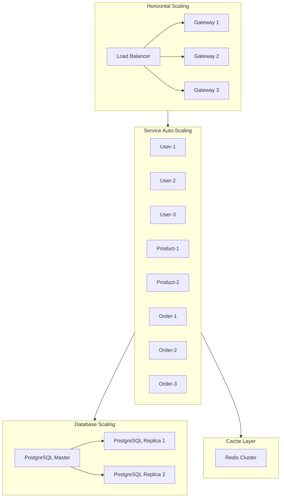
```mermaid
graph TB
    subgraph HorizontalScaling["Horizontal Scaling"]
        LB["Load Balancer"]
        GW1["Gateway 1"]
        GW2["Gateway 2"]
        GW3["Gateway 3"]
        LB --> GW1 & GW2 & GW3
    end

    subgraph AutoScaling["Service Auto-Scaling"]
        US1["User-1"]
        US2["User-2"]
        US3["User-3"]

        PS1["Product-1"]
        PS2["Product-2"]

        OS1["Order-1"]
        OS2["Order-2"]
        OS3["Order-3"]
    end

    subgraph DataScaling["Database Scaling"]
        PG_M["PostgreSQL Master"]
        PG_R1["PostgreSQL Replica 1"]
        PG_R2["PostgreSQL Replica 2"]

        PG_M --> PG_R1 & PG_R2
    end

    subgraph Caching["Cache Layer"]
        REDIS["Redis Cluster"]
    end

    HorizontalScaling --> AutoScaling
    AutoScaling --> DataScaling
    AutoScaling --> Caching
```

### 8.2 Scaling Strategy by Service

| Service | Scaling Strategy | Replicas | Notes |
|---------|-----------------|----------|-------|
| **API Gateway** | Horizontal | 3+ | Stateless, Redis for rate limit sync |
| **User Service** | Horizontal | 2-3 | Stateless JWT, MongoDB handles scale |
| **Product Service** | Horizontal + Read Replicas | 2-3 | Cache heavy, read-intensive |
| **Order Service** | Horizontal | 3+ | Ensure idempotency, saga pattern |
| **Payment Gateway** | Horizontal | 2 | Idempotency keys critical |
| **Notification Service** | Horizontal + Auto-scale | 2+ | Scale based on Kafka partitions |

### 8.3 Fault Tolerance Patterns

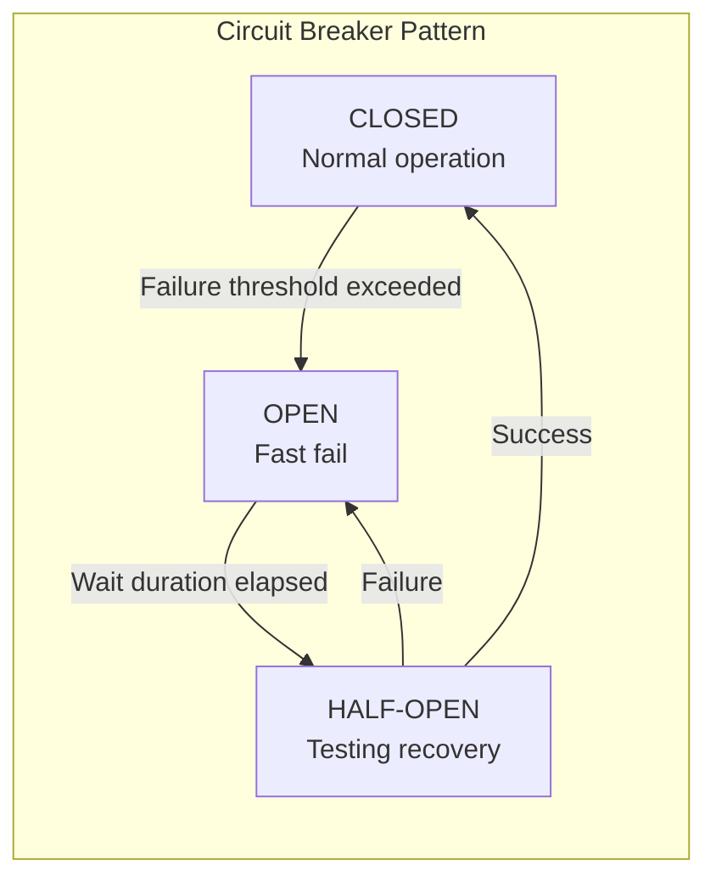
```mermaid
graph LR
    subgraph CircuitBreaker["Circuit Breaker Pattern"]
        CB_CLOSED["CLOSED<br/>Normal operation"]
        CB_OPEN["OPEN<br/>Fast fail"]
        CB_HALF["HALF-OPEN<br/>Testing recovery"]

        CB_CLOSED -->|Failure threshold exceeded| CB_OPEN
        CB_OPEN -->|Wait duration elapsed| CB_HALF
        CB_HALF -->|Success| CB_CLOSED
        CB_HALF -->|Failure| CB_OPEN
    end
```

### 8.4 Resilience4j Configuration

```yaml
resilience4j:
  circuitbreaker:
    instances:
      productService:
        slidingWindowSize: 10
        failureRateThreshold: 50
        waitDurationInOpenState: 10000
        permittedNumberOfCallsInHalfOpenState: 3

  retry:
    instances:
      productService:
        maxAttempts: 3
        waitDuration: 1000
        exponentialBackoffMultiplier: 2

  ratelimiter:
    instances:
      default:
        limitForPeriod: 100
        limitRefreshPeriod: 1s
        timeoutDuration: 5s

  bulkhead:
    instances:
      orderService:
        maxConcurrentCalls: 25
        maxWaitDuration: 500ms
```

### 8.5 Availability Patterns

| Pattern | Implementation | Target |
|---------|----------------|--------|
| **Health Checks** | `/actuator/health` endpoints | All services |
| **Graceful Shutdown** | Spring Boot actuator | Zero-downtime deployments |
| **Database Failover** | PostgreSQL streaming replication | < 30s RTO |
| **Queue Persistence** | RabbitMQ durable queues | No message loss |
| **Retry with Backoff** | Exponential backoff | Transient failures |
| **Timeout** | 5s default, 30s max | Prevent cascade failures |
| **Fallback** | Cached data or defaults | Degraded service |

### 8.6 Caching Strategy

| Cache Type | Technology | TTL | Use Case |
|------------|------------|-----|----------|
| **Session Cache** | Redis | 30min | User sessions |
| **Rate Limit** | Redis | Per config | API quotas |
| **Product Cache** | Spring Cache + Redis | 5min | Product listings |
| **Config Cache** | Config Server | On refresh | Application config |
| **Query Cache** | Hibernate L2 | 2min | Frequent queries |

---

## 9. Deployment Architecture

### 9.1 Docker Compose Deployment (Current)

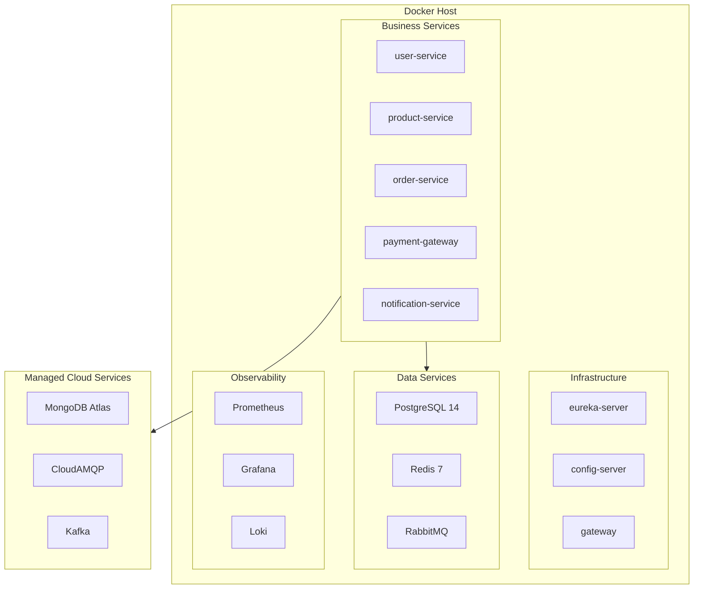
```mermaid
flowchart TB
    subgraph DockerHost["Docker Host"]
        subgraph InfraContainers["Infrastructure"]
            EUR["eureka-server"]
            CFG["config-server"]
            GW["gateway"]
        end

        subgraph ServiceContainers["Business Services"]
            US["user-service"]
            PS["product-service"]
            OS["order-service"]
            PG["payment-gateway"]
            NS["notification-service"]
        end

        subgraph DataContainers["Data Services"]
            POSTGRES["PostgreSQL 14"]
            REDIS["Redis 7"]
            RMQ["RabbitMQ"]
        end

        subgraph Observability["Observability"]
            PROM["Prometheus"]
            GRAF["Grafana"]
            LOKI["Loki"]
        end
    end

    subgraph Cloud["Managed Cloud Services"]
        MONGO["MongoDB Atlas"]
        AMQP["CloudAMQP"]
        KAFKA["Kafka"]
    end

    ServiceContainers --> DataContainers
    ServiceContainers --> Cloud
```

### 9.2 Container Configuration

```yaml
# docker-compose.yml structure
version: '3.8'

services:
  # Infrastructure
  eureka-server:
    build: ./eureka
    ports: ["8761:8761"]
    healthcheck:
      test: curl -f http://localhost:8761/actuator/health
      interval: 30s
      timeout: 10s
      retries: 3

  config-server:
    build: ./configserver
    ports: ["8888:8888"]
    depends_on:
      eureka-server:
        condition: service_healthy

  gateway:
    build: ./gateway
    ports: ["8080:8080"]
    depends_on: [eureka-server, config-server, redis]

  # Business Services
  user-service:
    build: ./user
    ports: ["8082:8082"]
    environment:
      - SPRING_PROFILES_ACTIVE=docker
    depends_on: [eureka-server, config-server]

  product-service:
    build: ./product
    ports: ["8081:8081"]
    depends_on: [eureka-server, config-server, postgres]

  order-service:
    build: ./order
    ports: ["8083:8083"]
    depends_on: [eureka-server, config-server, postgres, rabbitmq]

  payment-gateway:
    build: ./payment-gateway
    ports: ["8976:8976"]

  notification-service:
    build: ./notification
    ports: ["8084:8084"]
    depends_on: [kafka]

  # Data Services
  postgres:
    image: postgres:14
    ports: ["5432:5432"]
    volumes: [postgres_data:/var/lib/postgresql/data]
    environment:
      POSTGRES_PASSWORD: postgres

  redis:
    image: redis:7-alpine
    ports: ["6379:6379"]

  rabbitmq:
    image: rabbitmq:3-management
    ports: ["5672:5672", "15672:15672"]
```

### 9.3 Kubernetes Deployment (Future)

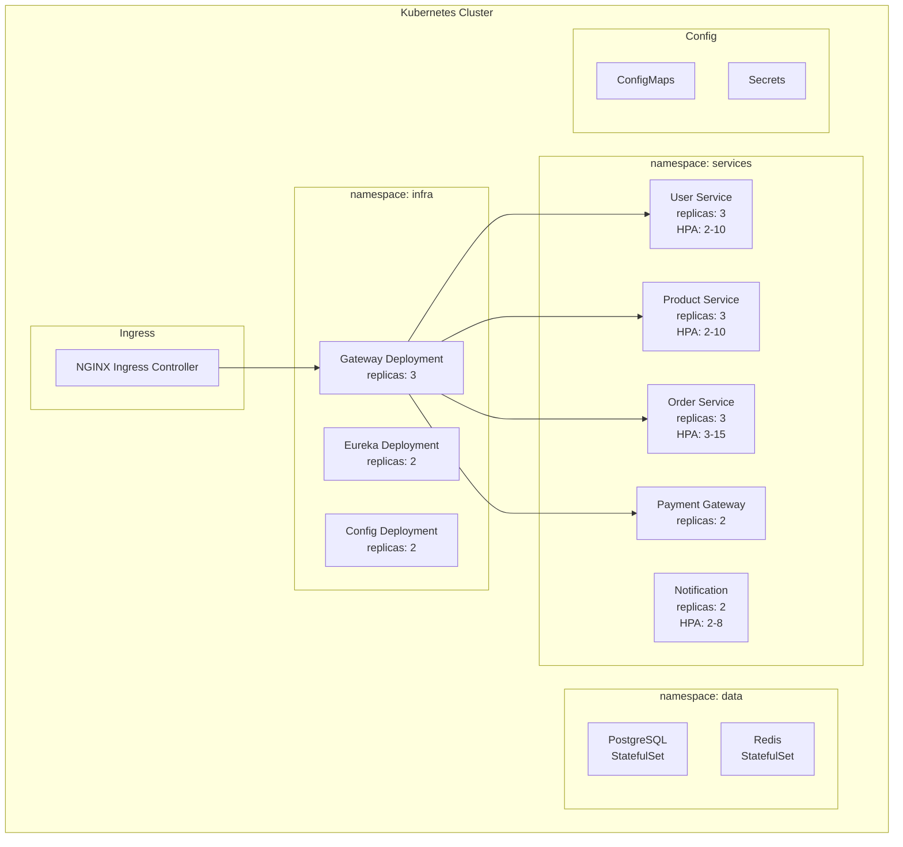
```mermaid
flowchart TB
    subgraph K8S["Kubernetes Cluster"]
        subgraph Ingress
            ING["NGINX Ingress Controller"]
        end

        subgraph InfraNamespace["namespace: infra"]
            EUR_DEP["Eureka Deployment<br/>replicas: 2"]
            CFG_DEP["Config Deployment<br/>replicas: 2"]
            GW_DEP["Gateway Deployment<br/>replicas: 3"]
        end

        subgraph ServiceNamespace["namespace: services"]
            US_DEP["User Service<br/>replicas: 3<br/>HPA: 2-10"]
            PS_DEP["Product Service<br/>replicas: 3<br/>HPA: 2-10"]
            OS_DEP["Order Service<br/>replicas: 3<br/>HPA: 3-15"]
            PG_DEP["Payment Gateway<br/>replicas: 2"]
            NS_DEP["Notification<br/>replicas: 2<br/>HPA: 2-8"]
        end

        subgraph DataNamespace["namespace: data"]
            PG_SS["PostgreSQL<br/>StatefulSet"]
            REDIS_SS["Redis<br/>StatefulSet"]
        end

        subgraph Config
            CM["ConfigMaps"]
            SEC["Secrets"]
        end
    end

    ING --> GW_DEP
    GW_DEP --> US_DEP & PS_DEP & OS_DEP & PG_DEP
```

### 9.4 Service Startup Order


```mermaid
graph LR
    subgraph Phase1["Phase 1: Data"]
        PG["PostgreSQL"]
        REDIS["Redis"]
        RMQ["RabbitMQ"]
    end

    subgraph Phase2["Phase 2: Infrastructure"]
        EUR["Eureka Server"]
    end

    subgraph Phase3["Phase 3: Config"]
        CFG["Config Server"]
    end

    subgraph Phase4["Phase 4: Services"]
        US["User Service"]
        PS["Product Service"]
        OS["Order Service"]
        PG_SVC["Payment Gateway"]
        NS["Notification Service"]
    end

    subgraph Phase5["Phase 5: Gateway"]
        GW["API Gateway"]
    end

    Phase1 --> Phase2 --> Phase3 --> Phase4 --> Phase5
```

---

## 10. Future Improvements

### 10.1 Short-Term Improvements (1-3 months)

| Improvement | Priority | Impact | Effort |
|-------------|----------|--------|--------|
| Add Zipkin Server deployment | High | Complete distributed tracing | Low |
| Externalize secrets (HashiCorp Vault) | High | Security compliance | Medium |
| Implement API versioning | Medium | Backward compatibility | Low |
| Add GraphQL Gateway | Medium | Flexible client queries | Medium |
| Implement CQRS for Orders | Medium | Read/write scaling | High |

### 10.2 Medium-Term Improvements (3-6 months)

| Improvement | Description |
|-------------|-------------|
| **Kubernetes Migration** | Full K8s deployment with Helm charts |
| **Service Mesh (Istio)** | mTLS, observability, traffic management |
| **Event Sourcing** | Full audit trail for orders/payments |
| **CDC (Debezium)** | Database change data capture |
| **OpenAPI Gateway** | Kong or AWS API Gateway |

### 10.3 Long-Term Vision (6-12 months)

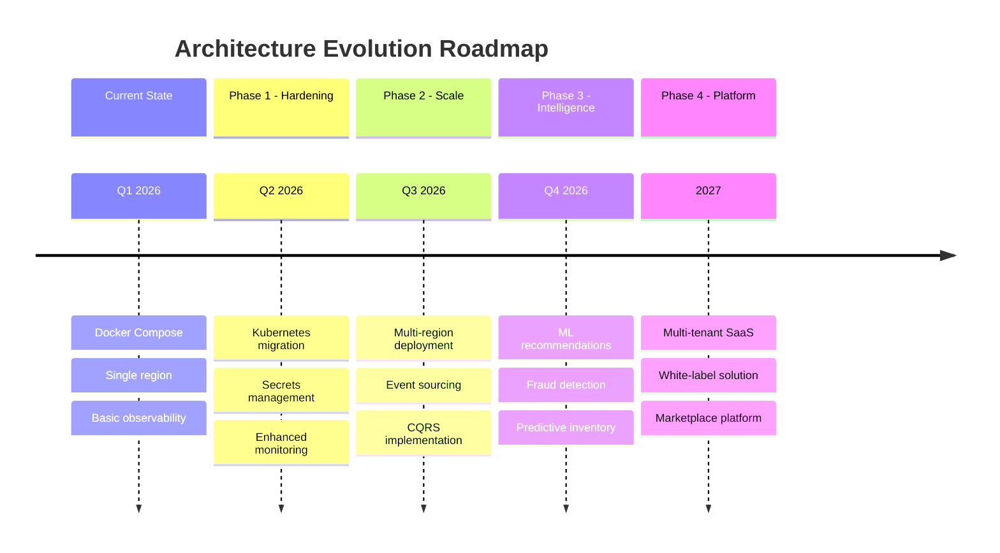
```mermaid
timeline
    title Architecture Evolution Roadmap

    section Current State
        Q1 2026 : Docker Compose
                : Single region
                : Basic observability

    section Phase 1 - Hardening
        Q2 2026 : Kubernetes migration
                : Secrets management
                : Enhanced monitoring

    section Phase 2 - Scale
        Q3 2026 : Multi-region deployment
                : Event sourcing
                : CQRS implementation

    section Phase 3 - Intelligence
        Q4 2026 : ML recommendations
                : Fraud detection
                : Predictive inventory

    section Phase 4 - Platform
        2027 : Multi-tenant SaaS
             : White-label solution
             : Marketplace platform
```

### 10.4 Technology Radar

| Adopt | Trial | Assess | Hold |
|-------|-------|--------|------|
| Kubernetes | Service Mesh (Istio) | GraphQL Federation | Monolith |
| Prometheus/Grafana | Event Sourcing | gRPC for internal | SOAP/XML |
| Redis Cluster | Apache Pulsar | Dapr | On-premise only |
| PostgreSQL 15 | Temporal.io | ClickHouse | Manual scaling |

---

## Appendix A: API Reference

### Quick Reference Endpoints

| Service | Base URL | Documentation |
|---------|----------|---------------|
| Gateway | `http://localhost:8080` | - |
| User Service | `/api/auth`, `/api/users` | Auth & Users |
| Product Service | `/api/products`, `/api/inventory` | Catalog & Stock |
| Order Service | `/api/orders`, `/api/cart`, `/api/shipping` | Commerce |
| Payment Gateway | `/orders` | Payments |
| Analytics | `/api/analytics` | Reports |

### Health Endpoints

| Service | Health Check URL |
|---------|-----------------|
| All Spring Services | `/actuator/health` |
| Eureka | `http://localhost:8761/actuator/health` |
| Prometheus Metrics | `/actuator/prometheus` |

---

## Appendix B: Configuration Reference

### Environment Variables

| Variable | Service | Description |
|----------|---------|-------------|
| `SPRING_PROFILES_ACTIVE` | All | Active Spring profile |
| `EUREKA_CLIENT_SERVICEURL_DEFAULTZONE` | All | Eureka server URL |
| `SPRING_CLOUD_CONFIG_URI` | All | Config server URL |
| `SPRING_DATASOURCE_URL` | Product, Order | PostgreSQL URL |
| `SPRING_DATA_MONGODB_URI` | User, Payment | MongoDB connection |
| `SPRING_RABBITMQ_ADDRESSES` | All | RabbitMQ connection |

---

*Document Version: 1.0*
*Last Updated: March 2026*
*Architecture Review: Quarterly*
