# E-Commerce Database Schema & ER Diagram

## Overview

This document contains the complete database schema for the e-commerce microservices platform, including:
- **Product Service** - PostgreSQL (product database)
- **Order Service** - PostgreSQL (order database)
- **User Service** - MongoDB Atlas (users collection)
- **Payment Gateway** - In-memory storage (Python)

---

## ER Diagram (Mermaid)

```mermaid
erDiagram
    %% =====================================================
    %% PRODUCT SERVICE (PostgreSQL - product database)
    %% =====================================================

    products ||--o{ product_reviews : "has"
    products ||--o{ product_faqs : "has"
    products ||--o{ stock_movements : "tracks"
    products ||--o{ inventory_alerts : "generates"
    products ||--o{ product_images : "contains"
    products ||--o{ product_sizes : "has"
    products ||--o{ product_colors : "has"

    campaigns ||--o{ coupon_codes : "generates"
    campaigns ||--o{ campaign_products : "includes"

    products {
        bigint id PK
        string name
        string description
        decimal price
        int stock_quantity
        string category
        string seller_id
        string seller_name
        string image_url
        boolean active
        string brand
        double rating
        int num_reviews
        decimal discount_price
        string dress_style
        int low_stock_threshold
        int reorder_point
        int reorder_quantity
        string sku
        timestamp created_at
        timestamp updated_at
    }

    product_images {
        bigint product_id FK
        string image_url
    }

    product_sizes {
        bigint product_id FK
        string size
    }

    product_colors {
        bigint product_id FK
        string color
    }

    product_reviews {
        bigint id PK
        bigint product_id FK
        int rating
        string content
        string user_id
        string user_name
        timestamp date
        boolean verified_purchase
        int helpful_count
        string seller_response
        timestamp seller_response_date
        boolean is_flagged
        string flag_reason
        timestamp flagged_at
        enum status
    }

    product_faqs {
        bigint id PK
        bigint product_id FK
        string question
        string answer
        int order_index
        boolean hidden
    }

    stock_movements {
        bigint id PK
        bigint product_id FK
        string seller_id
        int quantity
        int previous_stock
        int new_stock
        enum type
        string reason
        string performed_by
        bigint order_id
        timestamp created_at
    }

    inventory_alerts {
        bigint id PK
        bigint product_id FK
        string seller_id
        enum type
        int threshold
        boolean is_active
        boolean is_read
        string message
        timestamp created_at
        timestamp read_at
    }

    campaigns {
        bigint id PK
        string seller_id
        string name
        string description
        enum type
        enum discount_type
        decimal discount_value
        decimal minimum_purchase
        decimal maximum_discount
        timestamp start_date
        timestamp end_date
        enum status
        boolean is_active
        boolean all_products
        int usage_limit
        int usage_count
        int per_customer_limit
        int views
        int clicks
        int conversions
        decimal revenue_generated
        timestamp created_at
        timestamp updated_at
    }

    campaign_products {
        bigint campaign_id FK
        bigint product_id
    }

    coupon_codes {
        bigint id PK
        string code UK
        bigint campaign_id FK
        string seller_id
        int usage_limit
        int usage_count
        int per_customer_limit
        boolean is_active
        timestamp expires_at
        timestamp created_at
        timestamp updated_at
    }

    %% =====================================================
    %% ORDER SERVICE (PostgreSQL - order database)
    %% =====================================================

    orders ||--o{ order_items : "contains"
    orders ||--o{ seller_transactions : "generates"
    orders ||--o{ delivery_attempts : "has"
    orders ||--o{ return_requests : "may have"

    return_requests ||--o| refunds : "results in"
    return_requests ||--o{ return_photos : "has"

    seller_payouts ||--o{ seller_transactions : "includes"

    orders {
        bigint id PK
        string user_id
        decimal total_amount
        enum status
        string first_name
        string last_name
        string street
        string city
        string state
        string zip_code
        string country
        string phone
        string payment_method
        string payment_id
        string payment_status
        string payment_update_time
        string payment_email_address
        decimal items_price
        decimal tax_price
        decimal shipping_price
        boolean is_paid
        timestamp paid_at
        boolean is_delivered
        timestamp delivered_at
        int failed_delivery_attempts
        string failed_delivery_reason
        string paypal_order_id
        string stripe_client_secret
        timestamp created_at
        timestamp updated_at
    }

    order_items {
        bigint id PK
        bigint order_id FK
        string product_id
        string product_name
        string product_image
        int quantity
        decimal price
    }

    cart_items {
        bigint id PK
        string user_id
        string product_id
        int quantity
        decimal price
        string product_name
        string product_image
        string selected_color
        string selected_size
        timestamp created_at
        timestamp updated_at
    }

    return_requests {
        bigint id PK
        bigint order_id
        string product_id
        string user_id
        string seller_id
        string reason
        enum status
        decimal refund_amount
        string approved_by
        string rejection_reason
        timestamp created_at
        timestamp updated_at
        timestamp approved_at
    }

    return_photos {
        bigint return_request_id FK
        string photo_url
    }

    refunds {
        bigint id PK
        bigint order_id
        bigint return_request_id
        string seller_id
        decimal amount
        enum method
        enum status
        timestamp created_at
        timestamp scheduled_at
        timestamp processed_at
        string gateway_reference
        string failure_reason
    }

    seller_transactions {
        bigint id PK
        string seller_id
        bigint order_id FK
        enum type
        decimal amount
        decimal platform_fee
        decimal payment_gateway_fee
        decimal net_amount
        string description
        enum status
        bigint payout_id FK
        boolean is_settled
        timestamp settled_at
        timestamp created_at
    }

    seller_payouts {
        bigint id PK
        string seller_id
        decimal amount
        decimal platform_fee
        decimal payment_gateway_fee
        decimal net_amount
        timestamp period_start_date
        timestamp period_end_date
        int orders_count
        enum status
        string bank_account_name
        string bank_account_number
        string bank_name
        string transaction_reference
        string notes
        timestamp processed_at
        string processed_by
        timestamp created_at
        timestamp updated_at
    }

    seller_bank_accounts {
        bigint id PK
        string seller_id
        string bank_name
        string account_holder_name
        string account_number
        string routing_number
        string swift_code
        boolean is_primary
        boolean is_verified
        timestamp verified_at
        string verified_by
        timestamp created_at
        timestamp updated_at
    }

    delivery_attempts {
        bigint id PK
        bigint order_id
        string rider_id
        int attempt_number
        string failure_reason
        string notes
        timestamp attempt_date
        timestamp created_at
    }

    shipping_config {
        bigint id PK
        decimal default_shipping_price
    }

    cambodia_province_shipping_rates {
        bigint id PK
        string province
        string province_key UK
        decimal price
        boolean active
    }

    store_settings {
        bigint id PK
        string store_name
        string store_email
        string store_phone
        string store_address
        string store_description
        string currency
        string timezone
    }

    platform_metrics {
        bigint id PK
        date date UK
        decimal gmv
        decimal revenue
        decimal commission
        decimal fees
        bigint total_orders
        bigint active_users
        bigint new_users
        bigint page_views
        timestamp created_at
        timestamp updated_at
    }

    %% =====================================================
    %% USER SERVICE (MongoDB - users database)
    %% =====================================================

    users ||--o{ addresses : "has"
    users ||--o| loyalty_accounts : "has"
    users ||--o{ point_transactions : "earns"
    users ||--o| referral_codes : "has"
    users ||--o| customer_trust_scores : "has"
    users ||--o{ user_sessions : "has"
    users ||--o{ refresh_tokens : "has"
    users ||--o{ password_reset_tokens : "requests"
    users ||--o{ oauth2_tokens : "has"

    users {
        string _id PK
        string name
        string email UK
        string password
        string phone
        string avatar
        boolean enabled
        string roles
        timestamp created_at
        timestamp updated_at
        string password_reset_code_hash
        timestamp password_reset_code_expires_at
        timestamp password_reset_code_sent_at
    }

    addresses {
        string _id PK
        string user_id FK
        string label
        boolean is_default
        string first_name
        string last_name
        string phone
        string street
        string village
        string commune
        string district
        string province
        string postal_code
        string country
        string additional_info
        timestamp created_at
        timestamp updated_at
    }

    loyalty_accounts {
        string _id PK
        string user_id UK
        int total_points
        int current_points
        string tier
        timestamp tier_updated_at
        timestamp created_at
        timestamp updated_at
    }

    point_transactions {
        string _id PK
        string user_id FK
        int points
        string type
        string order_id
        string description
        timestamp created_at
        timestamp expires_at
    }

    referral_codes {
        string _id PK
        string user_id FK
        string code UK
        int usage_count
        int max_usage
        timestamp created_at
    }

    customer_trust_scores {
        string _id PK
        string user_id UK
        double score
        double cod_limit
        int total_orders
        int successful_orders
        int failed_orders
        int cancellations
        timestamp created_at
        timestamp updated_at
    }

    user_sessions {
        string _id PK
        string user_id FK
        string session_token
        string device_info
        string browser
        string operating_system
        string ip_address
        string location
        boolean is_current
        timestamp created_at
        timestamp last_activity
        timestamp expires_at
        boolean is_active
    }

    refresh_tokens {
        string _id PK
        string token UK
        string user_id FK
        timestamp expiry_date
        timestamp created_at
    }

    password_reset_tokens {
        string _id PK
        string token UK
        string user_id FK
        string email
        timestamp expires_at
        boolean used
        timestamp created_at
    }

    oauth2_tokens {
        string _id PK
        string user_id FK
        string provider
        string access_token
        string refresh_token
        string token_type
        string scope
        timestamp expires_at
        timestamp created_at
    }

    roles {
        string _id PK
        string name UK
        string description
    }
```



---

## Visual ER Diagram (ASCII)

```
╔══════════════════════════════════════════════════════════════════════════════════════════════════════╗
║                              PRODUCT SERVICE (PostgreSQL - product DB)                               ║
╠══════════════════════════════════════════════════════════════════════════════════════════════════════╣
║                                                                                                      ║
║  ┌─────────────────┐       ┌──────────────────┐       ┌─────────────────┐                           ║
║  │  product_images │       │     products     │       │  product_sizes  │                           ║
║  ├─────────────────┤       ├──────────────────┤       ├─────────────────┤                           ║
║  │ product_id (FK) │──────<│ id (PK)          │>──────│ product_id (FK) │                           ║
║  │ image_url       │       │ name             │       │ size            │                           ║
║  └─────────────────┘       │ description      │       └─────────────────┘                           ║
║                            │ price            │                                                      ║
║  ┌─────────────────┐       │ stock_quantity   │       ┌─────────────────┐                           ║
║  │ product_colors  │       │ category         │       │ product_reviews │                           ║
║  ├─────────────────┤       │ seller_id        │       ├─────────────────┤                           ║
║  │ product_id (FK) │──────<│ seller_name      │>──────│ id (PK)         │                           ║
║  │ color           │       │ brand            │       │ product_id (FK) │                           ║
║  └─────────────────┘       │ rating           │       │ rating          │                           ║
║                            │ num_reviews      │       │ content         │                           ║
║  ┌─────────────────┐       │ sku              │       │ user_id         │                           ║
║  │ stock_movements │       │ active           │       │ status          │                           ║
║  ├─────────────────┤       │ ...              │       └─────────────────┘                           ║
║  │ id (PK)         │       └────────┬─────────┘                                                      ║
║  │ product_id (FK) │────────────────┘                 ┌─────────────────┐                           ║
║  │ quantity        │                                  │  product_faqs   │                           ║
║  │ type            │       ┌──────────────────┐       ├─────────────────┤                           ║
║  │ reason          │       │    campaigns     │       │ id (PK)         │                           ║
║  └─────────────────┘       ├──────────────────┤       │ product_id (FK) │                           ║
║                            │ id (PK)          │       │ question        │                           ║
║  ┌─────────────────┐       │ seller_id        │       │ answer          │                           ║
║  │ inventory_alerts│       │ name             │       └─────────────────┘                           ║
║  ├─────────────────┤       │ type             │                                                      ║
║  │ id (PK)         │       │ discount_value   │       ┌─────────────────┐                           ║
║  │ product_id (FK) │       │ status           │       │  coupon_codes   │                           ║
║  │ type            │       │ start_date       │       ├─────────────────┤                           ║
║  │ threshold       │       │ end_date         │>──────│ id (PK)         │                           ║
║  │ message         │       └──────────────────┘       │ campaign_id(FK) │                           ║
║  └─────────────────┘                                  │ code (UK)       │                           ║
║                                                       │ usage_count     │                           ║
║                                                       └─────────────────┘                           ║
╚══════════════════════════════════════════════════════════════════════════════════════════════════════╝

╔══════════════════════════════════════════════════════════════════════════════════════════════════════╗
║                               ORDER SERVICE (PostgreSQL - order DB)                                  ║
╠══════════════════════════════════════════════════════════════════════════════════════════════════════╣
║                                                                                                      ║
║  ┌────────────────┐        ┌──────────────────┐        ┌────────────────┐                           ║
║  │   cart_items   │        │      orders      │        │  order_items   │                           ║
║  ├────────────────┤        ├──────────────────┤        ├────────────────┤                           ║
║  │ id (PK)        │        │ id (PK)          │───────>│ id (PK)        │                           ║
║  │ user_id        │        │ user_id          │        │ order_id (FK)  │                           ║
║  │ product_id     │        │ total_amount     │        │ product_id     │                           ║
║  │ quantity       │        │ status           │        │ product_name   │                           ║
║  │ price          │        │ shipping_address │        │ quantity       │                           ║
║  │ selected_color │        │ payment_result   │        │ price          │                           ║
║  │ selected_size  │        │ is_paid          │        └────────────────┘                           ║
║  └────────────────┘        │ is_delivered     │                                                      ║
║                            │ created_at       │        ┌─────────────────────┐                      ║
║                            └────────┬─────────┘        │ delivery_attempts   │                      ║
║                                     │                  ├─────────────────────┤                      ║
║                                     │                  │ id (PK)             │                      ║
║                                     └────────────────> │ order_id            │                      ║
║                                     │                  │ rider_id            │                      ║
║                                     │                  │ attempt_number      │                      ║
║                                     │                  │ failure_reason      │                      ║
║  ┌────────────────────┐             │                  └─────────────────────┘                      ║
║  │  return_requests   │<────────────┘                                                               ║
║  ├────────────────────┤             ┌───────────────────┐                                           ║
║  │ id (PK)            │────────────>│     refunds       │                                           ║
║  │ order_id           │             ├───────────────────┤                                           ║
║  │ product_id         │             │ id (PK)           │                                           ║
║  │ user_id            │             │ return_request_id │                                           ║
║  │ seller_id          │             │ amount            │                                           ║
║  │ status             │             │ method            │                                           ║
║  │ refund_amount      │             │ status            │                                           ║
║  └────────────────────┘             └───────────────────┘                                           ║
║                                                                                                      ║
║  ┌─────────────────────┐    ┌──────────────────────┐    ┌─────────────────────┐                     ║
║  │ seller_transactions │───>│   seller_payouts     │    │ seller_bank_accounts│                     ║
║  ├─────────────────────┤    ├──────────────────────┤    ├─────────────────────┤                     ║
║  │ id (PK)             │    │ id (PK)              │    │ id (PK)             │                     ║
║  │ seller_id           │    │ seller_id            │    │ seller_id           │                     ║
║  │ order_id (FK)       │    │ amount               │    │ bank_name           │                     ║
║  │ type                │    │ net_amount           │    │ account_number      │                     ║
║  │ amount              │    │ status               │    │ is_primary          │                     ║
║  │ payout_id (FK)      │    │ processed_at         │    │ is_verified         │                     ║
║  └─────────────────────┘    └──────────────────────┘    └─────────────────────┘                     ║
║                                                                                                      ║
║  ┌─────────────────┐   ┌───────────────────────────────┐   ┌─────────────────┐                      ║
║  │ shipping_config │   │cambodia_province_shipping_rates│   │ store_settings  │                      ║
║  ├─────────────────┤   ├───────────────────────────────┤   ├─────────────────┤                      ║
║  │ id (PK)         │   │ id (PK)                       │   │ id (PK)         │                      ║
║  │ default_price   │   │ province                      │   │ store_name      │                      ║
║  └─────────────────┘   │ province_key (UK)             │   │ store_email     │                      ║
║                        │ price                         │   │ currency        │                      ║
║                        │ active                        │   │ timezone        │                      ║
║                        └───────────────────────────────┘   └─────────────────┘                      ║
╚══════════════════════════════════════════════════════════════════════════════════════════════════════╝

╔══════════════════════════════════════════════════════════════════════════════════════════════════════╗
║                                USER SERVICE (MongoDB Atlas)                                          ║
╠══════════════════════════════════════════════════════════════════════════════════════════════════════╣
║                                                                                                      ║
║                            ┌──────────────────┐                                                      ║
║                            │      users       │                                                      ║
║                            ├──────────────────┤                                                      ║
║                            │ _id (PK)         │                                                      ║
║                            │ name             │                                                      ║
║       ┌─────────────────┐  │ email (UK)       │  ┌─────────────────┐                                ║
║       │    addresses    │  │ password         │  │ loyalty_accounts│                                ║
║       ├─────────────────┤  │ phone            │  ├─────────────────┤                                ║
║       │ _id (PK)        │<─│ roles []         │─>│ _id (PK)        │                                ║
║       │ user_id (FK)    │  │ enabled          │  │ user_id (FK,UK) │                                ║
║       │ label           │  │ created_at       │  │ total_points    │                                ║
║       │ is_default      │  └────────┬─────────┘  │ current_points  │                                ║
║       │ province        │           │            │ tier            │                                ║
║       │ district        │           │            └─────────────────┘                                ║
║       │ street          │           │                                                                ║
║       └─────────────────┘           │            ┌──────────────────┐                               ║
║                                     │            │point_transactions│                               ║
║  ┌──────────────────────┐           │            ├──────────────────┤                               ║
║  │customer_trust_scores │<──────────┤            │ _id (PK)         │                               ║
║  ├──────────────────────┤           ├───────────>│ user_id (FK)     │                               ║
║  │ _id (PK)             │           │            │ points           │                               ║
║  │ user_id (FK,UK)      │           │            │ type             │                               ║
║  │ score                │           │            │ order_id         │                               ║
║  │ cod_limit            │           │            │ description      │                               ║
║  │ total_orders         │           │            └──────────────────┘                               ║
║  │ successful_orders    │           │                                                                ║
║  │ cancellations        │           │            ┌─────────────────┐                                ║
║  └──────────────────────┘           │            │  referral_codes │                                ║
║                                     │            ├─────────────────┤                                ║
║  ┌─────────────────┐                ├───────────>│ _id (PK)        │                                ║
║  │  user_sessions  │                │            │ user_id (FK)    │                                ║
║  ├─────────────────┤                │            │ code (UK)       │                                ║
║  │ _id (PK)        │<───────────────┤            │ usage_count     │                                ║
║  │ user_id (FK)    │                │            │ max_usage       │                                ║
║  │ session_token   │                │            └─────────────────┘                                ║
║  │ device_info     │                │                                                                ║
║  │ ip_address      │                │            ┌──────────────────┐                               ║
║  │ is_active       │                │            │  refresh_tokens  │                               ║
║  └─────────────────┘                │            ├──────────────────┤                               ║
║                                     ├───────────>│ _id (PK)         │                               ║
║  ┌─────────────────────┐            │            │ token (UK)       │                               ║
║  │password_reset_tokens│            │            │ user_id (FK)     │                               ║
║  ├─────────────────────┤            │            │ expiry_date      │                               ║
║  │ _id (PK)            │<───────────┤            └──────────────────┘                               ║
║  │ token (UK)          │            │                                                                ║
║  │ user_id (FK)        │            │            ┌─────────────────┐                                ║
║  │ email               │            │            │  oauth2_tokens  │                                ║
║  │ expires_at          │            │            ├─────────────────┤                                ║
║  │ used                │            └───────────>│ _id (PK)        │                                ║
║  └─────────────────────┘                         │ user_id (FK)    │                                ║
║                                                  │ provider        │                                ║
║              ┌───────────────┐                   │ access_token    │                                ║
║              │     roles     │                   │ refresh_token   │                                ║
║              ├───────────────┤                   └─────────────────┘                                ║
║              │ _id (PK)      │                                                                       ║
║              │ name (UK)     │                                                                       ║
║              │ description   │                                                                       ║
║              └───────────────┘                                                                       ║
╚══════════════════════════════════════════════════════════════════════════════════════════════════════╝
```

---

## Database Tables Detail

### Product Service (PostgreSQL)

#### 1. products
| Column | Type | Constraints | Description |
|--------|------|-------------|-------------|
| id | BIGINT | PK, AUTO_INCREMENT | Primary key |
| name | VARCHAR(255) | NOT NULL | Product name |
| description | TEXT | | Product description |
| price | DECIMAL(19,2) | NOT NULL | Current price |
| stock_quantity | INT | DEFAULT 0 | Available stock |
| category | VARCHAR(100) | | Product category |
| seller_id | VARCHAR(255) | | Foreign key to User service |
| seller_name | VARCHAR(255) | | Seller display name |
| image_url | VARCHAR(500) | | Primary image (deprecated) |
| active | BOOLEAN | DEFAULT TRUE | Is product active |
| brand | VARCHAR(100) | | Product brand |
| rating | DOUBLE | DEFAULT 0.0 | Average rating |
| num_reviews | INT | DEFAULT 0 | Review count |
| discount_price | DECIMAL(19,2) | | Discounted price |
| dress_style | VARCHAR(50) | | Style category |
| low_stock_threshold | INT | DEFAULT 10 | Alert threshold |
| reorder_point | INT | DEFAULT 5 | Reorder trigger |
| reorder_quantity | INT | DEFAULT 50 | Reorder amount |
| sku | VARCHAR(50) | | Stock Keeping Unit |
| created_at | TIMESTAMP | AUTO | Creation timestamp |
| updated_at | TIMESTAMP | AUTO | Last update |

#### 2. product_images
| Column | Type | Constraints | Description |
|--------|------|-------------|-------------|
| product_id | BIGINT | FK → products.id | Product reference |
| image_url | VARCHAR(500) | | Image URL |

#### 3. product_sizes
| Column | Type | Constraints | Description |
|--------|------|-------------|-------------|
| product_id | BIGINT | FK → products.id | Product reference |
| size | VARCHAR(20) | | Size value (S, M, L, XL) |

#### 4. product_colors
| Column | Type | Constraints | Description |
|--------|------|-------------|-------------|
| product_id | BIGINT | FK → products.id | Product reference |
| color | VARCHAR(50) | | Color name |

#### 5. product_reviews
| Column | Type | Constraints | Description |
|--------|------|-------------|-------------|
| id | BIGINT | PK, AUTO_INCREMENT | Primary key |
| product_id | BIGINT | FK → products.id, NOT NULL | Product reference |
| rating | INT | 1-5 | Star rating |
| content | TEXT | | Review text |
| user_id | VARCHAR(255) | | Reviewer ID |
| user_name | VARCHAR(100) | | Reviewer name |
| date | TIMESTAMP | AUTO | Review date |
| verified_purchase | BOOLEAN | DEFAULT FALSE | Verified buyer |
| helpful_count | INT | DEFAULT 0 | Helpful votes |
| seller_response | TEXT | | Seller reply |
| seller_response_date | TIMESTAMP | | Reply date |
| is_flagged | BOOLEAN | DEFAULT FALSE | Flagged for review |
| flag_reason | VARCHAR(255) | | Flag reason |
| flagged_at | TIMESTAMP | | Flag timestamp |
| status | ENUM | DEFAULT 'PUBLISHED' | PUBLISHED, HIDDEN, FLAGGED, UNDER_REVIEW |

#### 6. product_faqs
| Column | Type | Constraints | Description |
|--------|------|-------------|-------------|
| id | BIGINT | PK, AUTO_INCREMENT | Primary key |
| product_id | BIGINT | FK → products.id, NOT NULL | Product reference |
| question | TEXT | | FAQ question |
| answer | TEXT | | FAQ answer |
| order_index | INT | | Display order |
| hidden | BOOLEAN | DEFAULT FALSE | Is hidden |

#### 7. stock_movements
| Column | Type | Constraints | Description |
|--------|------|-------------|-------------|
| id | BIGINT | PK, AUTO_INCREMENT | Primary key |
| product_id | BIGINT | FK → products.id | Product reference |
| seller_id | VARCHAR(255) | | Seller ID |
| quantity | INT | | Change amount (+/-) |
| previous_stock | INT | | Stock before |
| new_stock | INT | | Stock after |
| type | ENUM | | ADD, REMOVE, ADJUST, SALE, RETURN, DAMAGE, TRANSFER |
| reason | VARCHAR(500) | | Movement reason |
| performed_by | VARCHAR(255) | | User who made change |
| order_id | BIGINT | | Related order |
| created_at | TIMESTAMP | AUTO | Timestamp |

#### 8. inventory_alerts
| Column | Type | Constraints | Description |
|--------|------|-------------|-------------|
| id | BIGINT | PK, AUTO_INCREMENT | Primary key |
| product_id | BIGINT | FK → products.id | Product reference |
| seller_id | VARCHAR(255) | | Seller ID |
| type | ENUM | | LOW_STOCK, OUT_OF_STOCK, OVERSTOCK, BACK_IN_STOCK |
| threshold | INT | | Alert threshold |
| is_active | BOOLEAN | DEFAULT TRUE | Alert active |
| is_read | BOOLEAN | DEFAULT FALSE | Has been read |
| message | VARCHAR(500) | | Alert message |
| created_at | TIMESTAMP | AUTO | Creation time |
| read_at | TIMESTAMP | | Read timestamp |

#### 9. campaigns
| Column | Type | Constraints | Description |
|--------|------|-------------|-------------|
| id | BIGINT | PK, AUTO_INCREMENT | Primary key |
| seller_id | VARCHAR(255) | | Seller ID |
| name | VARCHAR(255) | | Campaign name |
| description | TEXT | | Description |
| type | ENUM | DEFAULT 'PERCENTAGE_DISCOUNT' | PERCENTAGE_DISCOUNT, FIXED_DISCOUNT, BOGO, BUNDLE, FLASH_SALE, FREE_SHIPPING |
| discount_type | ENUM | DEFAULT 'PERCENTAGE' | PERCENTAGE, FIXED_AMOUNT |
| discount_value | DECIMAL(19,2) | | Discount amount |
| minimum_purchase | DECIMAL(19,2) | | Min order amount |
| maximum_discount | DECIMAL(19,2) | | Max discount cap |
| start_date | TIMESTAMP | | Campaign start |
| end_date | TIMESTAMP | | Campaign end |
| status | ENUM | DEFAULT 'DRAFT' | DRAFT, SCHEDULED, ACTIVE, PAUSED, ENDED, CANCELLED |
| is_active | BOOLEAN | DEFAULT FALSE | Is currently active |
| all_products | BOOLEAN | DEFAULT FALSE | Applies to all products |
| usage_limit | INT | | Total usage limit |
| usage_count | INT | DEFAULT 0 | Times used |
| per_customer_limit | INT | | Per user limit |
| views | INT | DEFAULT 0 | View count |
| clicks | INT | DEFAULT 0 | Click count |
| conversions | INT | DEFAULT 0 | Successful uses |
| revenue_generated | DECIMAL(19,2) | DEFAULT 0 | Total revenue |
| created_at | TIMESTAMP | AUTO | Creation time |
| updated_at | TIMESTAMP | AUTO | Last update |

#### 10. campaign_products
| Column | Type | Constraints | Description |
|--------|------|-------------|-------------|
| campaign_id | BIGINT | FK → campaigns.id | Campaign reference |
| product_id | BIGINT | | Product ID |

#### 11. coupon_codes
| Column | Type | Constraints | Description |
|--------|------|-------------|-------------|
| id | BIGINT | PK, AUTO_INCREMENT | Primary key |
| code | VARCHAR(50) | UNIQUE | Coupon code |
| campaign_id | BIGINT | FK → campaigns.id | Campaign reference |
| seller_id | VARCHAR(255) | | Seller ID |
| usage_limit | INT | | Max uses |
| usage_count | INT | DEFAULT 0 | Current uses |
| per_customer_limit | INT | | Per user limit |
| is_active | BOOLEAN | DEFAULT TRUE | Is active |
| expires_at | TIMESTAMP | | Expiration date |
| created_at | TIMESTAMP | AUTO | Creation time |
| updated_at | TIMESTAMP | AUTO | Last update |

---

### Order Service (PostgreSQL)

#### 1. orders
| Column | Type | Constraints | Description |
|--------|------|-------------|-------------|
| id | BIGINT | PK, AUTO_INCREMENT | Primary key |
| user_id | VARCHAR(255) | NOT NULL | Customer ID |
| total_amount | DECIMAL(19,2) | | Order total |
| status | ENUM | DEFAULT 'PENDING' | PENDING, CONFIRMED, SHIPPED, DELIVERED, CANCELLED |
| first_name | VARCHAR(100) | | Shipping first name |
| last_name | VARCHAR(100) | | Shipping last name |
| street | VARCHAR(255) | | Shipping street |
| city | VARCHAR(100) | | Shipping city |
| state | VARCHAR(100) | | Shipping state |
| zip_code | VARCHAR(20) | | Shipping postal code |
| country | VARCHAR(100) | | Shipping country |
| phone | VARCHAR(20) | | Contact phone |
| payment_method | VARCHAR(50) | | Payment type |
| payment_id | VARCHAR(255) | | Payment gateway ID |
| payment_status | VARCHAR(50) | | Payment status |
| payment_update_time | VARCHAR(50) | | Payment update |
| payment_email_address | VARCHAR(255) | | Payer email |
| items_price | DECIMAL(19,2) | | Subtotal |
| tax_price | DECIMAL(19,2) | | Tax amount |
| shipping_price | DECIMAL(19,2) | | Shipping cost |
| is_paid | BOOLEAN | DEFAULT FALSE | Payment received |
| paid_at | TIMESTAMP | | Payment timestamp |
| is_delivered | BOOLEAN | DEFAULT FALSE | Delivered |
| delivered_at | TIMESTAMP | | Delivery timestamp |
| failed_delivery_attempts | INT | DEFAULT 0 | Failed attempts |
| failed_delivery_reason | VARCHAR(500) | | Failure reason |
| paypal_order_id | VARCHAR(255) | | PayPal order ID |
| stripe_client_secret | VARCHAR(255) | | Stripe secret |
| created_at | TIMESTAMP | AUTO | Creation time |
| updated_at | TIMESTAMP | AUTO | Last update |

#### 2. order_items
| Column | Type | Constraints | Description |
|--------|------|-------------|-------------|
| id | BIGINT | PK, AUTO_INCREMENT | Primary key |
| order_id | BIGINT | FK → orders.id, NOT NULL | Order reference |
| product_id | VARCHAR(255) | | Product ID |
| product_name | VARCHAR(255) | | Product name snapshot |
| product_image | VARCHAR(500) | | Product image snapshot |
| quantity | INT | | Item quantity |
| price | DECIMAL(19,2) | | Item price |

#### 3. cart_items
| Column | Type | Constraints | Description |
|--------|------|-------------|-------------|
| id | BIGINT | PK, AUTO_INCREMENT | Primary key |
| user_id | VARCHAR(255) | | Customer ID |
| product_id | VARCHAR(255) | | Product ID |
| quantity | INT | | Item quantity |
| price | DECIMAL(19,2) | | Item price |
| product_name | VARCHAR(255) | | Product name |
| product_image | VARCHAR(500) | | Product image |
| selected_color | VARCHAR(50) | | Chosen color |
| selected_size | VARCHAR(20) | | Chosen size |
| created_at | TIMESTAMP | AUTO | Added time |
| updated_at | TIMESTAMP | AUTO | Last update |

#### 4. return_requests
| Column | Type | Constraints | Description |
|--------|------|-------------|-------------|
| id | BIGINT | PK, AUTO_INCREMENT | Primary key |
| order_id | BIGINT | | Order reference |
| product_id | VARCHAR(255) | | Product ID |
| user_id | VARCHAR(255) | | Customer ID |
| seller_id | VARCHAR(255) | | Seller ID |
| reason | TEXT | | Return reason |
| status | ENUM | DEFAULT 'PENDING' | PENDING, APPROVED, REJECTED, COMPLETED |
| refund_amount | DECIMAL(19,2) | | Refund amount |
| approved_by | VARCHAR(255) | | Approver ID |
| rejection_reason | TEXT | | Rejection reason |
| created_at | TIMESTAMP | AUTO | Request time |
| updated_at | TIMESTAMP | AUTO | Last update |
| approved_at | TIMESTAMP | | Approval time |

#### 5. return_photos
| Column | Type | Constraints | Description |
|--------|------|-------------|-------------|
| return_request_id | BIGINT | FK → return_requests.id | Return reference |
| photo_url | TEXT | | Photo URL |

#### 6. refunds
| Column | Type | Constraints | Description |
|--------|------|-------------|-------------|
| id | BIGINT | PK, AUTO_INCREMENT | Primary key |
| order_id | BIGINT | | Order reference |
| return_request_id | BIGINT | | Return request reference |
| seller_id | VARCHAR(255) | | Seller ID |
| amount | DECIMAL(19,2) | | Refund amount |
| method | ENUM | DEFAULT 'ORIGINAL' | ORIGINAL, STORE_CREDIT |
| status | ENUM | DEFAULT 'PENDING' | PENDING, SCHEDULED, PROCESSING, COMPLETED, FAILED |
| created_at | TIMESTAMP | AUTO | Creation time |
| scheduled_at | TIMESTAMP | | Scheduled time |
| processed_at | TIMESTAMP | | Processing time |
| gateway_reference | VARCHAR(255) | | Payment gateway ref |
| failure_reason | VARCHAR(1000) | | Failure details |

#### 7. seller_transactions
| Column | Type | Constraints | Description |
|--------|------|-------------|-------------|
| id | BIGINT | PK, AUTO_INCREMENT | Primary key |
| seller_id | VARCHAR(255) | | Seller ID |
| order_id | BIGINT | FK → orders.id | Order reference |
| type | ENUM | | SALE, REFUND, PLATFORM_FEE, GATEWAY_FEE, PAYOUT, ADJUSTMENT |
| amount | DECIMAL(19,2) | | Transaction amount |
| platform_fee | DECIMAL(19,2) | | Platform commission |
| payment_gateway_fee | DECIMAL(19,2) | | Gateway fee |
| net_amount | DECIMAL(19,2) | | Net amount |
| description | VARCHAR(500) | | Description |
| status | ENUM | DEFAULT 'PENDING' | PENDING, HOLD, AVAILABLE, SETTLED, CANCELLED |
| payout_id | BIGINT | FK → seller_payouts.id | Payout reference |
| is_settled | BOOLEAN | DEFAULT FALSE | Is settled |
| settled_at | TIMESTAMP | | Settlement time |
| created_at | TIMESTAMP | AUTO | Creation time |

#### 8. seller_payouts
| Column | Type | Constraints | Description |
|--------|------|-------------|-------------|
| id | BIGINT | PK, AUTO_INCREMENT | Primary key |
| seller_id | VARCHAR(255) | | Seller ID |
| amount | DECIMAL(19,2) | | Payout amount |
| platform_fee | DECIMAL(19,2) | | Platform fee |
| payment_gateway_fee | DECIMAL(19,2) | | Gateway fee |
| net_amount | DECIMAL(19,2) | | Net payout |
| period_start_date | TIMESTAMP | | Period start |
| period_end_date | TIMESTAMP | | Period end |
| orders_count | INT | | Orders in payout |
| status | ENUM | DEFAULT 'PENDING' | PENDING, PROCESSING, COMPLETED, FAILED, CANCELLED |
| bank_account_name | VARCHAR(255) | | Account name |
| bank_account_number | VARCHAR(50) | | Account number |
| bank_name | VARCHAR(100) | | Bank name |
| transaction_reference | VARCHAR(255) | | Bank ref |
| notes | TEXT | | Notes |
| processed_at | TIMESTAMP | | Processing time |
| processed_by | VARCHAR(255) | | Processor ID |
| created_at | TIMESTAMP | AUTO | Creation time |
| updated_at | TIMESTAMP | AUTO | Last update |

#### 9. seller_bank_accounts
| Column | Type | Constraints | Description |
|--------|------|-------------|-------------|
| id | BIGINT | PK, AUTO_INCREMENT | Primary key |
| seller_id | VARCHAR(255) | | Seller ID |
| bank_name | VARCHAR(100) | | Bank name |
| account_holder_name | VARCHAR(255) | | Account holder |
| account_number | VARCHAR(50) | | Account number |
| routing_number | VARCHAR(50) | | Routing number |
| swift_code | VARCHAR(20) | | SWIFT code |
| is_primary | BOOLEAN | DEFAULT FALSE | Primary account |
| is_verified | BOOLEAN | DEFAULT FALSE | Is verified |
| verified_at | TIMESTAMP | | Verification time |
| verified_by | VARCHAR(255) | | Verifier ID |
| created_at | TIMESTAMP | AUTO | Creation time |
| updated_at | TIMESTAMP | AUTO | Last update |

#### 10. delivery_attempts
| Column | Type | Constraints | Description |
|--------|------|-------------|-------------|
| id | BIGINT | PK, AUTO_INCREMENT | Primary key |
| order_id | BIGINT | NOT NULL | Order reference |
| rider_id | VARCHAR(255) | | Delivery rider |
| attempt_number | INT | NOT NULL | Attempt count |
| failure_reason | TEXT | | Failure reason |
| notes | TEXT | | Additional notes |
| attempt_date | TIMESTAMP | NOT NULL | Attempt time |
| created_at | TIMESTAMP | AUTO | Creation time |

#### 11. shipping_config
| Column | Type | Constraints | Description |
|--------|------|-------------|-------------|
| id | BIGINT | PK, AUTO_INCREMENT | Primary key |
| default_shipping_price | DECIMAL(12,2) | DEFAULT 0 | Default price |

#### 12. cambodia_province_shipping_rates
| Column | Type | Constraints | Description |
|--------|------|-------------|-------------|
| id | BIGINT | PK, AUTO_INCREMENT | Primary key |
| province | VARCHAR(100) | NOT NULL | Province name |
| province_key | VARCHAR(50) | UNIQUE, NOT NULL | Province key |
| price | DECIMAL(12,2) | DEFAULT 0 | Shipping price |
| active | BOOLEAN | DEFAULT TRUE | Is active |

#### 13. store_settings
| Column | Type | Constraints | Description |
|--------|------|-------------|-------------|
| id | BIGINT | PK, AUTO_INCREMENT | Primary key |
| store_name | VARCHAR(255) | DEFAULT 'E-Shop' | Store name |
| store_email | VARCHAR(255) | | Contact email |
| store_phone | VARCHAR(50) | | Contact phone |
| store_address | VARCHAR(500) | | Store address |
| store_description | VARCHAR(1000) | | Description |
| currency | VARCHAR(10) | DEFAULT 'USD' | Currency |
| timezone | VARCHAR(50) | DEFAULT 'America/New_York' | Timezone |

#### 14. platform_metrics
| Column | Type | Constraints | Description |
|--------|------|-------------|-------------|
| id | BIGINT | PK, AUTO_INCREMENT | Primary key |
| date | DATE | UNIQUE, NOT NULL | Metrics date |
| gmv | DECIMAL(19,2) | DEFAULT 0 | Gross Merchandise Value |
| revenue | DECIMAL(19,2) | DEFAULT 0 | Platform revenue |
| commission | DECIMAL(19,2) | DEFAULT 0 | Commission earned |
| fees | DECIMAL(19,2) | DEFAULT 0 | Fees collected |
| total_orders | BIGINT | DEFAULT 0 | Order count |
| active_users | BIGINT | DEFAULT 0 | Active users |
| new_users | BIGINT | DEFAULT 0 | New registrations |
| page_views | BIGINT | DEFAULT 0 | Page views |
| created_at | TIMESTAMP | AUTO | Creation time |
| updated_at | TIMESTAMP | AUTO | Last update |

---

### User Service (MongoDB Atlas)

#### 1. users
| Field | Type | Constraints | Description |
|-------|------|-------------|-------------|
| _id | ObjectId | PK | Primary key |
| name | String | NOT NULL, max 50 | User name |
| email | String | UNIQUE, NOT NULL | Email address |
| password | String | NOT NULL, min 6 | Hashed password |
| phone | String | max 20 | Phone number |
| avatar | String | | Profile image URL |
| enabled | Boolean | DEFAULT true | Account active |
| roles | Array[String] | | User roles |
| created_at | DateTime | | Registration time |
| updated_at | DateTime | | Last update |
| password_reset_code_hash | String | | Reset code hash |
| password_reset_code_expires_at | DateTime | | Code expiry |
| password_reset_code_sent_at | DateTime | | Code sent time |

#### 2. addresses
| Field | Type | Constraints | Description |
|-------|------|-------------|-------------|
| _id | ObjectId | PK | Primary key |
| user_id | String | INDEX, NOT NULL | User reference |
| label | String | NOT NULL, max 50 | Address label |
| is_default | Boolean | DEFAULT false | Default address |
| first_name | String | NOT NULL, max 50 | First name |
| last_name | String | NOT NULL, max 50 | Last name |
| phone | String | NOT NULL, max 20 | Contact phone |
| street | String | NOT NULL, max 200 | Street address |
| village | String | | Village (Cambodia) |
| commune | String | | Commune (Cambodia) |
| district | String | NOT NULL | District |
| province | String | NOT NULL | Province |
| postal_code | String | max 10 | Postal code |
| country | String | DEFAULT 'Cambodia' | Country |
| additional_info | String | | Delivery notes |
| created_at | DateTime | | Creation time |
| updated_at | DateTime | | Last update |

#### 3. loyalty_accounts
| Field | Type | Constraints | Description |
|-------|------|-------------|-------------|
| _id | ObjectId | PK | Primary key |
| user_id | String | UNIQUE INDEX | User reference |
| total_points | Integer | DEFAULT 0 | Lifetime points |
| current_points | Integer | DEFAULT 0 | Available points |
| tier | String | DEFAULT 'BRONZE' | BRONZE, SILVER, GOLD, PLATINUM |
| tier_updated_at | DateTime | | Tier change time |
| created_at | DateTime | | Creation time |
| updated_at | DateTime | | Last update |

#### 4. point_transactions
| Field | Type | Constraints | Description |
|-------|------|-------------|-------------|
| _id | ObjectId | PK | Primary key |
| user_id | String | INDEX | User reference |
| points | Integer | | Points (+/-) |
| type | String | | EARN, REDEEM, EXPIRE, BONUS |
| order_id | String | | Related order |
| description | String | | Transaction description |
| created_at | DateTime | | Transaction time |
| expires_at | DateTime | | Point expiry |

#### 5. referral_codes
| Field | Type | Constraints | Description |
|-------|------|-------------|-------------|
| _id | ObjectId | PK | Primary key |
| user_id | String | INDEX | User reference |
| code | String | UNIQUE INDEX | Referral code |
| usage_count | Integer | DEFAULT 0 | Times used |
| max_usage | Integer | DEFAULT 100 | Max uses |
| created_at | DateTime | | Creation time |

#### 6. customer_trust_scores
| Field | Type | Constraints | Description |
|-------|------|-------------|-------------|
| _id | ObjectId | PK | Primary key |
| user_id | String | UNIQUE INDEX | User reference |
| score | Double | DEFAULT 100.0 | Trust score |
| cod_limit | Double | DEFAULT 5000.0 | COD limit |
| total_orders | Integer | DEFAULT 0 | Total orders |
| successful_orders | Integer | DEFAULT 0 | Successful orders |
| failed_orders | Integer | DEFAULT 0 | Failed orders |
| cancellations | Integer | DEFAULT 0 | Cancellation count |
| created_at | DateTime | | Creation time |
| updated_at | DateTime | | Last update |

#### 7. user_sessions
| Field | Type | Constraints | Description |
|-------|------|-------------|-------------|
| _id | ObjectId | PK | Primary key |
| user_id | String | INDEX | User reference |
| session_token | String | INDEX | Session token |
| device_info | String | | Device information |
| browser | String | | Browser name |
| operating_system | String | | OS name |
| ip_address | String | | Client IP |
| location | String | | Geo location |
| is_current | Boolean | | Current session |
| created_at | DateTime | | Login time |
| last_activity | DateTime | | Last activity |
| expires_at | DateTime | | Session expiry |
| is_active | Boolean | | Session active |

#### 8. refresh_tokens
| Field | Type | Constraints | Description |
|-------|------|-------------|-------------|
| _id | ObjectId | PK | Primary key |
| token | String | UNIQUE INDEX | Refresh token |
| user_id | String | | User reference |
| expiry_date | Instant | | Token expiry |
| created_at | DateTime | | Creation time |

#### 9. password_reset_tokens
| Field | Type | Constraints | Description |
|-------|------|-------------|-------------|
| _id | ObjectId | PK | Primary key |
| token | String | UNIQUE INDEX | Reset token |
| user_id | String | INDEX | User reference |
| email | String | | User email |
| expires_at | DateTime | | Token expiry |
| used | Boolean | DEFAULT false | Token used |
| created_at | DateTime | | Creation time |

#### 10. oauth2_tokens
| Field | Type | Constraints | Description |
|-------|------|-------------|-------------|
| _id | ObjectId | PK | Primary key |
| user_id | String | | User reference |
| provider | String | | OAuth provider |
| access_token | String | | Access token |
| refresh_token | String | | Refresh token |
| token_type | String | DEFAULT 'Bearer' | Token type |
| scope | String | | OAuth scope |
| expires_at | Instant | | Token expiry |
| created_at | DateTime | | Creation time |

#### 11. roles
| Field | Type | Constraints | Description |
|-------|------|-------------|-------------|
| _id | ObjectId | PK | Primary key |
| name | String | UNIQUE INDEX | Role name |
| description | String | | Role description |

---

### Payment Gateway (In-Memory - Python)

#### payments (Dictionary)
| Key | Type | Description |
|-----|------|-------------|
| order_id | String | Order identifier (key) |
| amount | Integer | Payment amount |
| currency | String | Currency code |
| qr | String | KHQR code |
| md5 | String | Transaction hash |
| status | String | PENDING, COMPLETED, FAILED |

---

## Cross-Service Relationships

```
┌─────────────────────────────────────────────────────────────────────────────────────────┐
│                           CROSS-SERVICE RELATIONSHIPS                                   │
├─────────────────────────────────────────────────────────────────────────────────────────┤
│                                                                                         │
│  USER SERVICE                ORDER SERVICE                 PRODUCT SERVICE              │
│  (MongoDB)                   (PostgreSQL)                  (PostgreSQL)                 │
│                                                                                         │
│  ┌──────────┐                ┌──────────────┐              ┌────────────┐               │
│  │  users   │◄──────────────►│    orders    │◄────────────►│  products  │               │
│  │  _id     │  user_id       │   user_id    │  product_id  │     id     │               │
│  └────┬─────┘                └──────┬───────┘              └─────┬──────┘               │
│       │                             │                            │                      │
│       │                             │                            │                      │
│       │         ┌───────────────────┴────────────────┐           │                      │
│       │         ▼                                    ▼           │                      │
│       │    ┌────────────┐                    ┌─────────────┐     │                      │
│       │    │ cart_items │                    │ order_items │     │                      │
│       │    │  user_id   │                    │ product_id  │◄────┘                      │
│       │    │ product_id │─────────────────►  └─────────────┘                            │
│       │    └────────────┘                                                               │
│       │                                                                                 │
│       │    ┌─────────────────┐                                                          │
│       └───►│ return_requests │                                                          │
│            │    user_id      │                                                          │
│            │   seller_id     │◄─────────────────────────► seller (user_id)              │
│            │   product_id    │◄─────────────────────────► products.id                   │
│            └─────────────────┘                                                          │
│                                                                                         │
│  PAYMENT GATEWAY ◄─────────────────────────────────────────► orders (paypal_order_id)   │
│                                                                                         │
└─────────────────────────────────────────────────────────────────────────────────────────┘
```

### Key Relationships

| From Service | From Entity | Relationship | To Service | To Entity | Join Key |
|--------------|-------------|--------------|------------|-----------|----------|
| Order | orders | belongs to | User | users | user_id = _id |
| Order | cart_items | belongs to | User | users | user_id = _id |
| Order | order_items | references | Product | products | product_id = id |
| Order | cart_items | references | Product | products | product_id = id |
| Order | return_requests | belongs to | User | users | user_id = _id |
| Order | return_requests | references seller | User | users | seller_id = _id |
| Order | return_requests | references | Product | products | product_id = id |
| Order | seller_transactions | references seller | User | users | seller_id = _id |
| Product | products | owned by seller | User | users | seller_id = _id |
| Product | product_reviews | reviewed by | User | users | user_id = _id |
| User | loyalty_accounts | belongs to | User | users | user_id = _id |
| User | point_transactions | references | Order | orders | order_id = id |

---

## Enum Values Reference

### Product Service
| Enum | Values |
|------|--------|
| ReviewStatus | PUBLISHED, HIDDEN, FLAGGED, UNDER_REVIEW |
| MovementType | ADD, REMOVE, ADJUST, SALE, RETURN, DAMAGE, TRANSFER |
| AlertType | LOW_STOCK, OUT_OF_STOCK, OVERSTOCK, BACK_IN_STOCK |
| CampaignType | PERCENTAGE_DISCOUNT, FIXED_DISCOUNT, BOGO, BUNDLE, FLASH_SALE, FREE_SHIPPING |
| DiscountType | PERCENTAGE, FIXED_AMOUNT |
| CampaignStatus | DRAFT, SCHEDULED, ACTIVE, PAUSED, ENDED, CANCELLED |

### Order Service
| Enum | Values |
|------|--------|
| OrderStatus | PENDING, CONFIRMED, SHIPPED, DELIVERED, CANCELLED |
| ReturnStatus | PENDING, APPROVED, REJECTED, COMPLETED |
| RefundMethod | ORIGINAL, STORE_CREDIT |
| RefundStatus | PENDING, SCHEDULED, PROCESSING, COMPLETED, FAILED |
| TransactionType | SALE, REFUND, PLATFORM_FEE, GATEWAY_FEE, PAYOUT, ADJUSTMENT |
| TransactionStatus | PENDING, HOLD, AVAILABLE, SETTLED, CANCELLED |
| PayoutStatus | PENDING, PROCESSING, COMPLETED, FAILED, CANCELLED |

### User Service
| Enum | Values |
|------|--------|
| LoyaltyTier | BRONZE, SILVER, GOLD, PLATINUM |
| PointTransactionType | EARN, REDEEM, EXPIRE, BONUS |
| DefaultRoles | CUSTOMER, SELLER, ADMIN |

---

## Database Statistics

| Service | Database | Tables/Collections | Total Entities |
|---------|----------|-------------------|----------------|
| Product Service | PostgreSQL | 11 | 11 |
| Order Service | PostgreSQL | 14 | 14 |
| User Service | MongoDB | 11 | 11 |
| Payment Gateway | In-Memory | 1 | 1 |
| **Total** | **3 databases** | **37** | **37** |

---

*Document Version: 1.0*
*Last Updated: March 14, 2026*
*Generated by: Database Analysis Tool*
